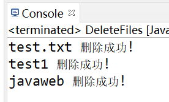
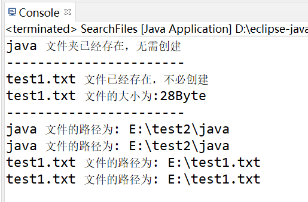
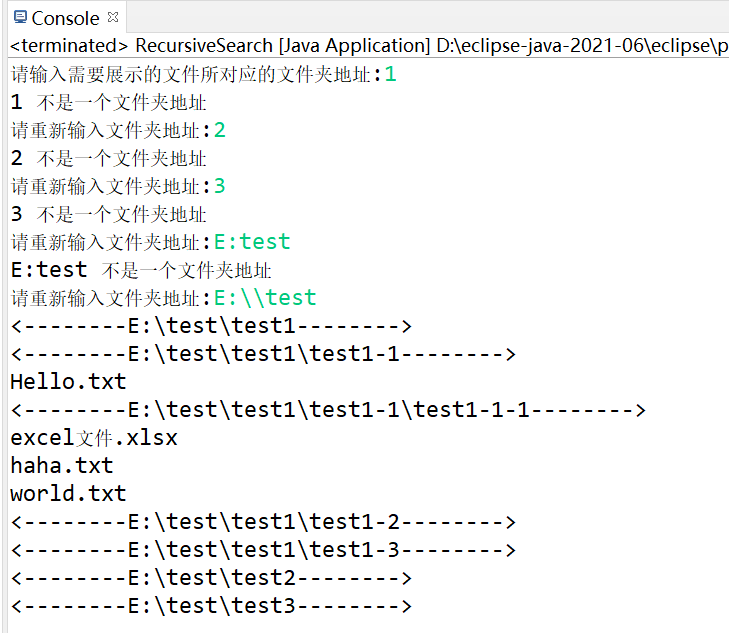
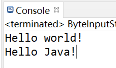
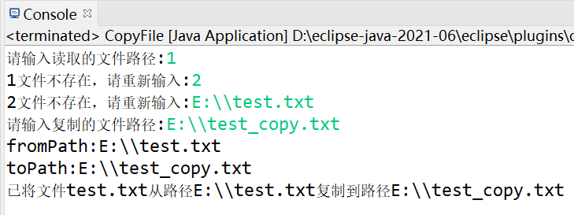
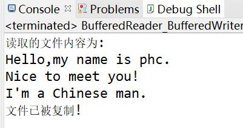

## Java输入输出流(I/O流)

---

### 一、`File`类之添加方法

#### 1.1 创建文件

> 1. 创建文本文件
>
>    ```java
>    //创建一个普通文本文件
>    File file1 = new File("E:\\test.txt");
>    boolean isFile=file1.createNewFile();
>    System.out.println(isFile? file1.getName()+"文件创建成功!": file1.getName()+"文件创建失败!");
>    ```
>
> 2. 创建单个文件夹
>
>    ```java
>    //创建一个文件夹
>    File file2=new File("E:\\test1");
>    boolean isFileDir=file2.mkdir();
>    System.out.println(isFileDir?file2.getName()+"文件夹创建成功!": file2.getName()+"文件夹创建失败!");
>    ```
>
> 3. 创建多级文件夹
>
>    ```java
>    //创建多级别文件夹
>    File file3=new File("E:\\test2\\java\\javaweb");
>    boolean isFileDirs=file3.mkdirs();
>    System.out.println(isFileDirs?file3.getName()+"多级文件夹创建成功!":file3.getName()+"多级文件夹创建失败!");
>    ```
>
>    **若文件或文件夹已经存在，则会出现文件夹创建失败的提示，并且不会创建新的文件；若文件或文件夹不存在，则会创建新的文件或者文件夹**
>
> 4. 实例
>
>    ```java
>    package com.phc.ioStream;
>         
>    import java.io.File;
>    import java.io.IOException;
>         
>    public class FileDemo01 {
>         
>    	public static void main(String[] args) {
>         
>    		try {
>    			//创建一个普通文本文件
>    			File file1 = new File("E:\\test.txt");
>    			boolean isFile=file1.createNewFile();
>    			System.out.println(isFile? file1.getName()+"文件创建成功!": file1.getName()+"文件创建失败!");
>    			//创建一个文件夹
>    			File file2=new File("E:\\test1");
>    			boolean isFileDir=file2.mkdir();
>    			System.out.println(isFileDir?file2.getName()+"文件夹创建成功!": file2.getName()+"文件夹创建失败!");
>    			//创建多级别文件夹
>    			File file3=new File("E:\\test2\\java\\javaweb");
>    			boolean isFileDirs=file3.mkdirs();
>    			System.out.println(isFileDirs?file3.getName()+"多级文件夹创建成功!":file3.getName()+"多级文件夹创建失败!");
>    		} catch (IOException e) {
>    			e.printStackTrace();
>    		}
>    	}
>    }
>    ```
>
>    
>
>    
>
>

#### 1.2 删除文件

> 1. 核心代码：
>
>    ```java
>    File file = new File("E:\\test.txt");
>    boolean is_delete_file=file.delete();
>    ```
>
> 2. 实例：
>
>    ```java
>    package com.phc.ioStream;
>          
>    import java.io.File;
>          
>    public class DeleteFiles {
>          
>    	public static void main(String[] args) {
>    		File file1 = new File("E:\\test.txt");
>    		boolean is_delete_file1=file1.delete();
>    		System.out.println(file1.getName()+(is_delete_file1?" 删除成功!":" 删除失败!"));
>    		File file2=new File("E:\\test1");
>    		boolean is_delete_file2=file2.delete();
>    		System.out.println(file2.getName()+(is_delete_file2?" 删除成功!":" 删除失败!"));
>    		File file3=new File("E:\\test2\\java\\javaweb");
>    		boolean is_delete_file3=file3.delete();
>    		System.out.println(file3.getName()+(is_delete_file3?" 删除成功!":" 删除失败!"));
>    	}
>    }
>    ```
>
>    

#### 1.3 查询文件

> 1. 查询文件：
>
>    ```java
>    file.exists();//判断文件是否存在
>    ```
>
> 2. 获取文件大小：
>
>    ```java
>    file.length();
>    ```
>
> 3. 获取文件名称：
>
>    ```java
>    file.getName();
>    ```
>
> 4. 获取文件绝对路径：
>
>    ```java
>    file.getPath();
>    ```
>
> 5. 实例：
>
>    ```java
>    package com.phc.ioStream;
>    import java.io.File;
>    import java.io.IOException;
>    /*
>     * description:查询
>     * author:phc
>     * time:2022-3-13,11:32
>     */
>    public class SearchFiles {
>
>    	public static void main(String[] args) {
>    		//1. 判断文件是否存在--->file.exists();
>    		File file1=new File("E:\\test2\\java");
>    		boolean is_file_exist=file1.exists();
>    		if(is_file_exist) {
>    			System.out.println(file1.getName()+" 文件夹已经存在，无需创建");
>    		}
>    		else {
>    			file1.mkdirs();
>    			System.out.println(file1.getName()+" 文件夹不存在，已为您自动创建");
>    		}
>    		System.out.println("-----------------------");
>    		//2. 获取文件的大小--->file.length()
>    		File file2=new File("E:\\test1.txt");
>    		try {
>    			boolean is_file_create = file2.createNewFile();
>    			System.out.println(file2.getName()+(is_file_create?" 文件创建成功":" 文件已经存在，不必创建"));
>    			System.out.println(file2.getName()+" 文件的大小为:"+file2.length()+"Byte");
>    		} catch (IOException e) {
>    			e.printStackTrace();
>    		}
>    		System.out.println("-----------------------");
>    		//3. 获取文件路径--->file.getPath()
>    		System.out.println(file1.getName()+" 文件的路径为: "+file1.getPath());
>    		System.out.println(file1.getName()+" 文件的路径为: "+file1.getAbsolutePath());
>    		System.out.println(file2.getName()+" 文件的路径为: "+file2.getPath());
>    		System.out.println(file2.getName()+" 文件的路径为: "+file2.getAbsolutePath());
>    	}
>    }
>    ```
>
>    
>
> 6. length方法总结
>
>    * String 字符串：length()方法，返回字符串中字符的个数；
>    * 集合：对象名.size()，返回集合中元素的个数
>    * 数组：length属性，获取数组中元素的个数
>
> 7. 递归遍历文件夹下所有的文件
>
>    > （1）判断此抽象路径名表示的文件是否是一个文件夹，返回Boolean类型
>    >
>    > ```java
>    > isDirectory();
>    > ```
>    >
>    > （2）查询某个文件夹下的所有文件，返回数组
>    >
>    > ```java
>    > listFiles();
>    > ```
>    >
>    > （3）实例
>    >
>    > ```java
>    > //使用递归调用的方法实现对文件夹里的文件的列举
>    > package com.phc.ioStream;
>    > import java.io.File;
>    > import java.util.Scanner;
>    > public class RecursiveSearch {
>    > 	//从控制台获取文件夹路径
>    > 	public static String getPathFromConsole() {
>    > 		System.out.print("请输入需要展示的文件所对应的文件夹地址:");
>    > 		Scanner input=new Scanner(System.in);
>    > 		String path=input.next();
>    > 		File file=new File(path);
>    > 		//不是文件夹
>    > 		while(!file.isDirectory()) {
>    > 			System.out.println(file.getPath()+" 不是一个文件夹地址");
>    > 			System.out.print("请重新输入文件夹地址:");
>    > 			path=input.next();
>    > 			file=new File(path);
>    > 		}
>    > 		return path;
>    > 	}
>    > 	
>    > 	//显示文件
>    > 	public static void showFile(String pathName) {
>    > 		File file=new File(pathName);
>    > 		//是文件夹
>    > 		if(file.isDirectory()) {
>    > 			File[] fileArray=file.listFiles();
>    > 			for(File tempFile:fileArray) {
>    > 				if(tempFile.isDirectory()) {
>    > 					System.out.println("<--------"+tempFile.getPath()+"-------->");
>    > 				}
>    > 				showFile(tempFile.getPath());
>    > 			}
>    > 		}
>    > 		//不是文件夹
>    > 		else {
>    > 			System.out.println(file.getName());
>    > 		}
>    > 	}
>    > 	
>    > 	public static void main(String[] args) {
>    > 		String pathName=getPathFromConsole();
>    > 		showFile(pathName);
>    > 	}
>    > }
>    > ```
>    >
>    > 
>    >
>    > 
>
> 8. 

### 二、IO流（输入输出流）

#### 2.1 字节流：

> 字节流可以读取一切文件
>
> **A、字节输入流（FileInputStream）**
>
> 文件一个一个字节`（Byte）`输入或输出
>
> 1. 在文件和程序之间铺设管道（通过实例化File对象来铺设文件输入流管道）
>
>    ```java
>    File file=new File("E:\\test.txt");
>    FileInputStream fis=new FileInputStream(file);
>    ```
>
> 2. 打开水龙头
>
>    ```java
>    /*
>    *fis.read()的返回值为int类型，当返回值为-1时则代表文件读取完毕
>    */
>    while((tap_return=fis.read())!=-1) {
>    	System.out.print((char)tap_return);
>    }
>    ```
>
> 3. 关闭水龙头（关闭流）
>
>    ```java
>    fis.close();
>    ```
>
> 4. 实例：
>
>    ```java
>    //字节输入流
>    package com.phc.ioStream;
>    import java.io.File;
>    import java.io.FileInputStream;
>    import java.io.FileNotFoundException;
>    import java.io.IOException;
>    
>    public class ByteInputStream {
>    	private static int tap_return;//用于接收FileInputStream.read()的返回值
>    	public static void main(String[] args) throws IOException {
>    		//1. 在文件和程序代码之间铺设管道（通过实例化File对象来铺设文件输入流管道）
>    		File file=new File("E:\\test.txt");
>    		//若文件不存在，则创建一个文件
>    		if(!file.exists()) {
>    			file.createNewFile();
>    			System.out.println("已为你创建文件"+file.getName());
>    		}
>    		FileInputStream fis=new FileInputStream(file);
>    		//2. 打开水龙头（打开输入流）
>    		while((tap_return=fis.read())!=-1) {
>    			System.out.print((char)tap_return);
>    		}
>    		//3. 关闭水龙头（关闭输入流）
>    		fis.close();
>    	}
>    }
>    ```
>
>    
>    
>    **B、字节输入流（BufferedInputStream）**
>    
>    ```java
>    package com.phc.ioStream;
>    
>    import java.io.BufferedInputStream;
>    import java.io.FileInputStream;
>    import java.io.FileNotFoundException;
>    import java.io.IOException;
>    
>    public class BufferedInputStreamDemo {
>    
>    	public static void main(String[] args) {
>    		try {
>    			//1. 铺设管道
>    			FileInputStream fis=new FileInputStream("E:\\test.txt");
>    			BufferedInputStream bis=new BufferedInputStream(fis);
>    			//2. 开水龙头
>    			// 创建一辆水车 最大一次搬运1024滴水
>    			byte[] car=new byte[1024];
>    			int len=0;
>    			//通过bis将水一滴一滴流入car中（最多装1024滴）
>    			while((len=bis.read(car))!=-1) {
>    				System.out.println("文件字节数:"+len+"Bytes");//len为读入缓冲区的字节数
>    				System.out.println("文件内容:");
>    				System.out.println(new String(car,0,car.length));
>    			}
>    			//3. 关闭水龙头
>    			bis.close();
>    			fis.close();
>    		} catch (IOException e) {
>    			System.out.println("IOException!");
>    		}
>    	}
>    }
>    ```
>    
>    
>
> 
>
> **A、字节输出流（FileOutputStream）**
>
> 流程与字节输入流差不多，只是把`FileInputStream`改为`FileOutputStream`即可
>
> 实例：
>
> ```java
> package com.phc.ioStream;
> 
> import java.io.File;
> import java.io.FileNotFoundException;
> import java.io.FileOutputStream;
> import java.io.IOException;
> import java.util.Scanner;
> 
> public class ByteOutputStream {
> 
> 	public static void main(String[] args) throws IOException {
> 		System.out.println("Please input message to the file in English:");
> 		//1. 从键盘中获取数据流
> 		Scanner input=new Scanner(System.in);
> 		String message=input.nextLine();
> 		//2.铺设程序到文件的管道
> 		File file = new File("E:\\test.txt");
> 		if(!file.exists()) {
> 			try {
> 				file.createNewFile();
> 				System.out.println(file.getName()+"文件不存在，已为您在“"+file.getPath()+"”中新创建了一个");
> 			} catch (IOException e) {
> 				e.printStackTrace();
> 			}
> 		}
> 		//写入的数据直接覆盖源文件数据
> 		//FileOutputStream fos=new FileOutputStream(file);
> 		//第二个参数append为true表示将要写入的数据放在源文件的末尾
> 		FileOutputStream fos=new FileOutputStream(file,true);
> 		//3. 打开水龙头（数据流）
> 		byte[] data_stream=message.getBytes();
> 		fos.write(data_stream);
> 		//4. 关闭水龙头（数据流）
> 		fos.close();
> 	}
> }
> ```
>
> **输入输出实例——复制文件**
>
> ```java
> /*
>  * description:copy file to another path
>  * author:phc
>  * time:2022-3-14,15:50
>  * 
>  */
> package com.phc.ioStream;
> 
> import java.io.File;
> import java.io.FileInputStream;
> import java.io.FileNotFoundException;
> import java.io.FileOutputStream;
> import java.io.IOException;
> import java.util.Scanner;
> 
> public class CopyFile {
> 	//获取读取的文件路径
> 	public String getFromPath() {
> 		String fromPath;
> 		System.out.print("请输入读取的文件路径:");
> 		Scanner in = new Scanner(System.in);
> 		fromPath=in.next();
> 		File file=new File(fromPath);
> 		while(!file.exists()) {
> 			System.out.print(file.getName()+"文件不存在，请重新输入:");
> 			fromPath=in.next();
> 			file=new File(fromPath);
> 		}
> 		return fromPath;
> 	}
> 
> 	//获取输出的文件路径
> 		public String getToPath() {
> 			String toPath;
> 			System.out.print("请输入复制的文件路径:");
> 			Scanner in = new Scanner(System.in);
> 			toPath=in.next();
> 			return toPath;
> 		}
> 
> 	//读写操作
> 	public void read_write_file(String fromPath,String toPath) throws IOException {
> 		File readFile=new File(fromPath);
> 		File writeFile=new File(toPath);
> 		//1.铺设管道
> 		FileInputStream fis=new FileInputStream(readFile);
> 		FileOutputStream fos=new FileOutputStream(writeFile);
> 		//2.打开水龙头
> 		int tmp=0;
> 		while((tmp=fis.read())!=-1) {
> 			fos.write(tmp);//一个一个字节地写入数据
> 		}
> 		//3.关闭水龙头
> 		System.out.println("已将文件"+readFile.getName()+"从路径"+fromPath+"复制到路径"+toPath);
> 		fis.close();
> 		fos.close();
> 	}
> 
> 	public static void main(String[] args) throws IOException {
> 		CopyFile copyFile=new CopyFile();
> 		String fromPath = copyFile.getFromPath();
> 		String toPath=copyFile.getToPath();
> 		//System.out.println("fromPath:"+fromPath);
> 		//System.out.println("toPath:"+toPath);
> 		copyFile.read_write_file(fromPath, toPath);
> 	}
> }
> ```
>
> 
>
> **B、字节输出流（BufferedOutputStream）**
>
> ```java
> package com.phc.ioStream;
> 
> import java.io.BufferedInputStream;
> import java.io.BufferedOutputStream;
> import java.io.FileInputStream;
> import java.io.FileOutputStream;
> import java.io.IOException;
> import java.util.Scanner;
> 
> public class BufferOutputStreamDemo{
> 	
> 	public static void main(String[] args) throws IOException{
> 		System.out.println("Please input messages in English:");
> 		//从控制台读取消息
> 		Scanner in=new Scanner(System.in);
> 		String getMessage=in.nextLine();
> 		//将控制台的消息转换成byte[]类型
> 		byte[] buffer=new byte[1024];
> 		buffer=getMessage.getBytes();
> 		
> 		
> 		//1. 铺设管道
> 		FileOutputStream fos=new FileOutputStream("E:\\test_BufferedOutputStream.txt");
> 		BufferedOutputStream bos=new BufferedOutputStream(fos);
> 		//2. 打开水龙头
> 		bos.write(buffer);
> 		System.out.println("文件已完成写入!");
> 		//3. 关闭流
> 		bos.flush();//刷新此缓冲的输出流，保证数据全部都能写出
> 		fos.close();
> 		bos.close();
> 	}
> }
> ```
>
> 
>
> 

#### 2.2 字符流

> 字符流方便读取文本文件，已为我们**处理了中文乱码问题**，以**字符（char）**的形式读取和写入文件
>
> 字符输入流输出流
>
> ```java
> package com.phc.ioStream;
> 
> import java.io.BufferedReader;
> import java.io.BufferedWriter;
> import java.io.FileReader;
> import java.io.FileWriter;
> import java.io.IOException;
> 
> public class BufferedReader_BufferedWriter {
> 
> 	public static void main(String[] args) throws IOException {
> 		//1. 铺设水管
> 		FileReader fr=new FileReader("E:\\test.txt");
> 		BufferedReader br=new BufferedReader(fr);
> 		FileWriter fw=new FileWriter("E:\\test_BufferedReader.txt");
> 		BufferedWriter bw=new BufferedWriter(fw);
> 		
> 		//2. 打开水龙头
> 		System.out.println("读取的文件内容为:");
> 		String line=null;
> 		while((line=br.readLine())!=null) {
> 			System.out.println(line);
> 			bw.write(line);
> 		}
> 		System.out.println("文件已被复制!");
> 		
> 		//3. 关闭流
> 		bw.flush();
> 		fr.close();
> 		br.close();
> 		fw.close();
> 		bw.close();
> 	}
> }
> ```
>
> 

