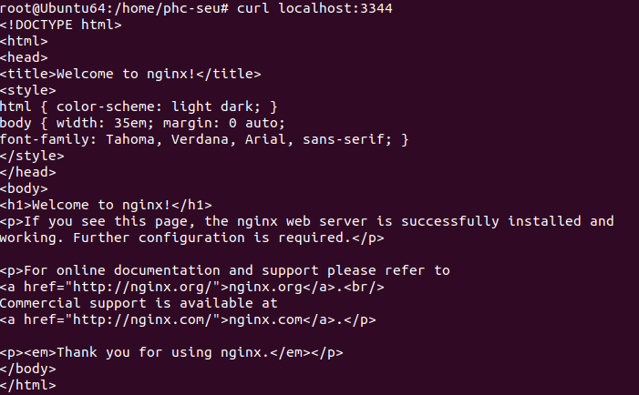
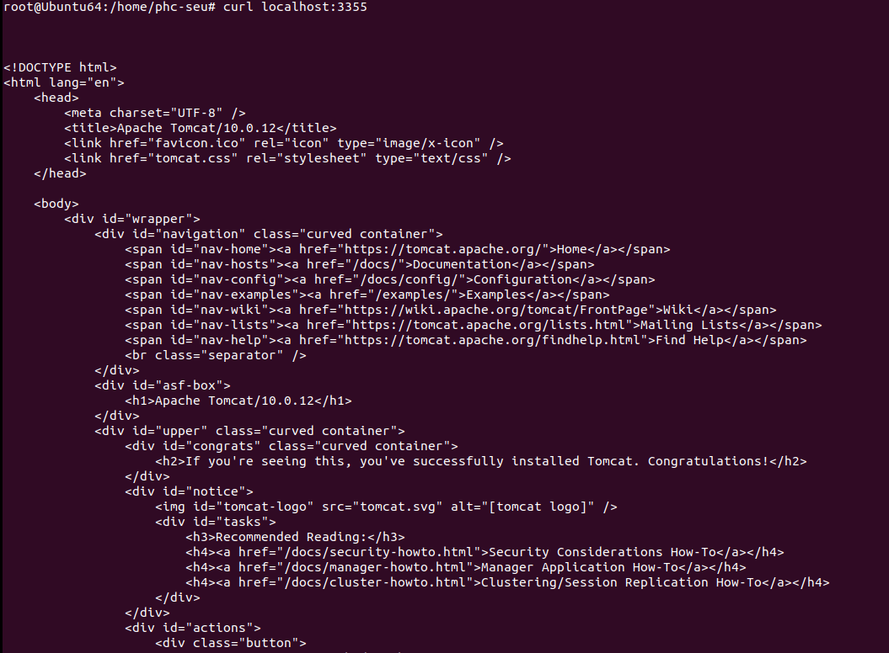
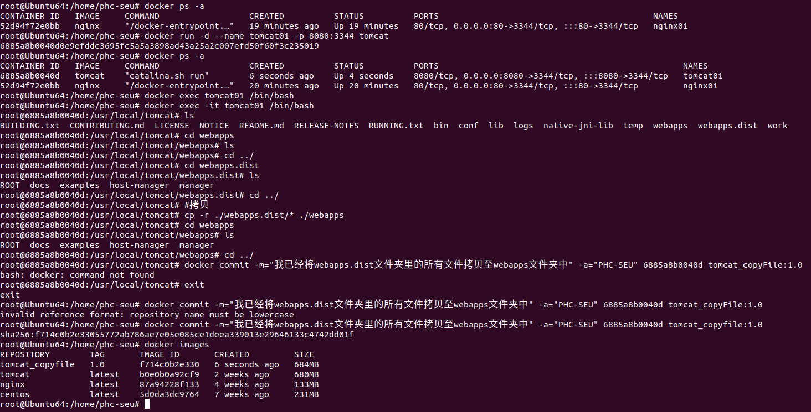
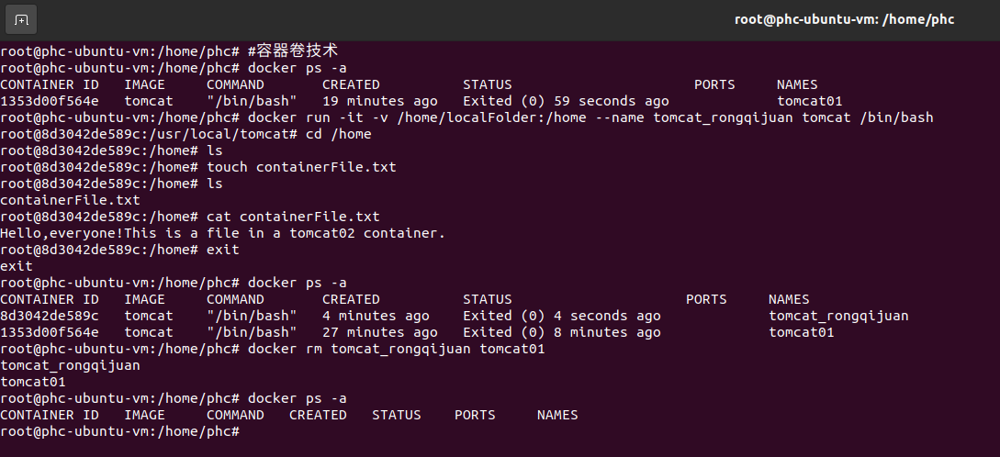
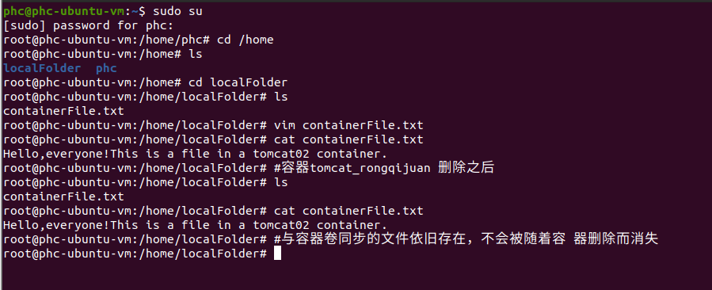

# Docker学习笔记


[toc]


### 一、docker概述

> 推荐的笔记：[狂神说docker(最全笔记）_烟霞畔的博客-CSDN博客_狂神说docker笔记](https://blog.csdn.net/qq_21197507/article/details/115071715)
>
> 推荐的视频：[【狂神说Java】Docker最新超详细版教程通俗易懂_哔哩哔哩_bilibili](https://www.bilibili.com/video/BV1og4y1q7M4?from=search&seid=11435706157147485821&spm_id_from=333.337.0.0)
>
> 不可变基础设施：主机OS与服务器运行环境（服务器程序、源代码、已编译的二进制文件）分离，只设置一次运行环境，之后不发生变更。
>
> 传统下开发出一套软件出来，需要运维去单独部署环境，这就会出现一种情况：同样一个程序在开发人员的电脑环境上运行是没有问题的，但是在运维部署的环境中却会出现各种各样的问题。这也是导致开发人员何运维人员有很大冲突的地方。
>
> Docker的出现为我们彻底解决了这一问题：Docker可以将开发人员的程序和运行环境（镜像）一起打包给运维人员，运维只需要下载然后运行测试即可，其使用的环境与开发人员使用的环境一模一样。
>
> 
>
> 从docker的logo可以看出其实现的核心思想：将不同的“箱子”隔离开来，将软件和环境打包装箱。Docker也很轻巧！
>
> 百度百科：[Docker 可以让开发者打包他们的应用以及依赖包到一个轻量级、可移植的容器中，然后发布到任何流行的 Linux 机器上，也可以实现虚拟化。容器是完全使用沙箱机制，相互之间不会有任何接口（类似 iPhone 的 app）,更重要的是容器性能开销极低。]
>
> [Docker的官方文档](https://docs.docker.com/)
>
> * Docker实现原理
>
> 
>
> 1. **镜像(image)**
>
>    docker镜像就好比一个模板，可以通过这个模板来创建容器服务，通过一个镜像可以创建多个容器。一般镜像可以存放在仓库(repository)中。
>
> 2. **容器(container)**
>
>    Docker利用容器技术，独立运行一个或一组应用，这是通过镜像来创建的。
>
>    你也可以把容器理解为一个简易的linux系统
>
> 3. **仓库(repository)**
>
>    仓库就是存放镜像的地方；
>
>    仓库分为公有仓库和私有仓库；
>
>    Docker Hub(境外仓库)、阿里云、华为云都有容器服务器(配置镜像加速)


### 二、Docker安装

> 1. 安装环境：```Ubuntu-20.04.3``` 操作系统
>
> 2. 获取```ubuntu```管理员权限
>
>    * ```shell
>       sudo su
>      ```
>
> 3. 安装步骤
>
>    * 移除加锁的文件（否则会安装失败）
>
>      ```shell
>     sudo rm /var/lib/apt/lists/lock
>      ```
>
>    * 数据包升级
>
>      ```shell
>     sudo apt-get update
>      ```
>
>    * 安装 ```docker.io``` （过程比较漫长，注意网络不要中断）
>
>      ```shell
>     sudo apt install docker.io
>      ```
>
>    * 将 ```/user/bin/docker.io``` 可执行文件链接到 ```/user/local/bin/docker``` 并使用
>
>      ```shell
>     sudo ln -sf /user/bin/docker.io /user/local/bin/docker
>      ```
>
>    * 判断```docker```是否安装成功（查看```docker```的版本号）
>
>      ```shell
>       docker -v
>      ```
>


### 三、Docker命令

> ```Docker```命令需要使用```sudo docker```作为前缀，当然也可以直接进入```root```权限，这样```docker```命令就不用每次都加上```sudo```权限获取命令了。
>
> 

#### 镜像命令

> 1. 使用```search```命令搜索镜像
>
>    ```shell
>    #格式：sudo docker research 镜像名
>    sudo docker search kalilinux
>    ```
>
> 2. 使用```pull```命令下载镜像
>
>    ```shell
>    #格式：sudo docker pull 镜像名:版本号
>    sudo docker pull kalilinux/kali-rolling:latest
>    ```
>
> 3. 使用```rmi```命令删除镜像
>
>    ```shell
>    #格式：sudo docker rmi 镜像名:版本号
>    sudo docker rmi kalilinux/kali-rolling:latest
>    ```
>
> 4. 使用```images```查看所有的镜像
>
>    ```shell
>    sudo docker images
>    sudo docker images kalilinux
>    ```
>

#### 容器命令

> 1. 使用run命令创建容器
>
>    ```shell
>    #格式：sudo run 选项 镜像名称 要运行的文件
>    sudo docker run -i -t --name KaLi kalilinux/kali-rolling /bin/bash
>    #解释：
>    #-i(interactive)	指定可以在运行的Bash Shell中进行输入
>    #-t(Pseudo-tty)	指定可以在运行的Bash Shell中进行输入
>    #--name	后面指定容器的名字，一般需要设置，以方便之后进行容器的引用
>    #/bin/bash	这是镜像的一个执行文件
>    
>    #编写一段后台运行的shell脚本
>    docker run -d centos /bin/sh -c "i=1;while i<=10;do echo 'PHC NB';i++;sleep 3;done;"
>    ```
>
> 2. 使用```ps```来查看容器列表
>
>    ```shell
>    #只查看当前运行的容器
>    sudo docker ps
>    #查看所有的容器（包括运行和中止的容器）
>    sudo docker ps -a
>    ```
>
> 3. 使用```start```命令启动容器
>
>    ```shell
>    #格式：sudo docker start 容器名称（也可以使用容器ID）
>    sudo docker start KaLi
>    ```
>
> 4. 使用```restart```命令来重启容器
>
>    ```shell
>    #格式：sudo docker restart 容器名称（也可以使用容器ID）
>    sudo docker restart KaLi
>    ```
>
> 5. 使用```attach```命令来连接容器，也可以进入在后台运行中的容器。
>
>    ```shell
>    #格式：sudo docker attach 容器名称（也可以使用容器ID）
>    sudo docker attach KaLi
>    
>    #格式：sudo docker attach 容器名称（容器ID）
>    #以sudo docker attach的命令是进入容器正在执行的终端，不会打开一个新的终端，这点需要跟sudo docker exec进行区分。
>    sudo docker attach KaLi
>    ```
>
> 6. 使用```exec```命令可以从外部运行容器内部的命令（要求容器处于运行状态），也可以进入在后台运行中的容器。
>
>    ```shell
>    #格式：sudo docker exec 容器名（容器ID） 命令行
>    sudo docker exec KaLi echo "Hello,World!"
>    
>    #以交互的形式进入在后台运行中的容器（进入容器后开启一个新的终端）
>    #格式：sudo docker exec -it 容器名(容器ID) bin/bash
>    sudo docker exec -it KaLi bin/bash
>    ```
>
> 7. 使用```stop```命令终止容器
>
>    ```shell
>    #格式：sudo docker stop 容器名称（也可以使用容器ID）
>    sudo docker stop KaLi 
>    ```
>
> 8. 使用```rm```命令删除容器
>
>    ```shell
>    #格式：sudo docker rm 容器名称（也可以使用容器ID）
>    sudo docker rm KaLi
>    ```
>

#### 其他命令

> 1. 使用```logs```查看日志
>
>    ```shell
>    #格式：docker logs -tf --tail 日志显示的条数 容器名（容器ID）
>    docker logs -tf --tail 10 test
>    ```
>
> 2. 使用```inspect```查看容器的详细信息（元数据）
>
>    ```shell
>    #格式：docker inspect 容器名（容器ID）
>    docker inspect test
>    ```
>
> 3. 使用```top```查看```docker```的进程ID
>
>    ```shell
>    #格式：docker top 容器名（容器ID）
>    docker top test
>    ```
>
> 4. 将容器内的文件拷贝到主机上
>
>    ```shell
>    #格式：docker cp 容器ID:容器内文件的地址 主机存放文件的地址
>    docker cp b78453025116:/home/test_file.txt ./home/test_dir
>    ```
>


### 四、Docker部署软件实战

##### ```Docker```安装```Nginx```

1. ```Nginx```的部署和应用命令

```shell
# 1. 搜索镜像 search 建议去docker hub搜索，可以看到帮助文档
# 2. 下载镜像 pull
# 3. 运行测试
[root@iZ2zeg4ytp0whqtmxbsqiiZ home]# docker images
REPOSITORY          TAG                 IMAGE ID            CREATED             SIZE
centos              latest              0d120b6ccaa8        32 hours ago        215MB
nginx               latest              08393e824c32        7 days ago          132MB
 
# -d 后台运行
# -name 给容器命名
# -p 宿主机端口：容器内部端口
[root@iZ2zeg4ytp0whqtmxbsqiiZ home]# docker run -d --name nginx01 -p 3344:80 nginx  # 后台方式启动启动镜像
fe9dc33a83294b1b240b1ebb0db9cb16bda880737db2c8a5c0a512fc819850e0
[root@iZ2zeg4ytp0whqtmxbsqiiZ home]# docker ps
CONTAINER ID        IMAGE               COMMAND                  CREATED             STATUS              PORTS                  NAMES
fe9dc33a8329        nginx               "/docker-entrypoint.…"   4 seconds ago       Up 4 seconds        0.0.0.0:3344->80/tcp   nginx01
[root@iZ2zeg4ytp0whqtmxbsqiiZ home]# curl localhost:3344    # 本地访问测试
 
# 进入容器
[root@iZ2zeg4ytp0whqtmxbsqiiZ home]# docker exec -it nginx01 /bin/bash
root@fe9dc33a8329:/# whereis nginx
nginx: /usr/sbin/nginx /usr/lib/nginx /etc/nginx /usr/share/nginx
root@fe9dc33a8329:/# cd /etc/nginx/
root@fe9dc33a8329:/etc/nginx# ls
conf.d      koi-utf  mime.types  nginx.conf   uwsgi_params
fastcgi_params  koi-win  modules     scgi_params  win-utf
```

2. 本地访问测试



3. 端口暴露概念


##### ```docker```安装```Tomcat```

1. ```docker```的部署和运用命令

   ```shell
   # 官方的使用（目前不建议）
   docker run -it --rm tomcat:latest
    
   # 我们之前的启动都是后台的，停止了容器之后， 容器还是可以查到，docker run -it --rm 一般用来测试，用完就删
    
   # 下载再启动
   docker pull tomcat
    
   # 启动运行
   docker run -d -p 3344:8080 --name tomcat01 tomcat
    
   # 测试访问没有问题
    
   # 进入容器
   docker exec -it tomcat01 /bin/bash
   
   #列出tomcat01容器下的所有文件，分别进入webapps和webapps.dist文件夹，发现webapps文件夹里面是空的，而webapps.dist文件夹含有可以访问3344端口的执行文件，但程序默认是去webapps文件夹去找执行文件的。所以我们可以将webapps.dist文件夹里的文件全部拷贝到webapps文件夹中。
   ls
   cd webapps
   ls
   cd ../
   cd webapps.dist
   ls
   cd ../
   cp -r ./webapps.dist/* ./webapps
   
   #通过8080本地端口访问3344端口
   curl localhost:3344
   
   # 发现问题：1.linux命令少了， 2. webapps下内容为空，阿里云镜像默认是最小的镜像，所有不必要的都剔除了，保证最小可运行环境即可
   ```

2. 通过```curl localhost:3344```访问3344端口

   

##### ```Docker```部署```es(elasticsearch)```和```kibana```

```shell
# es 暴露的端口很多
# es 十分的耗内存
# es 的数据一般需要放置到安全目录！ 挂载
# --net somenetwork 网络配置
 
# 启动elasticsearch
docker run -d --name elasticsearch --net somenetwork -p 9200:9200 -p 9300:9300 -e "discovery.type=single-node" elasticsearch:7.6.2
 
[root@iZ2zeg4ytp0whqtmxbsqiiZ home]# docker run -d --name elasticsearch -p 9200:9200 -p 9300:9300 -e "discovery.type=single-node" elasticsearch:7.6.2
a920894a940b354d3c867079efada13d96cf9138712c76c8dea58fabd9c7e96f
 
# 启动了linux就卡主了，docker stats 查看cpu状态
 
# 测试一下es成功了
[root@iZ2zeg4ytp0whqtmxbsqiiZ home]# curl localhost:9200
{
  "name" : "a920894a940b",
  "cluster_name" : "docker-cluster",
  "cluster_uuid" : "bxE1TJMEThKgwmk7Aa3fHQ",
  "version" : {
    "number" : "7.6.2",
    "build_flavor" : "default",
    "build_type" : "docker",
    "build_hash" : "ef48eb35cf30adf4db14086e8aabd07ef6fb113f",
    "build_date" : "2020-03-26T06:34:37.794943Z",
    "build_snapshot" : false,
    "lucene_version" : "8.4.0",
    "minimum_wire_compatibility_version" : "6.8.0",
    "minimum_index_compatibility_version" : "6.0.0-beta1"
  },
  "tagline" : "You Know, for Search"
}
 
# 增加内存限制，修改配置文件 -e 环境配置修改
docker run -d --name elasticsearch -p 9200:9200 -p 9300:9300 -e "discovery.type=single-node" -e ES_JAVA_OPTS="-Xms64m -Xmx512m" elasticsearch:7.6.2
```

### 五、```Docker```可视化

1. Rancher（CI/CD再用）

2. portainer

* 可视化界面

  

* 安装命令

  ```shell
  docker run -d -p 8088:9000 --restart=always -v /var/run/docker.sock:/var/run/docker.sock --privileged=true portainer/portainer
   
  # 测试
  [root@iZ2zeg4ytp0whqtmxbsqiiZ home]# curl localhost:8088
  <!DOCTYPE html
  ><html lang="en" ng-app="portainer">
   
  # 外网访问 http://ip:8088
  ```

### 六、```Docker```镜像原理

Docker镜像都是只读的，当容器启动时， 一个新的可写层被加载到镜像的顶部！这一层就是我们通常说的容器层， 容器之下的都叫做镜像层。


* ```docker commit```提交创建或修改的镜像

  ```shell
  docker commit 提交容器成为一个新的版本
   
  # 命令和git 原理类似
  docker commit -m="提交的描述信息" -a="作者" 容器id 目标镜像名：[TAG]
   
  docker commit -a="PHC-SEU" -m="add webapps app" d798a5946c1f tomcat007:1.0
  ```

* 实战

  ```shell
  # 1. 启动一个默认的tomcat
  # 2. 发现这个默认的tomcat是没有webapps应用， 镜像的原因，官方镜像默认webapps下面是没有内容的
  # 3. 我自己拷贝进去了基本的文件
  # 4. 将我们操作过的容器通过commit提价为一个镜镜像！我们以后就使用我们自己制作的镜像了
  ```

  

### 七、容器数据卷技术

##### 问题提出

> * Docker镜像技术：将应用和环境打包成一个镜像！
>
> 一般而言，数据会存放在容器中，如果我们把容器删除了，那么就会导致容器里的数据丢失！
>
> 需求：数据可以持久化
>
> MySQL，容器删了，删库跑路！需求：MySQL数据可以存储在本地！
>
> * 容器之间可以有一个数据共享技术！Docker容器中产生的数据，同步到本地！容器删除后，本地的数据不会被清除
>
> 这就是**容器数据卷技术**，目录的挂载，将我们容器内的目录挂载到linux目录上面！
>
> **总结： **容器的持久化和同步操作！容器间数据也是可以共享的

##### 使用数据卷

>1. 使用```docker run ... -v```来启动数据卷技术
>
>   ```shell
>   #格式：sudo docker run -it -v 主机目录:容器目录 [--name 容器名] 镜像名 /bin/bash
>   
>   sudo docker run -it -v /home/localFolder:/home --name tomcat_rongqijuan tomcat /bin/bash
>   ```
>
>2. 进入容器内部的```/home```文件夹并且新建一个共享文件```containerFile.txt```
>
>   ```shell
>   root@phc-ubuntu-vm:/home/phc# #容器卷技术
>   root@phc-ubuntu-vm:/home/phc# docker ps -a
>   CONTAINER ID   IMAGE     COMMAND       CREATED          STATUS                      PORTS     NAMES
>   1353d00f564e   tomcat    "/bin/bash"   19 minutes ago   Exited (0) 59 seconds ago             tomcat01
>   root@phc-ubuntu-vm:/home/phc# docker run -it -v /home/localFolder:/home --name tomcat_rongqijuan tomcat /bin/bash
>   root@8d3042de589c:/usr/local/tomcat# cd /home
>   root@8d3042de589c:/home# ls
>   root@8d3042de589c:/home# touch containerFile.txt
>   root@8d3042de589c:/home# ls
>   containerFile.txt
>   ```
>
>3. 在主机```/home```文件夹下新建```localFolder```文件夹来存放与容器```tomcat_rongqijuan```共享的数据，并查看该文件夹下是否有容器内部共享的文件```containerFile.txt```
>
>   ```shell
>   phc@phc-ubuntu-vm:~$ sudo su
>   [sudo] password for phc: 
>   root@phc-ubuntu-vm:/home/phc# cd /home
>   root@phc-ubuntu-vm:/home# ls
>   localFolder  phc
>   root@phc-ubuntu-vm:/home# cd localFolder
>   root@phc-ubuntu-vm:/home/localFolder# ls
>   containerFile.txt
>   ```
>
>4. 在主机上写入```containerFile.txt```文件，看容器内的文件是否同步
>
>   ```shell
>   #主机
>   root@phc-ubuntu-vm:/home/localFolder# vim containerFile.txt
>   root@phc-ubuntu-vm:/home/localFolder# cat containerFile.txt
>   Hello,everyone!This is a file in a tomcat02 container.
>   #容器内部
>   root@8d3042de589c:/home# cat containerFile.txt
>   Hello,everyone!This is a file in a tomcat02 container.
>   
>   ```
>
>5. 退出并删除容器，看主机的共享文件```containerFile.txt```是否也会被删除（否）
>
>   ```shell
>   #容器内部
>   root@8d3042de589c:/home# exit
>   exit
>   root@phc-ubuntu-vm:/home/phc# docker ps -a
>   CONTAINER ID   IMAGE     COMMAND       CREATED          STATUS                     PORTS     NAMES
>   8d3042de589c   tomcat    "/bin/bash"   4 minutes ago    Exited (0) 4 seconds ago             tomcat_rongqijuan
>   1353d00f564e   tomcat    "/bin/bash"   27 minutes ago   Exited (0) 8 minutes ago             tomcat01
>   root@phc-ubuntu-vm:/home/phc# docker rm tomcat_rongqijuan tomcat01
>   tomcat_rongqijuan
>   tomcat01
>   root@phc-ubuntu-vm:/home/phc# docker ps -a
>   CONTAINER ID   IMAGE     COMMAND   CREATED   STATUS    PORTS     NAMES
>   #主机
>   root@phc-ubuntu-vm:/home/localFolder# #容器tomcat_rongqijuan 删除之后
>   root@phc-ubuntu-vm:/home/localFolder# ls
>   containerFile.txt
>   root@phc-ubuntu-vm:/home/localFolder# cat containerFile.txt
>   Hello,everyone!This is a file in a tomcat02 container.
>   root@phc-ubuntu-vm:/home/localFolder# #与容器卷同步的文件依旧存在，不会被随着容 器删除而消失
>   ```
>
>6. 效果展现
>
>   * 容器内部操作
>
>   
>
>   * 主机操作
>
>   
>

##### 安装`MySQL`

思考：`MySQL`的数据持久化的问题

```shell
# 获取镜像
[root@iZ2zeg4ytp0whqtmxbsqiiZ home]# docker pull mysql:5.7
 
# 运行容器， 需要做数据挂载！ # 安装启动mysql，需要配置密码（注意）
# 官方测试， docker run --name some-mysql -e MYSQL_ROOT_PASSWORD=my-secret-pw -d mysql:tag
 
# 启动我们的
-d      # 后台运行
-p      # 端口隐射
-v      # 卷挂载
-e      # 环境配置
--name  # 容器的名字
[root@iZ2zeg4ytp0whqtmxbsqiiZ home]# docker run -d -p 3344:3306 -v /home/mysql/conf:/etc/mysql/conf.d -v /home/mysql/data:/var/lib/mysql -e MYSQL_ROOT_PASSWORD=123456 --name mysql01 mysql:5.7
9552bf4eb2b69a2ccd344b5ba5965da4d97b19f2e1a78626ac1f2f8d276fc2ba
 
# 启动成功之后，我们在本地使用navicat链接测试一下
# navicat链接到服务器的3344 --- 3344 和 容器的3306映射，这个时候我们就可以连接上mysql喽！
 
# 在本地测试创建一个数据库，查看下我们的路径是否ok！
```


##### 匿名挂载和具名挂载

```shell
# 匿名挂载
#格式：-v 容器内路径
docker run -d -P --name nginx01 -v /etc/nginx nginx     # -P 随机指定端口
 
 #注：-P	随机端口
# 查看所有volume的情况
[root@iZ2zeg4ytp0whqtmxbsqiiZ ~]# docker volume ls
DRIVER              VOLUME NAME
local               561b81a03506f31d45ada3f9fb7bd8d7c9b5e0f826c877221a17e45d4c80e096
local               36083fb6ca083005094cbd49572a0bffeec6daadfbc5ce772909bb00be760882
 
# 这里发现，这种情况就是匿名挂载，我们在-v 后面只写了容器内的路径，没有写容器外的路径！
 
# 具名挂载
[root@iZ2zeg4ytp0whqtmxbsqiiZ ~]# docker run -d -P --name nginx02 -v juming-nginx:/etc/nginx nginx
26da1ec7d4994c76e80134d24d82403a254a4e1d84ec65d5f286000105c3da17
[root@iZ2zeg4ytp0whqtmxbsqiiZ ~]# docker ps
CONTAINER ID        IMAGE               COMMAND                  CREATED             STATUS              PORTS                   NAMES
26da1ec7d499        nginx               "/docker-entrypoint.…"   3 seconds ago       Up 2 seconds        0.0.0.0:32769->80/tcp   nginx02
486de1da03cb        nginx               "/docker-entrypoint.…"   3 minutes ago       Up 3 minutes        0.0.0.0:32768->80/tcp   nginx01
[root@iZ2zeg4ytp0whqtmxbsqiiZ ~]# docker volume ls
DRIVER              VOLUME NAME
local               561b81a03506f31d45ada3f9fb7bd8d7c9b5e0f826c877221a17e45d4c80e096
local               36083fb6ca083005094cbd49572a0bffeec6daadfbc5ce772909bb00be760882
local               juming-nginx
 
# 通过-v 卷名：容器内的路径
# 查看一下这个卷
# docker volume inspect juming-nginx
 
[root@iZ2zeg4ytp0whqtmxbsqiiZ ~]# docker volume inspect juming-nginx
[
  {
      "CreatedAt": "2020-08-12T18:15:21+08:00",
      "Driver": "local",
      "Labels": null,
      "Mountpoint": "/var/lib/docker/volumes/juming-nginx/_data",
      "Name": "juming-nginx",
      "Options": null,
      "Scope": "local"
  }
]
```

总结：

* 所有docker容器内的卷，没有指定目录的情况下都是在`/var/lib/docker/volumes/xxxxx/_data`
* 我们通过具名挂载可以方便的找到我们的一个卷，大多数情况下使用的是`具名挂载`

拓展

```shell
# 通过 -v 容器内容路径 ro rw 改变读写权限
ro  readonly    # 只读，且表示该路径只能通过宿主机来操作，容器内容无法操作
rw  readwrite   # 可读可写，默认状态
 
docker run -d -P --name nginx02 -v juming-nginx:/etc/nginx:ro nginx
docker run -d -P --name nginx02 -v juming-nginx:/etc/nginx:rw nginx
```

##### 数据卷容器

> * 使用`docker run ... volumes-from 父容器`，命令格式实现容器之间的数据共享
>
> ```shell
> phc@phc-ubuntu-vm:~$ #容器之间共享信息
> phc@phc-ubuntu-vm:~$ sudo su
> [sudo] password for phc: 
> root@phc-ubuntu-vm:/home/phc# sudo docker images
> REPOSITORY                  TAG       IMAGE ID       CREATED        SIZE
> centos/docker_file_images   1.0       59c159d12095   4 hours ago    231MB
> nginx                       latest    04661cdce581   34 hours ago   141MB
> tomcat                      latest    b0e0b0a92cf9   2 weeks ago    680MB
> centos                      latest    5d0da3dc9764   8 weeks ago    231MB
> root@phc-ubuntu-vm:/home/phc# docker run -d --name docker_father centos/docker_file_images:1.0
> root@phc-ubuntu-vm:/home/phc# docker ps -a
> CONTAINER ID   IMAGE                           COMMAND                  CREATED          STATUS                   PORTS     NAMES
> 62355974dd58   centos/docker_file_images:1.0   "/bin/sh -c /bin/bash"   21 seconds ago   Up 20 seconds                      docker_father
> 6a1904e65a0d   centos/docker_file_images:1.0   "/bin/bash"              4 hours ago      Exited (0) 4 hours ago             centos01
> #创建第一个子容器
> #子容器使用`volumes-from 父容器名称（容器ID）`命令实现数据挂载到父容器
> root@phc-ubuntu-vm:/home/phc# docker run -it --name docker_son01 --volumes-from docker_father centos/docker_file_images:1.0 /bin/bash
> [root@93720078a2de /]# ls
> bin  dev  etc  home  lib  lib64  lost+found  media  mnt  opt  proc  root  run  sbin  srv  sys  tmp  usr  var  volume01	volume02
> [root@93720078a2de /]# cd ./volume01
> [root@93720078a2de volume01]# ls
> [root@93720078a2de volume01]# touch shared_file.txt
> [root@93720078a2de volume01]# root@phc-ubuntu-vm:/home/phc# 
> #查看父容器中是否有子容器新建的文件
> root@phc-ubuntu-vm:/home/phc# docker attach docker_father
> [root@62355974dd58 volume01]# ls
> shared_file.txt
> [root@62355974dd58 volume01]# read escape sequence
> #创建第二个子容器
> root@phc-ubuntu-vm:/home/phc# docker run -it --name docker_son02 --volumes-from docker_father centos/docker_file_images:1.0 /bin/bash
> [root@f5fd4365c00e /]# ls
> bin  dev  etc  home  lib  lib64  lost+found  media  mnt  opt  proc  root  run  sbin  srv  sys  tmp  usr  var  volume01	volume02
> [root@f5fd4365c00e /]# cd volume01
> [root@f5fd4365c00e volume01]# ls
> shared_file.txt
> [root@f5fd4365c00e volume01]# touch share_file02.txt
> [root@f5fd4365c00e volume01]# ls
> share_file02.txt  shared_file.txt
> [root@f5fd4365c00e volume01]# root@phc-ubuntu-vm:/home/phc# 
> root@phc-ubuntu-vm:/home/phc# docker attach docker_son01
> [root@93720078a2de volume01]# ls
> share_file02.txt  shared_file.txt
> #停止并删除父容器查看子容器里的共享文件是否也会被删除掉（答案是子容器的共享文件不会被删除掉）
> [root@93720078a2de volume01]# docker stop docker_father
> bash: docker: command not found
> [root@93720078a2de volume01]# read escape sequence
> root@phc-ubuntu-vm:/home/phc# docker attach docker_father
> [root@62355974dd58 volume01]# exit
> exit
> root@phc-ubuntu-vm:/home/phc# docker rm -f docker_father
> docker_father
> root@phc-ubuntu-vm:/home/phc# docker ps -a
> CONTAINER ID   IMAGE                           COMMAND       CREATED              STATUS                   PORTS     NAMES
> f5fd4365c00e   centos/docker_file_images:1.0   "/bin/bash"   About a minute ago   Up About a minute                  docker_son02
> 93720078a2de   centos/docker_file_images:1.0   "/bin/bash"   4 minutes ago        Up 4 minutes                       docker_son01
> 6a1904e65a0d   centos/docker_file_images:1.0   "/bin/bash"   4 hours ago          Exited (0) 4 hours ago             centos01
> root@phc-ubuntu-vm:/home/phc# docker attach docker_son02
> #删除掉父容器后，子容器中依旧有共享的数据文件
> [root@f5fd4365c00e volume01]# ls
> share_file02.txt  shared_file.txt
> ```
>
> * 实现原理和过程
>
>   原理：`volumes-from`数据挂载是将父容器的文件拷贝（复制）到子容器中的，同样挂载点的文件中如果出现更新，将会重新拷贝给其他的容器，这样就实现了数据共享。这也是为什么把父容器删除后，子容器中依旧有共享的数据的原因了。
>
> 
>
> * 结论：
>
>   （1）容器之间配置信息的传递， 数据卷容器的声明周期一直持续到没有容器使用为止。
>
>   （2）但是一旦你持久化到了本地，这个时候，本地的数据是不会删除的！

### 八、`DockerFile`

##### 初识`DockerFile`

> DockerFile是用于创建属于自己的docker镜像的文件，构建步骤如下：
>
> 1. 编写一个dockerFile文件（创建脚本）
>
>    ```shell
>    # 创建一个dockerfile文件， 名字可以随机
>    # 文件的内容 指定（大写） 参数
>    #脚本内容
>    FROM centos
>    VOLUME ["volume01", "volume02"]
>    CMD echo "----end----"
>    CMD /bin/bash
>    # 这里的每一个命令都是镜像的一层！
>    ```
>
> 2. 通过```docker build```构建成为一个镜像
>
>    
>
> 
>
> 3. ```docker run```运行一个镜像（启动一个容器）
>
>    
>
>    
>
>    ```shell
>    #格式：docker inspect 容器ID
>    #查看主机和容器内的文件挂载
>    ```
>
>    
>
>    * 测试一下刚才的文件是否同步到主机上了！
>
>    * 这种方式我们未来使用的十分多， 因为我们通常会构建自己的镜像！
>
>    * 假设构建镜像时候没有挂载卷，要手动镜像挂载 -v 卷名:容器内路径！
>
> 4. ```docker push```发布镜像(DockerHub、阿里云镜像)
>
> 官方镜像也使用了`DockerFile`编写
>
> 
>
> 
>
> 
>
> 很多官方镜像都像是基础包，很多功能都不具备，我们通常会自己搭建自己的镜像！

##### `DockerFile`的构建

* 基础知识

  > 1. 每个保留关键字（指令）都是必须大写字母
  > 2. 执行从上到下顺序执行
  > 3. `#` 表示注释
  > 4. 每个指令都会创建提交一个新的镜像层，并提交！
  >
  > 
  >
  > * 学习`DockerFile`的理由：
  >
  >   dockerFile是面向开发的， 我们以后要发布项目， 做镜像， 就需要编写dockefile文件， 这个文件十分简单！
  >
  >   Docker镜像逐渐成为企业的交互标准，必须要掌握！
  >
  >   步骤：开发，部署， 运维..... 缺一不可！
  >
  >   DockerFile： 构建文件， 定义了一切的步骤，源代码
  >
  >   DockerImages： 通过DockerFile构建生成的镜像， 最终发布和运行的产品！
  >
  >   Docker容器：容器就是镜像运行起来提供服务器

##### `DockerFile`常用命令

> ```shell
> FROM            # 基础镜像，一切从这里开始构建
> MAINTAINER      # 镜像是谁写的， 姓名+邮箱
> RUN             # 镜像构建的时候需要运行的命令
> ADD             # 添加内容。步骤， tomcat镜像， 这个tomcat压缩包！
> WORKDIR         # 镜像的工作目录
> VOLUME          # 挂载的主机目录
> EXPOSE          # 保留端口配置
> CMD             # 指定这个容器启动的时候要运行的命令，只有最后一个会生效可被替代
> ENTRYPOINT      # 指定这个容器启动的时候要运行的命令， 可以追加命令
> ONBUILD         # 当构建一个被继承DockerFile 这个时候就会运行 ONBUILD 的指令，触发指令
> COPY            # 类似ADD, 将我们文件拷贝到镜像中
> ENV             # 构建的时候设置环境变量！
> ```
>
> 
>
> ```shell
> #CMD命令与ENTRYPOINT命令的区别
> CMD         # 指定这个容器启动的时候要运行的命令，只有最后一个会生效可被替代
> ENTRYPOINT      # 指定这个容器启动的时候要运行的命令， 可以追加命令
> #举个栗子
> #-----------测试CMD命令-----------
> # 1. 编写dockerfile文件
> [root@iZ2zeg4ytp0whqtmxbsqiiZ dockerfile]# vim dockerfile-cmd-test 
> FROM centos
> CMD ["ls", "-a"]
>  
> # 2. 构建镜像
> [root@iZ2zeg4ytp0whqtmxbsqiiZ dockerfile]# docker build -f dockerfile-cmd-test -t cmdtest .
>  
> # 3. run运行， 发现我们的ls -a 命令生效
> [root@iZ2zeg4ytp0whqtmxbsqiiZ dockerfile]# docker run ebe6a52bb125
> .
> ..
> .dockerenv
> bin
> dev
> etc
> home
> lib
> lib64
>  
> # 想追加一个命令 -l 变成 ls -al
> [root@iZ2zeg4ytp0whqtmxbsqiiZ dockerfile]# docker run ebe6a52bb125 -l
> docker: Error response from daemon: OCI runtime create failed: container_linux.go:349: starting container process caused "exec: \"-l\": executable file not found in $PATH": unknown.
> [root@iZ2zeg4ytp0whqtmxbsqiiZ dockerfile]# docker run ebe6a52bb125 ls -l
>  
> # cmd的情况下 -l替换了CMD["ls", "-a"]命令， -l不是命令，所以报错了
> 
> #-----------测试ENTRYPOINT命令-----------
> # 1. 编写dockerfile文件
> [root@iZ2zeg4ytp0whqtmxbsqiiZ dockerfile]# vim dockerfile-entrypoint-test 
> FROM centos
> ENTRYPOINT ["ls", "-a"]
>  
> # 2. 构建文件
> [root@iZ2zeg4ytp0whqtmxbsqiiZ dockerfile]# docker build -f dockerfile-entrypoint-test -t entrypoint-test .
>  
> # 3. run运行 发现我们的ls -a 命令同样生效
> [root@iZ2zeg4ytp0whqtmxbsqiiZ dockerfile]# docker run entrypoint-test
> .
> ..
> .dockerenv
> bin
> dev
> etc
> home
> lib
> # 4. 我们的追加命令， 是直接拼接到ENTRYPOINT命令的后面的！
> [root@iZ2zeg4ytp0whqtmxbsqiiZ dockerfile]# docker run entrypoint-test -l
> total 56
> drwxr-xr-x  1 root root 4096 Aug 13 07:52 .
> drwxr-xr-x  1 root root 4096 Aug 13 07:52 ..
> -rwxr-xr-x  1 root root    0 Aug 13 07:52 .dockerenv
> lrwxrwxrwx  1 root root    7 May 11  2019 bin -> usr/bin
> drwxr-xr-x  5 root root  340 Aug 13 07:52 dev
> drwxr-xr-x  1 root root 4096 Aug 13 07:52 etc
> drwxr-xr-x  2 root root 4096 May 11  2019 home
> lrwxrwxrwx  1 root root    7 May 11  2019 lib -> usr/lib
> lrwxrwxrwx  1 root root    9 May 11  2019 lib64 -> usr/lib64
> drwx------  2 root root 4096 Aug  9 21:40 lost+found
> 
> ```
>
> 

##### 创建一个属于自己的centos

> ```shell
> phc@phc-ubuntu-vm:~$ #实战练习——编写自己的centos
> phc@phc-ubuntu-vm:~$ sudo su
> root@phc-ubuntu-vm:/home/phc# docker images
> REPOSITORY   TAG       IMAGE ID       CREATED       SIZE
> nginx        latest    04661cdce581   3 days ago    141MB
> tomcat       latest    b0e0b0a92cf9   3 weeks ago   680MB
> centos       latest    5d0da3dc9764   8 weeks ago   231MB
> root@phc-ubuntu-vm:/home/phc# docker ps -a
> CONTAINER ID   IMAGE     COMMAND   CREATED   STATUS    PORTS     NAMES
> root@phc-ubuntu-vm:/# cd /home/phc
> root@phc-ubuntu-vm:/home/phc# ls
> Desktop  Documents  Downloads  Music  Pictures  Public  Shared_to_VM_Ubuntu64  snap  Templates  Videos
> root@phc-ubuntu-vm:/home/phc# mkdir localdockerfile
> root@phc-ubuntu-vm:/home/phc# cd localdockerfile
> root@phc-ubuntu-vm:/home/phc/localdockerfile# vim mycentos.txt
> root@phc-ubuntu-vm:/home/phc/localdockerfile# cat mycentos.txt
> #This is my centos created by myself
> 
> FROM centos
> 
> MAINTAINER phc<220215302@seu.edu.cn>
> 
> ENV MYPATH /home/phc/localdockerfile
> WORKDIR $MYPATH     # 镜像的工作目录
>  
> RUN yum -y install vim
> RUN yum -y install net-tools
> 
> EXPOSE 80
> 
> CMD echo $MYPATH
> CMD echo "------END------"
> CMD /bin/bash
> 
> root@phc-ubuntu-vm:/home/phc/localdockerfile# docker build -f ./mycentos.txt -t mycentos:0.1 .
> #安装mycentos镜像的进程省略
> root@phc-ubuntu-vm:/home/phc/localdockerfile# docker images
> REPOSITORY   TAG       IMAGE ID       CREATED          SIZE
> mycentos     0.1       c0441c0ab9eb   21 seconds ago   340MB
> nginx        latest    04661cdce581   3 days ago       141MB
> tomcat       latest    b0e0b0a92cf9   3 weeks ago      680MB
> centos       latest    5d0da3dc9764   8 weeks ago      231MB
> root@phc-ubuntu-vm:/home/phc/localdockerfile# docker run -it --name centos_container centos /bin/bash
> [root@bfeb9ca99755 /]# pwd
> /
> [root@bfeb9ca99755 /]# vim test.txt
> bash: vim: command not found
> [root@bfeb9ca99755 /]# ifconfig
> bash: ifconfig: command not found
> [root@bfeb9ca99755 /]# exit
> exit
> 
> root@phc-ubuntu-vm:/home/phc/localdockerfile# docker run -it --name mycentos_container mycentos:0.1 /bin/bash
> [root@cc046a0207ad localdockerfile     # 镜像的工作目录]# pwd
> /home/phc/localdockerfile     # 镜像的工作目录
> [root@cc046a0207ad localdockerfile     # 镜像的工作目录]# #自动进入我们自己制作的镜像工作目录中
> [root@cc046a0207ad localdockerfile     # 镜像的工作目录]# pwd
> /home/phc/localdockerfile     # 镜像的工作目录
> [root@cc046a0207ad localdockerfile     # 镜像的工作目录]# vim test.txt
> [root@cc046a0207ad localdockerfile     # 镜像的工作目录]# ifconfig
> eth0: flags=4163<UP,BROADCAST,RUNNING,MULTICAST>  mtu 1500
>         inet 172.17.0.2  netmask 255.255.0.0  broadcast 172.17.255.255
>         ether 02:42:ac:11:00:02  txqueuelen 0  (Ethernet)
>         RX packets 28  bytes 3390 (3.3 KiB)
>         RX errors 0  dropped 0  overruns 0  frame 0
>         TX packets 0  bytes 0 (0.0 B)
>         TX errors 0  dropped 0 overruns 0  carrier 0  collisions 0
> 
> lo: flags=73<UP,LOOPBACK,RUNNING>  mtu 65536
>         inet 127.0.0.1  netmask 255.0.0.0
>         loop  txqueuelen 1000  (Local Loopback)
>         RX packets 0  bytes 0 (0.0 B)
>         RX errors 0  dropped 0  overruns 0  frame 0
>         TX packets 0  bytes 0 (0.0 B)
>         TX errors 0  dropped 0 overruns 0  carrier 0  collisions 0
> 
> [root@cc046a0207ad localdockerfile     # 镜像的工作目录]# exit
> exit
> root@phc-ubuntu-vm:/home/phc/localdockerfile# docker ps -a
> CONTAINER ID   IMAGE          COMMAND       CREATED              STATUS                       PORTS     NAMES
> cc046a0207ad   mycentos:0.1   "/bin/bash"   About a minute ago   Exited (0) 3 seconds ago               mycentos_container
> bfeb9ca99755   centos         "/bin/bash"   3 minutes ago        Exited (127) 2 minutes ago             centos_container
> root@phc-ubuntu-vm:/home/phc/localdockerfile# docker history mycentos:0.1
> IMAGE          CREATED         CREATED BY                                      SIZE      COMMENT
> c0441c0ab9eb   5 minutes ago   /bin/sh -c #(nop)  CMD ["/bin/sh" "-c" "/bin…   0B        
> d84306c59122   5 minutes ago   /bin/sh -c #(nop)  CMD ["/bin/sh" "-c" "echo…   0B        
> 4df1a96e26f9   5 minutes ago   /bin/sh -c #(nop)  CMD ["/bin/sh" "-c" "echo…   0B        
> 1d221774ecf2   5 minutes ago   /bin/sh -c #(nop)  EXPOSE 80                    0B        
> d23a4fcccf8f   5 minutes ago   /bin/sh -c yum -y install net-tools             33.8MB    
> 1decd0a8ea64   5 minutes ago   /bin/sh -c yum -y install vim                   75MB      
> 2bf183aeab7e   6 minutes ago   /bin/sh -c #(nop) WORKDIR /home/phc/localdoc…   0B        
> 6afa9d7cd6be   6 minutes ago   /bin/sh -c #(nop)  ENV MYPATH=/home/phc/loca…   0B        
> c65dc7f9e5b7   6 minutes ago   /bin/sh -c #(nop)  MAINTAINER phc<220215302@…   0B        
> 5d0da3dc9764   8 weeks ago     /bin/sh -c #(nop)  CMD ["/bin/bash"]            0B        
> <missing>      8 weeks ago     /bin/sh -c #(nop)  LABEL org.label-schema.sc…   0B        
> <missing>      8 weeks ago     /bin/sh -c #(nop) ADD file:805cb5e15fb6e0bb0…   231MB     
> root@phc-ubuntu-vm:/home/phc/localdockerfile# 
> ```
>
> 