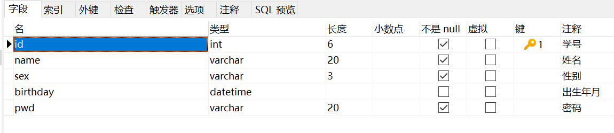

# MySQL学习笔记

---

推荐笔记：[MySQL 学习笔记（狂神说Java-CSDN博客）](https://blog.csdn.net/qq_33956536/article/details/107195051?spm=1001.2101.3001.6650.17&utm_medium=distribute.pc_relevant.none-task-blog-2~default~BlogCommendFromBaidu~Rate-17-107195051-blog-122348560.pc_relevant_multi_platform_whitelistv4&depth_1-utm_source=distribute.pc_relevant.none-task-blog-2~default~BlogCommendFromBaidu~Rate-17-107195051-blog-122348560.pc_relevant_multi_platform_whitelistv4&utm_relevant_index=22)

`SQL`底层原理：http://blog.codinglabs.org/articles/theory-of-mysql-index.html

官方文档：[MySQL 中文文档](https://www.mysqlzh.com/)

## 一、初识MySQL

### 1.1 数据库分类

#### 1.1.1 关系型数据库（SQL）

> eg:	mySQL，Oracle，Sql Server，DB2，SQLite
>
> 通过表与表之间、行与列之间的关系进行数据库的存储。比如学员信息表、考勤表

#### 1.1.2 非关系型数据库（NoSQL，not only sql）

> Redis，MongDB
>
> 非关系型数据库，对象存储，通过对象的自身属性来决定

DBMS，database manage system，数据库管理系统

### 1.2 安装MySQL

> 1. 安装教程：[mysql数据库安装（详细）_体会！的博客-CSDN博客_mysql安装教程](https://blog.csdn.net/weixin_43605266/article/details/110477391)
>
> 2. 安装地址：https://dev.mysql.com/downloads/mysql/5.5.html#downloads
>
> 3. 卸载教程：[如何卸载mysql教程（按照步骤可完全卸载）_码云铁粉的博客-CSDN博客_卸载mysql](https://blog.csdn.net/m0_63270506/article/details/124716918)
>
> 4. 安装Navicat16软件：
>
>    （1）概述：Navicat 是一款快速、高效、可视化的数据库管理软件
>
>    （2）安装教程：[Navicat16.0.13免费永久激活破解教程 - 哔哩哔哩 (bilibili.com)](https://www.bilibili.com/read/cv17235251/)
>
>    
>
>    （3）`navicat`软件的使用：[navicat软件的使用_哔哩哔哩_bilibili](https://www.bilibili.com/video/BV1yA41147Vi/?spm_id_from=333.337.search-card.all.click&vd_source=8afa6885363bb85758bb447427ddb4ec)
>
> 5. MySql连接
>
>    > 用户名：root
>    >
>    > 密码：w8RyCs#>E%25	修改为了 123456
>
> 6. 

## 二、基本命令行操作

### 2.1 连接数据库

```sql
mysql -uroot -p123456
```

```cmd
C:\Users\PengH>D:

D:\>cd D:\Program Files\mysql-8.0.30-winx64\bin

D:\Program Files\mysql-8.0.30-winx64\bin>mysql -uroot -p123456
mysql: [Warning] Using a password on the command line interface can be insecure.
Welcome to the MySQL monitor.  Commands end with ; or \g.
Your MySQL connection id is 25
Server version: 8.0.30 MySQL Community Server - GPL

Copyright (c) 2000, 2022, Oracle and/or its affiliates.

Oracle is a registered trademark of Oracle Corporation and/or its
affiliates. Other names may be trademarks of their respective
owners.

Type 'help;' or '\h' for help. Type '\c' to clear the current input statement.

mysql>
```

### 2.2 SQL基本命令

```sql
SHOW DATABASES;	--显示所有数据库
USE test;	--使用数据库/表
SHOW TABLES;	--显示当前数据库下所有的的表名
DESCRIBE student;	--显示数据库中表的详细信息

CREATE DATABASE test02;
USE test02;

--每条sql语句以;结尾
--这是单行注释
/*
这是
多行
注释
*/
-- 查看sql版本：8.0.30
SELECT VERSION()
```

数据库XXX语言

DDL	数据库定义语言

DML	数据库管理语言

DQL	数据库查询语言

DCL	数据库控制语言

## 三、数据操作

操作数据库--->操作数据库中的表--->操作数据库中表的数据

### 3.1 操作数据库

1. 创建数据库

   ```sql
   /*mysql语句不区分大小写*/
   CREATE DATABASE [IF NOT EXISTS] test03;
   ```

2. 删除数据库

   ```sql
   DROP DATABASE [IF EXISTS] test;
   ```

3. 使用数据库

   ```sql
   USE test03;
   USE `test03`;	--反引号：如果表名或者字段名是一个特殊字符，就需要带上反引号
   ```

4. 查看数据库

   ```sql
   SHOW DATABASES;
   ```

### 3.2 数据库的列类型

> 1. 数值
>
>    * tinyint   十分小的数据   1bytes
>    * smallint   较小的数据   2bytes
>    * mediumint   中等大小的数据   3bytes
>    * **int   标准的整数   4bytes**
>    * bigint   较大的数据   8bytes
>    * float   浮点数   4bytes
>    * double   浮点数   8bytes
>    * **decimal   字符串形式的浮点数   金融计算的时候，一般使用的是decimal数据类型**
>
> 2. 字符串
>
>    * char   字符串固定大小   0-255
>    * **varchar   可变字符串   0-65535   常用类型（类似于string）**
>    * tinytext   微型文本   2^8-1
>    * **text   文本串   2^16-1   保存大文本**
>
> 3. 时间日期
>
>    java.util.Date
>
>    * date   YYYY-MM-DD，日期格式
>    * time   HH:MM:SS，时间格式
>    * **datetime   YYYY-MM-DD  HH:MM:SS，最常用的时间格式**
>    * **timestamp   时间戳，1970.1.1到现在的毫秒数**
>    * year   年份表示
>
> 4. null
>
>    * 没有值，未知
>    * 注意，不要使用NULL进行运算，结果为NULL
>
> 5. 阿里巴巴要求每个表都要求有以下字段：
>
>    ```sql
>    /*
>    id	主键
>    `version`	乐观锁
>    is_delete	伪删除
>    gmt_create	创建时间
>    gmt_update	修改时间
>    */
>    ```
>
>    6. 

### 3.3 创建表

1. sql语句

   ```sql
   SET NAMES utf8mb4;
   SET FOREIGN_KEY_CHECKS = 0;
   
   -- ----------------------------
   -- Table structure for demo
   -- ----------------------------
   DROP TABLE IF EXISTS `demo`;
   CREATE TABLE `demo`  (
     `id` int(6) UNSIGNED ZEROFILL NOT NULL AUTO_INCREMENT COMMENT '学号',
     `name` varchar(20) CHARACTER SET utf8mb3 COLLATE utf8mb3_general_ci NOT NULL COMMENT '姓名',
     `sex` varchar(3) CHARACTER SET utf8mb3 COLLATE utf8mb3_general_ci NOT NULL COMMENT '性别',
     `birthday` datetime NULL DEFAULT NULL COMMENT '出生年月',
     `pwd` varchar(20) CHARACTER SET utf8mb3 COLLATE utf8mb3_general_ci NOT NULL COMMENT '密码',
     PRIMARY KEY (`id`) USING BTREE
   ) ENGINE = InnoDB CHARACTER SET = utf8mb3 COLLATE = utf8mb3_general_ci ROW_FORMAT = Dynamic;
   
   -- ----------------------------
   -- Records of demo
   -- ----------------------------
   
   SET FOREIGN_KEY_CHECKS = 1;
   ```

   ```sql
   DROP TABLE IF EXISTS `teacher`;
   CREATE TABLE `teacher`(
   	`id` int(6) UNSIGNED ZEROFILL NOT NULL AUTO_INCREMENT COMMENT '职工号',
   	`name` VARCHAR(11) NOT NULL COMMENT '名字',
   	`age` int(2) COMMENT '年龄',
   	`sex` VARCHAR(2) COMMENT '性别',
   	PRIMARY KEY(`id`)
   )ENGINE=INNODB CHARACTER SET=utf8mb4;
   ```

   

2. 效果：

   

3. 创建表的模板

   ```sql
   CREATE TABLE IF NOT EXISTS `表名` (
   	`字段名` 列类型 [属性] [索引] [注释],
       `字段名` 列类型 [属性] [索引] [注释],
       ...
       `字段名` 列类型 [属性] [索引] [注释]
   )[表类型][字符集设置][注释]
   ```

   

4. 显示`sql`创建和表的语句

   ```sql
   SHOW CREATE DATABASE `school`;	--查看创建数据库的语句
   SHOW CREATE TABLE `demo`; --查看创建表的语句
   DESC `demo`; --显示表的结构
   ```

### 3.4 修改和删除数据表字段

1. 修改对应表中的字段

   ```sql
   -- 修改表名:ALTER TABLE 旧表名 RENAME AS 新表名;
   ALTER TABLE `teacher` RENAME AS `teacher1`;
   
   -- 添加表的字段:ALTER TABLE 表名 ADD 字段名 列属性;
   ALTER TABLE `teacher1` ADD `height` int(6);
   	
   -- 修改表的字段(修改约束):ALTER TABLE 表名 MODIFY 字段名 约束列属性;
   ALTER TABLE `teacher1` MODIFY `height` VARCHAR(11);
   
   -- 修改表的字段名（字段重命名）:ALTER TABLE 表名 CHANGE 旧字段名 新字段名 列属性;
   ALTER TABLE `teacher1` CHANGE `height` `height1` INT(3);
   ```

   注意区分modify和change修改字段：

   **change用来字段重命名，不能修改字段类型和约束；**
   **modify不用来字段重命名，只能修改字段类型和约束**

2. 删除对应表中的字段

   ```sql
   -- 删除表的字段:ALTER TABLE 表名 DROP 字段名;
   ALTER TABLE IF EXISTS `teacher1` DROP `height1`;
   ```

## 四、数据库引擎与字符集编码

```sql
ENGINE = INNODB
/*
INNODB（默认使用）
MYISAM（早些年使用）
*/
```

|                      | MYISAM |           INNODB            |
| :------------------: | :----: | :-------------------------: |
| 事务（原子操作）支持 | 不支持 |            支持             |
|      数据行锁定      | 不支持 |            支持             |
|       外键约束       | 不支持 |            支持             |
|       全文索引       |  支持  | 支持（MySQL 5.6之后的版本） |
|      表空间大小      |  较小  |   较大，约为MYISAM的两倍    |

1. 常规使用操作：

   * MYISAM      节约空间，速度较快
   * INNODB      安全性高，支持事务的处理，多表多用户操作

2. 在物理空间存在的位置

   所有的数据库文件都存在data目录下（**本质还是文件的存储**），一个文件夹就对应一个数据库

   

   MySQL引擎在物理文件上的区别

   * INNODB

     在数据库表中只有一个`.idb`文件，且`MySQL8.0` 不再单独提供`.frm`文件，而是合并在了`.idb`文件中

   * MYISAM

     `*.frm`	表结构的定义文件

     `*.MYD`	数据文件(data)

     `*.MYI`	索引文件(index)

3. 设置数据库表的字符集编码

   ```sql
   CHARACTER SET = utf8mb3
   ```

   不设置的话会是`MySQL`的默认字符集编码Latin1（不支持中文）

## 五、MySQL数据管理

### 5.1  外键（foreign key）

当表中的主键被其他表所引用为外键（foreign key）时，则该表不能被删除！

> （1）方式一：创建表时添加外键关系
>
> ```sql
> -- 创建年级表grade
> DROP TABLE IF EXISTS `grade`;
> CREATE TABLE `grade`(
> 	`gradeid` int(6) NOT NULL AUTO_INCREMENT COMMENT '年级id',
> 	`gradename` VARCHAR(60) NOT NULL COMMENT '年级名',
> 	PRIMARY KEY(`gradeid`)
> ) ENGINE=INNODB CHARACTER SET=utf8mb4;
> DESC `grade`;
> 
> -- 创建学生表，并让gradeid作为外键，关联年级表的主键gradeid
> DROP TABLE IF EXISTS `student`;
> CREATE TABLE `student`(
> 	`id` int(6) ZEROFILL NOT NULL AUTO_INCREMENT COMMENT '学生id',
> 	`name` VARCHAR(20) NOT NULL COMMENT '姓名',
> 	`birthday` datetime NULL COMMENT '出生年月',
> 	-- 外键gradeid，关联年级表grade中的主键gradeid
> 	`gradeid` int(6) NOT NULL COMMENT '学生年级id',
> 	PRIMARY KEY(`id`), -- 主键
> 	KEY `FK_gradeid`(`gradeid`), -- 定义外键key
> 	-- 添加外键约束CONSTRAINT,并指定引用REFERENCE的表
> 	CONSTRAINT `FK_gradeid` FOREIGN KEY (`gradeid`) REFERENCES `grade` (`gradeid`)
> 	
> )ENGINE=INNODB CHARACTER SET=utf8mb4;
> DESC `student`;
> ```
>
> * 年级表
>
>   
>
> * 学生表
>
>   
>
> （2）方式二：将添加外键关系以修改表的形式进行（推荐）
>
> ```sql
> /*
> ALTER TABLE 表名
> ADD CONSTRAINT 约束名 FOREIGN KEY (作为外键的列) REFERENCES 引用的表名 (引用的表名的列);
> */
> ALTER TABLE `student`
> ADD CONSTRAINT `FK_gradeid` FOREIGN KEY (`gradeid`) REFERENCES `grade` (`gradeid`);
> ```
>
> ```sql
> -- 创建年级表grade
> DROP TABLE IF EXISTS `grade`;
> CREATE TABLE `grade`(
> 	`gradeid` int(6) NOT NULL AUTO_INCREMENT COMMENT '年级id',
> 	`gradename` VARCHAR(60) NOT NULL COMMENT '年级名',
> 	PRIMARY KEY(`gradeid`)
> ) ENGINE=INNODB CHARACTER SET=utf8mb4;
> DESC `grade`;
> 
> -- 创建学生表，并让gradeid作为外键，关联年级表的主键gradeid
> DROP TABLE IF EXISTS `student`;
> CREATE TABLE `student`(
> 	`id` int(6) ZEROFILL NOT NULL AUTO_INCREMENT COMMENT '学生id',
> 	`name` VARCHAR(20) NOT NULL COMMENT '姓名',
> 	`birthday` datetime NULL COMMENT '出生年月',
> 	-- 外键gradeid，关联年级表grade中的主键gradeid
> 	`gradeid` int(6) NOT NULL COMMENT '学生年级id',
> 	PRIMARY KEY(`id`) -- 主键
> )ENGINE=INNODB CHARACTER SET=utf8mb4;
> DESC `student`;
> 
> -- 添加外键的第二种方法
> ALTER TABLE `student`
> ADD CONSTRAINT `FK_gradeid` FOREIGN KEY (`gradeid`) REFERENCES `grade` (`gradeid`);
> ```
>
> 以上的操作都是物理外键，数据库级别的外键，我们不建议使用！（避免数据库过多造成困扰）
>
> [为什么不推荐使用外键_小夏陌的博客-CSDN博客_为什么不用外键](https://blog.csdn.net/qq_22136439/article/details/103714369?spm=1001.2101.3001.6650.1&utm_medium=distribute.pc_relevant.none-task-blog-2~default~CTRLIST~Rate-1-103714369-blog-124866610.pc_relevant_multi_platform_whitelistv3&depth_1-utm_source=distribute.pc_relevant.none-task-blog-2~default~CTRLIST~Rate-1-103714369-blog-124866610.pc_relevant_multi_platform_whitelistv3&utm_relevant_index=2)
>
> ==最佳实践==
>
> * 数据库就是单纯的表，只是用来存储数据，只有行（数据）和列（字段）
> * 我们想使用多张表的数据，想使用外键（程序去实现）

### 5.2 DML（数据库管理语言）

> 数据库的意义：数据存储、数据管理
>
> DML语言：数据操作语言
>
> * insert
> * update
> * delete

#### 5.2.1 增（insert）

```sql
-- 向表中添加数据
-- INSERT INTO 表名 (列名1,列名2,...列名n) VALUES (值1,值2,...值n);
```

```sql
DESC `student`;
INSERT INTO `student` (`name`,`birthday`,`gradeid`) VALUES ('phc','2000-01-01','1001');
INSERT INTO `student` VALUES ('000002','phw','2000-02-02','1002');
INSERT INTO `student` VALUES (3,'hxj','2000-03-03','1003');
-- 一次性插入多行
INSERT INTO `student` (`name`,`birthday`,`gradeid`)
VALUES ('张三','1977-10-01','1004'),('李四','2010-10-06','1005'),('王五','1988-11-11','1006');
```


#### 5.2.2 删（delete与truncate）

1. DELETE

   ```sql
   DELETE FROM 表名 [WHERE 条件语句];
   ```

   ```sql
   DESC `student`;
   SELECT * FROM `student`;
   -- 删除表中多行数据
   DELETE FROM `student` WHERE id>=5;
   
   -- 删除整张表的数据(不推荐使用)
   DELETE FROM `student`;
   -- 删除整张表的数据(推荐使用)
   TRUNCATE `student`;
   ```

   

2. TRUNCATE

   ```sql
   -- 删除整张表的数据(推荐使用)
   TRUNCATE `student`;
   ```

3. DELETE与TRUNCATE清空表中数据的区别

   （1）相同点：都能删除数据，都不会删除表结构（即列名）

   （2）不同点：

   * `TRUNCATE`重新设置自增列，计数器会归零
   * `TRUNCATE`不会影响事务

   DELETE删除表中数据后若重启数据库：

   * INNODB：自增列会从1开始（存在内存当中，断电即失）
   * MYISAM：继续从上一个自增量开始（存在文件中，不会丢失）

4. 

#### 5.2.3 改（update）

```sql
-- 修改表中数据的值
-- UPDATE 表名 SET 列名1=修改值1[,列名2=修改值2,...列名n=修改值n] [WHERE 条件判断语句]
```

```sql
DESC `student`;
SELECT * FROM `student`;
-- 修改表中数据的值
-- UPDATE 表名 SET 列名1=修改值1[,列名2=修改值2,...列名n=修改值n] [WHERE 条件判断语句]
UPDATE `student` SET `name`='小明',gradeid='1007' WHERE id=8;

-- 若不添加where条件判断语句,则会修改表中所有行对应的列表的值
UPDATE `student` SET `birthday`=CURRENT_TIME;
```


```sql
WHERE 条件语句
```

|      操作符      |           含义           |
| :--------------: | :----------------------: |
|        =         |           等于           |
|      <>或!=      |          不等于          |
|        >         |           大于           |
|        <         |           小于           |
|        >=        |         大于等于         |
|        <=        |         小于等于         |
| BETWEEN...AND... | 在某个范围（闭区间） [ ] |
|       AND        |       与，相当于&&       |
|        OR        |      或，相当于\|\|      |


## 六、DQL（数据库查询语言）

`select`完整的语法：

```sql
select [ALL | distinct]
{*|table.* |[table.field1[as alias1][table.field1[as alias2]]}
from table_name [as table_alias]
  [left | right | inner join table_name2] -- 联合查询
  [where...] -- 指定结果需满足的条件
  [group by..] -- 指定结果按照哪几个字段来分组
  [having] -- 过滤分组的记录必须满足的次要条件
  [order by...]  -- 指定查询记录按一个或多个条件排序
  [limit{[offset,]row_count |row_countoffset offset}]; -- 指定查询的记录从哪条至哪条
             
-- 注意：[]括号代表可选的，{}括号代表必选的
```

* 所有的查询操作都用它 select
* 简单的查询，复杂的查询它都能做
* **数据库中最核心的语言，最重要的语句**
* 使用频率最高的语句

### 6.1 指定查询字段

1. 基本语法：

   ```sql
   -- 语法： SELECT 字段 ... FROM 表
   -- 选择表中全部数据
   SELECT * FROM `student`;
   
   -- 查询指定字段student_name
   SELECT `student_name` FROM `student`;
   
   -- 别名，给结果取一个名字 AS(也可以省略AS)，可以为字段也可以为表取别名
   SELECT `student_no` AS '学号',`student_name` AS '姓名' FROM `student` AS s;
   -- 省略AS取别名
   SELECT `student_no` '学号',`student_name` '姓名' FROM `student` s;
   
   -- 函数concat(a,b)
   SELECT CONCAT('姓名：',`student_name`) AS '新名字' FROM student;
   ```

2. 去重查询

   作用：去除select语句查询出来的结果中重复的语句，重复的语句只显示一条

   ```sql
   -- 语法：SELECT DISTINCT 字段名 FROM 表名
   -- 查询一下有哪些同学参加了考试，成绩
   SELECT * FROM result -- 查询全部的考试成绩
   -- 查询有哪些同学参加了考试
   SELECT `studentNo` FROM result 
   -- 发现重复数据，去重
   SELECT DISTINCT `studentNo` FROM result 
   ```

3. 数据库的列（表达式）

   ```sql
   SELECT VERSION()  --查询系统版本（函数）
   SELECT 100*3-1 AS 计算结果 -- 用来计算（表达式）
   SELECT @@auto_increment_increment --查询自增的步长（变量）
   
   -- 学员考试成绩+1 分 查看
   SELECT `StudentNo`,`StudentResult`+1 AS '提分后' FROM result
   ```

   数据库中的表达式： 文本值，列，Null , 函数，计算表达式，系统变量…

   select `表达式` from 表

4. `where`条件子句

   作用：检索数据中符合条件的值

   （1）逻辑运算符

   | 运算符  | 语法          | 结果   |
   | ------- | ------------- | ------ |
   | and &&  | a and b a&&b  | 逻辑与 |
   | or \|\| | a or b a\|\|b | 逻辑或 |
   | Not !=  | not a !a      | 逻辑非 |

   ```sql
   -- 查询考试成绩在95分到100分之间
   SELECT `StduentNo`,`StudentResult` FROM result
   WHERE StudentResult >=95 AND StudentResult<=100
   
   -- 模糊查询（区间）
   SELECT `StduentNo`,`StudentResult` FROM result
   WHERE StudentResult BETWEEN 95 AND 100
   
   -- 除了1000号学生之外的同学成绩
   SELECT `StduentNo`,`StudentResult` FROM result
   WHERE NOT StudentNo = 1000
   ```

   

   （2）**模糊查询：比较运算符**
	
	| 运算符      | 语法              | 描述                                  |
	| ----------- | ----------------- | ------------------------------------- |
	| IS NULL     | a is null         | 如果操作符为null 结果为真             |
	| IS NOT NULL | a is not null     | 如果操作符为not null 结果为真         |
	| BETWEEN     | a between b and c | 若a在b 和c之间则为真                  |
	| **LIKE**    | a like b          | SQL匹配，如果a 匹配到b 则为真         |
	| IN          | a in (a1,a2,a3…)  | 假设a 在 a1,a2,a3其中的某一个中，为真 |
	
	```sql
	--  查询姓张的同学
	-- like结合 %（代表0到任意字符）  _(一个字符)
	SELECT `student_no`,`student_name` FROM `student`
	WHERE student_name LIKE '张%';
	
	-- 查询姓张的同学，名字后只有一个字
	SELECT `student_no`,`student_name` FROM `student`
	WHERE student_name LIKE '张_';
	
	-- 查询姓张的同学，名字后只有两个字
	SELECT `student_no`,`student_name` FROM `student`
	WHERE student_name LIKE '张__';
	
	-- 查询名字中间有麻字的同学 %麻%
	SELECT `student_no`,`student_name` FROM `student`
	WHERE student_name LIKE '%麻%';
	
	
	===================IN(具体的一个或者多个值)===========================
	-- 查询1001 1002 1003 学员信息
	SELECT `student_no`,`student_name` FROM `student`
	WHERE student_no = 1001 OR student_no = 1002 OR student_no = 1003;
	
	SELECT `student_no`,`student_name` FROM `student`
	WHERE student_no IN (1001,1002,1003);
	
	-- 查询在北京朝阳和江苏南京的学生
	SELECT `student_no`,`student_name` FROM `student`
	WHERE `Address` IN('北京朝阳','江苏南京');
	
	
	===================NULL NOT NULL===================================
	-- 查询地址为空的学生 null ''
	SELECT `student_no`,`student_name` FROM `student`
	WHERE address=''OR address IS NULL
	
	-- 查询有出生日期的同学  不为空
	SELECT `student_no`,`student_name` FROM `student`
	WHERE `born_date` IS NOT NULL;
	```
	
6. 


### 6.2 联表查询JoinOn详解

#### 6.2.1 七种JoinOn的区别


区别：[inner join、outer join、right join、left join 之间的区别_powerfuler的博客-CSDN博客](https://blog.csdn.net/dingjianmin/article/details/92009385?spm=1001.2101.3001.6650.2&utm_medium=distribute.pc_relevant.none-task-blog-2~default~CTRLIST~Rate-2-92009385-blog-125565202.pc_relevant_multi_platform_whitelistv3&depth_1-utm_source=distribute.pc_relevant.none-task-blog-2~default~CTRLIST~Rate-2-92009385-blog-125565202.pc_relevant_multi_platform_whitelistv3&utm_relevant_index=5)

本质区别：两张表的数据如果不对称时，以哪张（LEFT JOIN为以左表，RIGHT JOIN为以右表）为主显示数据

```sql
-- ======================联表查询 join ==============================
-- 查询参加考试的同学 （学号，姓名，考试编号，分数）

SELECT * FROM student;
SELECT * FROM result;

/*
1. 分析需求，分析查询的字段来自哪些表
2.确定使用哪种连接查询？7种
确定交叉点（这两个表中哪个数据是相同的）
判断的条件： 学生表中 studentNo = 成绩表中 studentNo 

*/

-- JION（表） ON （判断的条件）连接查询
-- where 等值查询
SELECT s.student_no,student_name,subject_no,student_result
FROM student AS s
INNER JOIN result AS r
WHERE s.student_no = r.student_no;

-- Right Join
SELECT s.student_no,student_name,subject_no,student_result
FROM student s
RIGHT JOIN result r
ON s.student_no = r.student_no;

-- LEFT Join
SELECT s.student_no,student_name,subject_no,student_result
FROM student s
LEFT JOIN result r
ON s.student_no = r.student_no;

-- 查询缺考的同学
SELECT s.student_no,student_name,subject_no,student_result
FROM student s
LEFT JOIN result r
ON s.student_no = r.student_no
WHERE student_result IS NULL;

-- 查询缺考的同学(右连接则无法查询,因为它是以result表为主)
SELECT s.student_no,student_name,subject_no,student_result
FROM student s
RIGHT JOIN result r
ON s.student_no = r.student_no
WHERE student_result IS NULL;

-- 查询了参加考试同学的信息：学号，学生姓名，科目名，分数
SELECT s.student_no,student_name,subject_name,student_result
FROM student s
RIGHT JOIN result r
ON s.student_no = r.student_no
INNER JOIN subject sub
ON r.subject_no=sub.subject_no

-- 我要查询哪些数据 SELECT ....
-- 从哪几个表中查 FROM 表 xxx JOIN 连接的表 ON 交叉条件
-- 假设存在一中多张表查询，先查询两章表，然后再慢慢增加

-- FROM a LEFT JOIN b   左表a为准
-- FROM a RIGHT JOIN b	右表b为准
```

#### 6.2.2 自连接

> 自己的表与自己的表相连接，核心是**一张表拆为两张一样的表**

1. 创建`category`表

   ```sql
   -- 创建category表
   DROP TABLE IF EXISTS `category`;
   CREATE TABLE `category`(
    `categoryid` INT(10) UNSIGNED NOT NULL AUTO_INCREMENT COMMENT '主题id',
    `pid` INT(10) NOT NULL COMMENT '父id',
    `categoryname` VARCHAR(50) NOT NULL COMMENT '主题名字',
   PRIMARY KEY (`categoryid`) 
    ) ENGINE=INNODB  AUTO_INCREMENT=9 DEFAULT CHARSET=utf8; 
   
   INSERT INTO `category` (`categoryid`, `pid`, `categoryname`) 
   VALUES ('2','1','信息技术'),
   ('3','1','软件开发'),
   ('5','1','美术设计'),
   ('4','3','数据库'),
   ('8','2','办公信息'),
   ('6','3','web开发'),
   ('7','5','ps技术');
   
   -- 显示category表
   SELECT * FROM `category`;
   ```

   

   

2. 自连接表解释

   （1）父类

   | pid  | categoryid | categoryName |
   | :--: | :--------: | :----------: |
   |  1   |     2      |   信息技术   |
   |  1   |     3      |   软件开发   |
   |  1   |     5      |   美术设计   |

   （2）子类

   | pid  | categoryid | categoryName |
   | :--: | :--------: | :----------: |
   |  3   |     4      |    数据库    |
   |  2   |     8      |   办公信息   |
   |  3   |     6      |   web开发    |
   |  5   |     7      |    ps技术    |

   （3）操作：查询父类对应子类关系

   |   父类   |   子类   |
   | :------: | :------: |
   | 信息技术 | 办公信息 |
   | 软件开发 |  数据库  |
   | 软件开发 | web开发  |
   | 美术设计 |  ps技术  |

3. 自连接表操作`SQL`

   ```sql
   -- 自连接操作
   SELECT a.`categoryname` AS '父栏目',b.`categoryname` AS '子栏目'
   FROM `category` AS a,`category` AS b
   WHERE a.categoryid=b.pid
   ```

   

4. 

### 6.3 分页`LIMIT`和排序`ORDER BY`

#### 6.3.1 排序`ORDER BY`

```sql
-- ==================== 分页limit和排序order by ====================
-- 查询选修了高等数学-1课程的学生的学号，姓名和成绩
SELECT s.student_no,student_name,subject_name,student_result
FROM student s
INNER JOIN `result` r
ON s.student_no=r.student_no 
INNER JOIN `subject` `sub`
ON r.subject_no=sub.subject_no
WHERE subject_name='高等数学-1';

-- 排序：
-- ORDER BY 根据排序的字段名 [ASC|DESC]
-- 升序(ASC),降序(DESC)
SELECT s.student_no,student_name,subject_name,student_result
FROM student s
INNER JOIN `result` r
ON s.student_no=r.student_no 
INNER JOIN `subject` `sub`
ON r.subject_no=sub.subject_no
WHERE subject_name='高等数学-1'
ORDER BY student_result DESC; -- 根据成绩降序
-- ORDER BY student_result ASC; -- 根据成绩升序
```


#### 6.3.2 分页`LIMIT`

为什么要分页？

> 环缓解数据库压力
>
> 给用户端更好的可视体验

```sql
-- 分页
-- 语法：LIMIT 起始页码,每页显示的数据条数
SELECT s.student_no,student_name,subject_name,student_result
FROM student s
INNER JOIN `result` r
ON s.student_no=r.student_no 
INNER JOIN `subject` `sub`
ON r.subject_no=sub.subject_no
WHERE subject_name='高等数学-1'
ORDER BY student_result DESC -- 根据成绩降序
-- ORDER BY student_result ASC -- 根据成绩升序
LIMIT 0,3; -- 每页显示3条数据


-- 思考题：
-- 查询 高等数学-1 课程成绩排名前3的学生，并且分数要及格的学生的信息（学号，姓名，课程名，分数）
SELECT s.student_no,student_name,subject_name,student_result
FROM student s
INNER JOIN result r
ON s.student_no=r.student_no
INNER JOIN `subject` `sub`
ON r.subject_no=sub.subject_no
WHERE sub.subject_name="高等数学-1" AND student_result>=60
ORDER BY student_result DESC
LIMIT 0,3;
```


### 6.4 子查询（嵌套查询）

```sql
SELECT 查询的字段名1
FROM 表名1
WHERE 拼接的字段名2 =[IN] (
	SELECT 查询的字段名2
	FROM 表名2
	WHERE ...
)
```

```sql
-- ===================嵌套查询===================
-- 1、查询“C语言-1”所有考试结果（学号、科目编号、科目名、成绩），然后进行降序排列
-- 方式1:使用连接查询
SELECT student_no,r.subject_no,subject_name,`student_result`
FROM result r
INNER JOIN `subject` `sub`
ON r.subject_no=sub.subject_no
WHERE subject_name="C语言-1"
ORDER BY student_result DESC;

-- 方式2:使用嵌套查询（由里及外）
SELECT student_no,subject_no,`student_result`
FROM result
WHERE subject_no=(
	-- 子查询:在subject表中查询到科目"C语言-1"对应的科目编号
	SELECT subject_no
	FROM `subject`
	WHERE subject_name="C语言-1"
)
ORDER BY student_result DESC;

-- 嵌套查询:查询课程为“高等数学-1”且分数不小于60分的学生的学号和姓名
SELECT DISTINCT student_no,student_name FROM student WHERE student_no IN(
		SELECT student_no FROM result WHERE student_result>=60 AND subject_no IN (
				SELECT subject_no FROM `subject` WHERE subject_name="高等数学-1"
		)
)
```


## 七、MySQL函数

### 7.1 常用函数

```sql
-- ==================常用函数==================

-- 数学运算
SELECT ABS(-8)	-- 绝对值
SELECT CEILING (9.4)	-- 向上取整
SELECT FLOOR (9.4)	-- 向下取整
SELECT RAND()	-- 返回一个从0-1的随机数
SELECT SIGN(-12.3) -- 返回一个数的符号:负数返回-1,正数返回1,0返回0

-- 字符串函数
SELECT CHAR_LENGTH("Hello,world") -- 字符串长度
SELECT CONCAT("Hello,","world","!") -- 拼接字符串
SELECT INSERT("你好啊phc",3,1,"我是") -- 插入替换	在SQL的字符串中是以1开始计数的	INSERT(str,pos,len,newstr)
SELECT UPPER("hello") -- 转换成大写
SELECT LOWER("HELLO") -- 转换成小写
SELECT INSTR("hi,phc","phc") -- 返回第一次出现子串的索引(以1开始)
SELECT REPLACE("hi,phc","phc","hxj") -- 替换出现的指定字符串
SELECT SUBSTR("hi,phc",4,3) -- 返回截取的子字符串	SUBSTR(str FROM pos FOR len)
SELECT REVERSE("清晨我上马") -- 反转字符串

-- 查询姓张的同学，并全部替换成姓章
SELECT REPLACE(student_name,"张","章") FROM student
WHERE student_name LIKE "张%"

-- 时间日期函数
SELECT NOW() -- 查询当前时间:年-月-日 时:分:秒
SELECT CURRENT_DATE() -- 获取当前日期:年-月-日

-- 系统
SELECT SYSTEM_USER() -- 当前用户:root@localhost
SELECT VERSION() -- sql版本:8.0.30
```


### 7.2 聚合函数

```sql
-- ==================聚合函数==================
-- 统计行数
SELECT COUNT(`student_no`) FROM student -- 会忽略所有的NULL值
SELECT COUNT(*) FROM student -- 不会忽略NULL值，统计所有列对应的行数，速度较慢
SELECT COUNT(1) FROM student -- 不会忽略NULL值，只统计1列所对应的行数

-- SUM,AVG,MAX,MIN 函数
SELECT SUM(`student_result`) AS "成绩总和",AVG(`student_result`) AS "平均分",MAX(`student_result`) AS "最高分",MIN(`student_result`) AS "最低分"  FROM result

```

### 7.3 分组(`GROUP BY`)和过滤(`HAVING`)

```SQL
SELECT * FROM `result`;
SELECT * FROM `subject`;
-- 查询不同课程的平均分，最高分，最低分，且要求课程平均分在60分以上
-- 核心：根据不同课程进行分组
SELECT subject_name AS '课程名',AVG(`student_result`) AS '平均分',MAX(`student_result`) As '最高分',MIN(`student_result`) AS '最低分'
FROM `result` AS r
INNER JOIN `subject` As sub
ON r.subject_no=sub.subject_no
GROUP BY r.subject_no -- 通过什么字段来分组
HAVING 平均分>60 -- 分组的次要条件
```


### 7.5 MD5加密函数

```sql
-- 创建MD5_test表
DROP TABLE IF EXISTS `MD5_test`
CREATE TABLE `MD5_test`(
	`id` INT(8) NOT NULL AUTO_INCREMENT COMMENT '用户识别码',
	`name` VARCHAR(20) COMMENT '用户姓名',
	`pwd` VARCHAR(50) NOT NULL COMMENT '用户密码',
	PRIMARY KEY(`id`)
)ENGINE=INNODB CHARACTER SET=utf8mb4;

-- 向表中明文密码
INSERT INTO `MD5_test` VALUES(1,'小明','123456'),(2,'小红','123456'),(3,'小蓝','123456')

-- MD5加密
UPDATE `MD5_test` SET pwd=MD5(pwd) WHERE id=1

-- 插入的时候加密
INSERT INTO `MD5_test` VALUES(4,'小紫',MD5('abcdefg'))

-- 如何校验：将用户传过来的密码进行MD5加密，再比对加密后的值
SELECT * FROM `MD5_test` WHERE pwd=MD5('123456')

SELECT * FROM `MD5_test`
```


## 八、事务

推荐学习：[事务ACID理解_dengjili的博客-CSDN博客_事务acid](https://blog.csdn.net/dengjili/article/details/82468576?spm=1001.2101.3001.6650.2&utm_medium=distribute.pc_relevant.none-task-blog-2~default~CTRLIST~Rate-2-82468576-blog-85279102.pc_relevant_landingrelevant&depth_1-utm_source=distribute.pc_relevant.none-task-blog-2~default~CTRLIST~Rate-2-82468576-blog-85279102.pc_relevant_landingrelevant&utm_relevant_index=5)

**要么都成功，要么都失败**

将一组`SQL`放在同一个批次中执行

### 8.1 事务原则

> ACID原则——原子性，一致性，隔离性，持久性
>
> 1. 原子性（Atomicity）
>
>    要么都成功，要么都失败
>
> 2. 一致性（Consistency）
>
>    事务前后的数据完整性要保持一致
>
> 3. 持久性（Durability）
>
>    事务一旦提交就不可逆转，被持久化到数据库中
>
> 4. 隔离性（Isolation）
>
>    事务产生多并发时，互不干扰

### 8.2 隔离产生的问题

> 1. 脏读：指一个事务读取了另外一个事务未提交的数据。
> 2. 不可重复读： 在一个事务内读取表中的某一行数据，多次读取结果不同。（这个不一定是错误，只是某些场合不对）
> 3. 虚读(幻读)：是指在一个事务内读取到了别的事务插入的数据，导致前后读取不一致。（一般是行影响，多了一行）
> 3. 
>
>

### 8.3 执行事务

1. 理论

   ```sql
   -- =============================事务=============================
   -- mysql是默认开启自动事务提交的
   SET autocommit = 0 /*关闭事务自动提交功能*/
   SET autocommit = 1 /*开启事务自动提交功能（默认）*/
   
   
   -- 事务处理流程
   -- 1.关闭事务自动提交
   SET autocommit = 0
   -- 2.开启事务
   START TRANSACTION -- 标记一个事务的开启，从这之后的sql都处于同一个事务内(同时成功或者失败)
   
   SQL操作语句...
   
   -- 3.提交：持久化（成功）
   COMMIT
   -- 3.回滚：回到原来的状态（失败）
   ROLLBACK
   
   -- 4.事务结束
   SET autocommit = 1 -- 开启事务自动提交
   
   SAVEPOINT 保存点名 -- 设置一个事务的保存点
   ROLLBACK TO SAVEPOINT 保存点名 -- 回滚到保存点
   RELEASE SAVEPOINT 保存点名 -- 撤销保存点
   ```

   

2. 实例演示

   ```sql
   -- =============================模拟实测=============================
   -- 创建数据库shop
   CREATE DATABASE `shop` CHARACTER SET utf8 COLLATE utf8_general_ci
   -- 使用数据库shop
   USE `shop`
   -- 创建账户表，模拟转账场景
   CREATE TABLE `account`(
   	`id` INT(8) NOT NULL AUTO_INCREMENT comment '用户id',
   	`name` VARCHAR(20) NOT NULL comment '用户名',
   	`money` DECIMAL(9,2) NOT NULL comment '用户余额',
   	PRIMARY KEY(`id`)
   )ENGINE=INNODB DEFAULT CHARACTER SET = utf8mb4
   
   -- 填入初始数据
   INSERT INTO account(`name`,`money`)
   VALUES ('A',2000),('B',10000)
   SELECT * FROM `account`;
   -- 转账操作
   SET autocommit = 0 -- 关闭自动提交
   START TRANSACTION -- 开启事务（一组事务）
   UPDATE `account` SET `money` = `money`-500 WHERE `name`='A' -- A转出500元
   UPDATE `account` SET `money` = `money`+500 WHERE `name`='B' -- B转入500元
   
   commit -- 事务提交（成功），被持久化
   ROLLBACK -- 回滚（失败）
   SET autocommit = 1 -- 开启自动提交（恢复默认值）
   SELECT * FROM `account`
   ```

   

## 九、索引

MySQL索引的建立对于MySQL的高效运行是很重要的，**索引可以大大提高MySQL的检索速度**。

### 9.1 索引的分类

> 在一个表中，主键索引只能有一个，唯一索引可以有多个
>
> （1）主键索引（`PRIMARY KEY`）：唯一的标识，主键不可重复，只能有一个列作为主键
>
> （2）唯一索引（`UNIQUE KEY`）：避免重复的行出现，多个列都可以标识唯一索引
>
> （3）常规索引（`KEY/INDEX`）：默认的，index,key关键字来设置
>
> （4）全文索引（`FULLTEXT`）
>
> - 在特点的数据库引擎下才有，MyISAM
> - 快速定位数据

```sql
-- =================索引=================
-- 索引的使用
-- 1.在创建表的时候给字段增加索引
-- 2.创建完毕后，增加索引

-- 显示所有的索引信息
SHOW INDEX FROM 表名

SHOW INDEX FROM `student`;

-- 增加一个索引
ALTER TABLE 表 ADD FULLTEXT INDEX 索引名（字段名）

ALTER TABLE school.student ADD FULLTEXT student_name(student_name);


-- EXPLAIN 分析sql执行状况
EXPLAIN SELECT * FROM student -- 非全文索引

EXPLAIN SELECT * FROM student WHERE MATCH(student_name) AGAINST('张');-- 非全文索引

SELECT * FROM `student`
```

### 9.2 测试索引

```sql
-- ==================测试索引==================
-- 创建表app_user
DROP TABLE IF EXISTS `app_user`;
CREATE TABLE `app_user` (
`id` BIGINT(20) UNSIGNED NOT NULL AUTO_INCREMENT,
`name` VARCHAR(50) DEFAULT'' COMMENT '用户昵称',
`email` VARCHAR(50) NOT NULL COMMENT '用户邮箱',
`phone` VARCHAR(20) DEFAULT'' COMMENT '手机号',
`gender` TINYINT(4) UNSIGNED DEFAULT '0' COMMENT '性别（0:男;1:女）',
`password` VARCHAR(100) NOT NULL COMMENT '密码',
`age` TINYINT(4) DEFAULT'0'  COMMENT '年龄',
`create_time` DATETIME DEFAULT CURRENT_TIMESTAMP COMMENT '当前时间',
`update_time` TIMESTAMP NOT NULL DEFAULT CURRENT_TIMESTAMP ON UPDATE CURRENT_TIMESTAMP COMMENT '实时时间',
PRIMARY KEY (`id`)
) ENGINE=INNODB DEFAULT CHARSET=utf8 COMMENT = 'app用户表'


-- 8.0.18版本代码
-- 百万数据插入(77.710 sec)
DROP FUNCTION IF EXISTS mock_data;
TRUNCATE `app_user`;
/*
  第一个语句 delimiter 将 mysql 解释器命令行的结束符由”;” 改成了”$$”，
  让存储过程内的命令遇到”;” 不执行
*/
DELIMITER $$ -- 写函数之前必须要写，标志:$$
CREATE FUNCTION mock_data()
RETURNS INT -- 注意returns，否则报错。
DETERMINISTIC -- 8.0版本需要多这么一行
BEGIN
	DECLARE num INT DEFAULT 1000000; -- num 作为截止数字，定义为百万，
	DECLARE i INT DEFAULT 0;
	WHILE i < num DO
	 INSERT INTO app_user(`name`, `email`, `phone`, `gender`, `password`, `age`)
	 VALUES(CONCAT('用户', i),CONCAT(RAND()*(9999999999-1000000000)+1000000000,'@qq.com'), CONCAT('13', FLOOR(RAND()*(999999999-100000000)+100000000)),FLOOR(RAND()*2),UUID(), FLOOR(RAND()*100));
	SET i = i + 1;
	END WHILE;
	RETURN i;
END;
SELECT mock_data();

-- 查找表
SELECT * FROM `app_user` -- 3.772 sec
SELECT * FROM `app_user` WHERE `name`='用户999999' -- 4.588 sec
EXPLAIN SELECT * FROM `app_user` WHERE `name`='用户999999'

-- 索引命名规则:id_表名_列名
-- 为name字段建立索引
CREATE INDEX id_app_user_name ON app_user(`name`) -- 6.138 sec
SELECT * FROM `app_user` WHERE `name`='用户999999' -- 0.075 sec
EXPLAIN SELECT * FROM `app_user` WHERE `name`='用户999999'
```


`SQL`底层原理：http://blog.codinglabs.org/articles/theory-of-mysql-index.html

### 9.3 索引原则

> 1. 索引不是越多越好
> 2. 不要对进程变动数据加索引
> 3. 小数据量的表不需要加索引
> 4. 索引一般加在常用来查询的字段上
> 5. 索引的数据结构
>    * Hash 类型的索引
>    * Btree: 默认innodb 的数据结构
>    * 阅读： http://blog.codinglabs.org/articles/theory-of-mysql-index.html

## 十、用户权限

### 10.1 用户管理

1. `SQL Navicat`可视化管理

   （1）新增用户

   

   （2）用户信息填写

   

   （3）用户权限授予

   

   （4）用户连接登录

   


## 十一、JDBC（重点）

### 11.1 数据库驱动

说明：连接Java与数据库。我们的程序会通过数据库驱动，和数据库打交道！

Sun公司为了简化开发人员（对数据库的统一）操作，提供了一个（Java操作数据库）规范，俗称`JDBC`，这些规范的实现由具体的厂商去做。对于开发人员来说，我们只需要掌握`JDBC`接口的操作即可！


导包：java.sql、javax.sql、数据库驱动包

### 11.2 `Eclipse`使用数据库驱动包连接`MySQL`

1. 教程：[Java MySQL 连接 | 菜鸟教程 (runoob.com)](https://www.runoob.com/java/java-mysql-connect.html)

2. 查询`MySQL`版本

   ```sql
   select version();	-- 8.0.30
   ```

3. 下载`MySQL 8.0`以上版本驱动包版本：[`maven`官方下载](https://mvnrepository.com/artifact/mysql/mysql-connector-java)

   

   

4. 本实例使用的是 Eclipse，导入 jar 包：

   [eclipse连接MySQL8.0数据库_G.E.N.的博客-CSDN博客](https://blog.csdn.net/qq_63708623/article/details/123738580)

   

5. 

### 11.3 第一个`JDBC`程序

#### 11.3.1 在`navicat`中创建数据库并添加`users`表

```sql
-- 创建数据库
DROP DATABASE IF EXISTS `jdbcstudy`;
CREATE DATABASE `jdbcstudy` CHARACTER SET utf8mb4 COLLATE utf8mb4_general_ci;

-- 使用数据库
USE `jdbcstudy`	

-- 创建表
DROP TABLE IF EXISTS `users`;
CREATE TABLE `users` (
	id INT PRIMARY KEY,
	NAME VARCHAR(40),
	PASSWORD VARCHAR(20),
	email VARCHAR(40),
	birthday DATE
);

-- 插入数据
INSERT INTO `users` (id,NAME,PASSWORD,email,birthday)
VALUES(1,'张三','123456','1111@qq.com','1999-12-04'),
(2,'李四','789012','2222@qq.com','1996-06-14'),
(3,'王五','345678','3333@qq.com','2000-12-18');
```

#### 11.3.2 编写连接数据库的`java`代码

```java
package com.phc.study;
import java.sql.*;
public class Demo01 {
	public static void main(String[] args) throws ClassNotFoundException, SQLException {
		// 1.加载驱动
		Class.forName("com.mysql.cj.jdbc.Driver");	// sql8.0以上,固定写法
		
		// 2.用户信息和url
		String url="jdbc:mysql://localhost:3306/jdbcstudy?useUnicode=true&characterEncoding=utf8&useSSL=false";	// jdbc:mysql://主机名:端口号/连接的数据库名?参数"
		String username="root";
		String password="123456";

		// 3.连接成功,返回数据库对象	Connection代表数据库
		Connection conn=DriverManager.getConnection(url, username, password);
		
		// 4.执行SQL的对象	Statement执行sql对象
		Statement statement=conn.createStatement();
		
		// 5.使用执行SQL的对象去执行数据库,可能存在结果,查看返回结果
		String sql="SELECT * FROM `users`";
		ResultSet rs=statement.executeQuery(sql);	// 返回的结果集,结果集封装了我们查询到的所有结果对象
		while(rs.next()) {
			System.out.println("------------------------------------------");
			System.out.println("id="+rs.getObject("id"));
			System.out.println("name="+rs.getObject("NAME"));
			System.out.println("password="+rs.getObject("PASSWORD"));
			System.out.println("email="+rs.getObject("email"));
			System.out.println("birthday="+rs.getObject("birthday"));
		}
		
		// 6.释放连接
		rs.close();
		statement.close();
		conn.close();
	}
}
```


#### 11.3.3 总结

> 1. 加载驱动`com.mysql.cj.jdbc.Driver`
> 2. 填写用户信息和`url`
> 3. 连接数据库`DriverManager`
> 4. 执行SQL的对象`Statement`
> 5. 使用执行SQL的对象去执行数据库，获得结果集
> 6. 释放连接

`CRUD`是指在做计算处理时的<u>增加(Create)、读取(Read)、更新(Update)和删除(Delete)</u>几个单词的首字母简写。crud主要被用在描述软件系统中数据库或者持久层的基本操作功能。

### 11.4 `Statement`对象详解

Jdbc中的`statement`对象用于向数据库发送SQL语句，想完成对数据库的增删改查，只需要通过这个对象向数据库发送增删改查语句即可。

（1）`Statement`对象的`executeUpdate`方法，用于向数据库发送增、删、改的sq|语句，`executeUpdate`执行完后， 将会返回一个整数(即增删改语句导致了数据库几行数据发生了变化)。

（2）`Statement.executeQuery`方法用于向数据库发生查询语句，`executeQuery`方法返回代表查询结果的ResultSet对象。

1. CRUD操作-create

   使用executeUpdate(String sql)方法完成数据添加操作，示例操作：

   ```C++
   Statement statement = connection.createStatement();
   String sql = "insert into user(...) values(...)";
   int num = statement.executeUpdate(sql);
   if(num>0){
      System.out.println("插入成功");
   }
   ```

2. CRUD操作-delete

   使用executeUpdate(String sql)方法完成数据删除操作，示例操作：

   ```C++
   Statement statement = connection.createStatement();
   String sql = "delete from user where id =1";
   int num = statement.executeUpdate(sql);
   if(num>0){
       System.out.println("删除成功");
   }
   ```

3. CURD操作-update

   使用executeUpdate(String sql)方法完成数据修改操作，示例操作：

```C++
Statement statement = connection.createStatement();
String sql = "update user set name ='' where name = ''";
int num = statement.executeUpdate(sql);
if(num>0){
    System.out.println("修改成功");
}
```

4. CURD操作-read

   使用executeUpdate(String sql)方法完成数据查询操作，示例操作：

```C++
Statement statement = connection.createStatement();
String sql = "select * from  user where id =1";
ResultSet rs= statement.executeQuery(sql);
if(rs.next()){
    System.out.println("");
}
```


### 11.5 提取`jdbc`工具类

1. 全局配置：在`src`文件夹下新建立一个`db.properties`文件

   ```java
   driver=com.mysql.cj.jdbc.Driver
   url=jdbc:mysql://localhost:3306/jdbcstudy?useUnicode=true&characterEncoding=utf8&useSSL=false
   username=root
   password=123456
   ```

   

2. 工具类`jdbcUtils`：封装数据库连接方法

   ```java
   package com.phc.study;
   
   import java.io.IOException;
   import java.io.InputStream;
   import java.sql.Connection;
   import java.sql.DriverManager;
   import java.sql.ResultSet;
   import java.sql.SQLException;
   import java.sql.Statement;
   import java.util.Properties;
   
   public class jdbcUtils {
   	
   	private static String driver=null;
   	private static String url=null;
   	private static String username=null;
   	private static String password=null;
   	
   	static {
   		try {
   			InputStream in=jdbcUtils.class.getClassLoader().getResourceAsStream("db.properties");
   			Properties properties=new Properties();
   			properties.load(in);
   			
   			driver=properties.getProperty("driver");
   			url=properties.getProperty("url");
   			username=properties.getProperty("username");
   			password=properties.getProperty("password");
   			
   			//驱动只需加载一次
   			Class.forName(driver);
   			
   		} catch (Exception e) {
   			// TODO Auto-generated catch block
   			e.printStackTrace();
   		}
   	}
   	
   	// 获取连接
   	public static Connection getConnection() throws SQLException {
   		return DriverManager.getConnection(url, username, password);
   	}
   	
   	// 释放连接
   	public static void release(Connection conn,Statement statement,ResultSet rs) {
   		if (rs!=null) {
   			try {
   				rs.close();
   			} catch (SQLException e) {
   				// TODO Auto-generated catch block
   				e.printStackTrace();
   			}
   		}
   		if (statement!=null) {
   			try {
   				statement.close();
   			} catch (SQLException e) {
   				// TODO Auto-generated catch block
   				e.printStackTrace();
   			}
   		}
   		if (conn!=null) {
   			try {
   				conn.close();
   			} catch (SQLException e) {
   				// TODO Auto-generated catch block
   				e.printStackTrace();
   			}
   		}
   	}
   }
   ```

   


### 11.6 使用`jdbc`工具类进行插入`Insert`操作

   ```Java
   package com.phc.study;
   
   import java.sql.Connection;
   import java.sql.ResultSet;
   import java.sql.SQLException;
   import java.sql.Statement;
   
   public class TestInsert {
   
   	public static void main(String[] args) {
   		
   		Connection conn=null;
   		Statement st=null;
   		ResultSet rs=null;
   		
   		try {
   			conn=jdbcUtils.getConnection(); //获取数据库连接
   			st=conn.createStatement();	// 获取SQL的执行对象
   			String sql="INSERT INTO `users`(id,`NAME`,`PASSWORD`,`email`,`birthday`)"
   					+ "VALUES(4,'张麻子','abcdef','444@qq.com','1998-3-12')";
   			int affectRows=st.executeUpdate(sql);
   			if(affectRows>0) {
   				System.out.println("插入数据成功!影响了"+affectRows+"行");
   			}
   			System.out.println("-------------插入数据后的表-------------");
   			sql="SELECT * FROM `users`";
   			rs=st.executeQuery(sql);
   			while(rs.next()) {
   				System.out.println("*********************");
   				System.out.println("id:"+rs.getInt("id"));
   				System.out.println("姓名:"+rs.getString("NAME"));
   				System.out.println("密码:"+rs.getString("PASSWORD"));
   				System.out.println("邮箱:"+rs.getString("email"));
   				System.out.println("生日:"+rs.getDate("birthday"));
   			}
   			
   		} catch (SQLException e) {
   			// TODO Auto-generated catch block
   			e.printStackTrace();
   		} finally {
   			jdbcUtils.release(conn, st, rs);
   		}
   	}
   }
   ```

   

3. 

### 11.7 模拟`SQL`注入

1. 正常业务逻辑

   （1）模拟登录业务

   ```java
   // 模拟登录业务
   public static void login(String name,String password) {
   	Connection conn=null;
   	Statement st=null;
   	ResultSet rs=null;
   	
   	try {
   		conn=jdbcUtils.getConnection(); //获取数据库连接
   		st=conn.createStatement();	// 获取SQL的执行对象
   		String sql="SELECT * FROM `users` WHERE `name`='"+name+"' AND `PASSWORD` = '"+password+"'";
   		rs=st.executeQuery(sql);
   		if(rs.next()) {
   			System.out.println("你好,"+name+",恭喜你,登录成功!用户信息如下:");
   			System.out.println("*********************************");
   			System.out.println("id:"+rs.getInt("id"));
   			System.out.println("姓名:"+rs.getString("NAME"));
   			System.out.println("密码:"+rs.getString("PASSWORD"));
   			System.out.println("邮箱:"+rs.getString("email"));
   			System.out.println("生日:"+rs.getDate("birthday"));
   		}
   	} catch (SQLException e) {
   		// TODO Auto-generated catch block
   		e.printStackTrace();
   	} finally {
   		jdbcUtils.release(conn, st, rs);
   	}
   }
   ```

   （2）登录流程

   ```java
   public static void main(String[] args) {
   	login("张三","123456");	// 正常登录
   }
   ```

   

   （3）结果

   .png)

2. 异常业务逻辑（`SQL`注入）

   （1）登录流程

   ```java
   public static void main(String[] args) {
   //		login("张三","123456");	// 正常登录
   	login("'or '1=1","'or '1=1");	// sql注入
   }
   ```

   （2）结果

   .png)

3. 

### 11.8 PreparedStatement对象

`PreparedStatement`可以防止`SQL`注入，并且执行的效率更高

1. 插入操作

   ```java
   package com.phc.study;
   
   import java.sql.Connection;
   import java.sql.PreparedStatement;
   import java.sql.SQLException;
   import java.util.Date;
   
   public class PrepareStatementTest {
   	public static void main(String[] args) {
   		Connection conn=null;
   		PreparedStatement pst=null;
   		
   		try {
   			conn=jdbcUtils.getConnection();
   			// 与statement的区别:使用?占位符代替参数
   			String sql="INSERT INTO `users`(id,`NAME`,`PASSWORD`,`email`,`birthday`) VALUES(?,?,?,?,?)";
   			pst=conn.prepareStatement(sql);	//预编译SQL,先写SQL,但是不执行
   			
   			// 手动给参数赋值
   			pst.setInt(1, 5);
   			pst.setString(2, "phc");
   			pst.setString(3, "123456");
   			pst.setString(4, "555@qq.com");
   			// java.sql.Date	数据库
   			// Date().getTime()	获得时间戳(java)
   			pst.setDate(5, new java.sql.Date(new Date().getTime()));
   			
   			// 执行
   			int affectRows=pst.executeUpdate();
   			if(affectRows>0) {
   				System.out.println("插入数据成功");
   				System.out.println("影响了"+affectRows+"行");
   			}
   			
   		} catch (SQLException e) {
   			// TODO Auto-generated catch block
   			e.printStackTrace();
   		}
   	}
   }
   ```

   

2. 查询操作（防止sql注入）

   防止SQL注入本质：把转义进来的参数当作字符，假设其中存在转义字符，比如说单引号''，会被直接转义

   ```java
   package com.phc.study;
   
   import java.sql.Connection;
   import java.sql.PreparedStatement;
   import java.sql.ResultSet;
   import java.sql.SQLException;
   import java.sql.Statement;
   
   public class PrepareStatementTest {
   
   	public static void main(String[] args) {
   //		login("张三","123456");	// 正常登录
   		login("'or '1=1","'or '1=1");	// sql注入
   	}
   	
   	// 模拟登录业务
   	public static void login(String name,String password) {
   		Connection conn=null;
   		Statement st=null;
   		ResultSet rs=null;
   		
   		try {
   			conn=jdbcUtils.getConnection(); //获取数据库连接
   //			st=conn.createStatement();	// 获取SQL的执行对象
   			String sql="SELECT * FROM `users` WHERE `name`=? AND `PASSWORD` = ?";
   			PreparedStatement pst=conn.prepareStatement(sql);
   			
   			pst.setString(1, name);
   			pst.setString(2, password);
   			
   			rs=pst.executeQuery();
   			if(rs.next()) {
   				System.out.println("你好,"+name+",恭喜你,登录成功!用户信息如下:");
   				System.out.println("*********************************");
   				System.out.println("id:"+rs.getInt("id"));
   				System.out.println("姓名:"+rs.getString("NAME"));
   				System.out.println("密码:"+rs.getString("PASSWORD"));
   				System.out.println("邮箱:"+rs.getString("email"));
   				System.out.println("生日:"+rs.getDate("birthday"));
   			} else {
   				System.out.println("登录失败,数据库中没有 "+name+" 用户");
   			}
   		} catch (SQLException e) {
   			// TODO Auto-generated catch block
   			e.printStackTrace();
   		} finally {
   			jdbcUtils.release(conn, st, rs);
   		}
   	}
   }
   ```

   

### 11.9 `JDBC`事务

**要么都成功，要么都失败**

1. `ACID`原则

> 原子性：要么全部完成，要么都不完成
>
> 一致性：结果总数不变
>
> 隔离性：多个进程互不干扰
>
> 持久性：一旦提交不可逆，持久化到数据库了

2. 隔离性的问题：

> 脏读： 一个事务读取了另一个没有提交的事务
>
> 不可重复读：在同一个事务内，重复读取表中的数据，表发生了改变
>
> 虚读（幻读）：在一个事务内，读取到了别人插入的数据，导致前后读出来的结果不一致

3. 代码实现

> 开启事务conn.setAutoCommit(false);
>
> 一组业务执行完毕，提交事务
>
> 可以在catch语句中显示的定义回滚，但是默认失败会回滚

```java
package com.phc.study;

import java.sql.Connection;
import java.sql.PreparedStatement;
import java.sql.SQLException;

public class TransactionTest {

	public static void main(String[] args) throws SQLException {

        Connection conn =null;
        PreparedStatement ps = null;

        try {
            conn = jdbcUtils.getConnection();
            //关闭数据库的自动提交功能， 开启事务
            conn.setAutoCommit(false);
            //自动开启事务
            String sql = "update account set money = money-500 where id = 1";
            ps =conn.prepareStatement(sql);
            ps.executeUpdate();
            
//            int x=1/0;	//错误语句,终止事务执行,事务发生回滚
            
            String sql2 = "update account set money = money-500 where id = 2";
            ps=conn.prepareStatement(sql2);
            ps.executeUpdate();

            //业务完毕，提交事务
            conn.commit();
            System.out.println("操作成功");
        } catch (Exception e) {
            try {
                //如果失败，则默认回滚
                conn.rollback();//如果失败，回滚
            } catch (SQLException throwables) {
                throwables.printStackTrace();
            }
            e.printStackTrace();
        }finally {
            jdbcUtils.release(conn,ps,null);
        }
    }
}
```

