# SMBMS超市订单管理系统

SMBMS，supermarket bill management system 超市订单管理系统。

视频学习：[javaweb-30：smbms项目搭建_哔哩哔哩_bilibili](https://www.bilibili.com/video/BV12J411M7Sj?p=30&vd_source=8afa6885363bb85758bb447427ddb4ec)

## 一、基本架构

### 1.1 项目结构

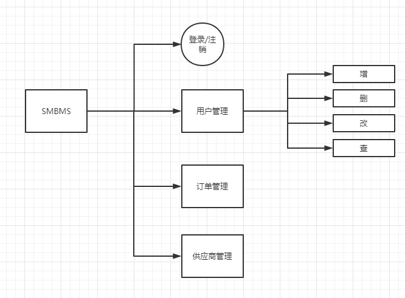

### 1.2 数据库设计

```sql
DROP TABLE IF EXISTS `smbms_address`;
CREATE TABLE `smbms_address`  (
  `id` BIGINT(20) NOT NULL AUTO_INCREMENT COMMENT '主键ID',
  `contact` VARCHAR(15) NULL DEFAULT NULL COMMENT '联系人姓名',
  `addressDesc` VARCHAR(50) NULL DEFAULT NULL COMMENT '收货地址明细',
  `postCode` VARCHAR(15) NULL DEFAULT NULL COMMENT '邮编',
  `tel` VARCHAR(20) NULL DEFAULT NULL COMMENT '联系人电话',
  `createdBy` BIGINT(20) NULL DEFAULT NULL COMMENT '创建者',
  `creationDate` DATETIME NULL DEFAULT NULL COMMENT '创建时间',
  `modifyBy` BIGINT(20) NULL DEFAULT NULL COMMENT '修改者',
  `modifyDate` DATETIME NULL DEFAULT NULL COMMENT '修改时间',
  `userId` BIGINT(20) NULL DEFAULT NULL COMMENT '用户ID',
  PRIMARY KEY (`id`) USING BTREE
) ENGINE=INNODB DEFAULT CHARSET=utf8;

INSERT INTO `smbms_address` VALUES (1, '王丽', '北京市东城区东交民巷44号', '100010', '13678789999', 1, '2016-04-13 00:00:00', NULL, NULL, 1);
INSERT INTO `smbms_address` VALUES (2, '张红丽', '北京市海淀区丹棱街3号', '100000', '18567672312', 1, '2016-04-13 00:00:00', NULL, NULL, 1);
INSERT INTO `smbms_address` VALUES (3, '任志强', '北京市东城区美术馆后街23号', '100021', '13387906742', 1, '2016-04-13 00:00:00', NULL, NULL, 1);
INSERT INTO `smbms_address` VALUES (4, '曹颖', '北京市朝阳区朝阳门南大街14号', '100053', '13568902323', 1, '2016-04-13 00:00:00', NULL, NULL, 2);
INSERT INTO `smbms_address` VALUES (5, '李慧', '北京市西城区三里河路南三巷3号', '100032', '18032356666', 1, '2016-04-13 00:00:00', NULL, NULL, 3);
INSERT INTO `smbms_address` VALUES (6, '王国强', '北京市顺义区高丽营镇金马工业区18号', '100061', '13787882222', 1, '2016-04-13 00:00:00', NULL, NULL, 3);

DROP TABLE IF EXISTS `smbms_bill`;
CREATE TABLE `smbms_bill`  (
  `id` BIGINT(20) NOT NULL AUTO_INCREMENT COMMENT '主键ID',
  `billCode` VARCHAR(20) NULL DEFAULT NULL COMMENT '账单编码',
  `productName` VARCHAR(20) NULL DEFAULT NULL COMMENT '商品名称',
  `productDesc` VARCHAR(50) NULL DEFAULT NULL COMMENT '商品描述',
  `productUnit` VARCHAR(10) NULL DEFAULT NULL COMMENT '商品单位',
  `productCount` DECIMAL(20, 2) NULL DEFAULT NULL COMMENT '商品数量',
  `totalPrice` DECIMAL(20, 2) NULL DEFAULT NULL COMMENT '商品总额',
  `isPayment` INT(10) NULL DEFAULT NULL COMMENT '是否支付（1：未支付 2：已支付）',
  `createdBy` BIGINT(20) NULL DEFAULT NULL COMMENT '创建者（userId）',
  `creationDate` DATETIME NULL DEFAULT NULL COMMENT '创建时间',
  `modifyBy` BIGINT(20) NULL DEFAULT NULL COMMENT '更新者（userId）',
  `modifyDate` DATETIME NULL DEFAULT NULL COMMENT '更新时间',
  `providerId` BIGINT(20) NULL DEFAULT NULL COMMENT '供应商ID',
  PRIMARY KEY (`id`) USING BTREE
) ENGINE=INNODB DEFAULT CHARSET=utf8;

INSERT INTO `smbms_bill` VALUES (2, 'BILL2016_002', '香皂、肥皂、药皂', '日用品-皂类', '块', 1000.00, 10000.00, 2, 1, '2016-03-23 04:20:40', NULL, NULL, 13);
INSERT INTO `smbms_bill` VALUES (3, 'BILL2016_003', '大豆油', '食品-食用油', '斤', 300.00, 5890.00, 2, 1, '2014-12-14 13:02:03', NULL, NULL, 6);
INSERT INTO `smbms_bill` VALUES (4, 'BILL2016_004', '橄榄油', '食品-进口食用油', '斤', 200.00, 9800.00, 2, 1, '2013-10-10 03:12:13', NULL, NULL, 7);
INSERT INTO `smbms_bill` VALUES (5, 'BILL2016_005', '洗洁精', '日用品-厨房清洁', '瓶', 500.00, 7000.00, 2, 1, '2014-12-14 13:02:03', NULL, NULL, 9);
INSERT INTO `smbms_bill` VALUES (6, 'BILL2016_006', '美国大杏仁', '食品-坚果', '袋', 300.00, 5000.00, 2, 1, '2016-04-14 06:08:09', NULL, NULL, 4);
INSERT INTO `smbms_bill` VALUES (7, 'BILL2016_007', '沐浴液、精油', '日用品-沐浴类', '瓶', 500.00, 23000.00, 1, 1, '2016-07-22 10:10:22', NULL, NULL, 14);
INSERT INTO `smbms_bill` VALUES (8, 'BILL2016_008', '不锈钢盘碗', '日用品-厨房用具', '个', 600.00, 6000.00, 2, 1, '2016-04-14 05:12:13', NULL, NULL, 14);
INSERT INTO `smbms_bill` VALUES (9, 'BILL2016_009', '塑料杯', '日用品-杯子', '个', 350.00, 1750.00, 2, 1, '2016-02-04 11:40:20', NULL, NULL, 14);
INSERT INTO `smbms_bill` VALUES (10, 'BILL2016_010', '豆瓣酱', '食品-调料', '瓶', 200.00, 2000.00, 2, 1, '2013-10-29 05:07:03', NULL, NULL, 8);
INSERT INTO `smbms_bill` VALUES (11, 'BILL2016_011', '海之蓝', '饮料-国酒', '瓶', 50.00, 10000.00, 1, 1, '2016-04-14 16:16:00', NULL, NULL, 1);
INSERT INTO `smbms_bill` VALUES (12, 'BILL2016_012', '芝华士', '饮料-洋酒', '瓶', 20.00, 6000.00, 1, 1, '2016-09-09 17:00:00', NULL, NULL, 1);
INSERT INTO `smbms_bill` VALUES (13, 'BILL2016_013', '长城红葡萄酒', '饮料-红酒', '瓶', 60.00, 800.00, 2, 1, '2016-11-14 15:23:00', NULL, NULL, 1);
INSERT INTO `smbms_bill` VALUES (14, 'BILL2016_014', '泰国香米', '食品-大米', '斤', 400.00, 5000.00, 2, 1, '2016-10-09 15:20:00', NULL, NULL, 3);
INSERT INTO `smbms_bill` VALUES (15, 'BILL2016_015', '东北大米', '食品-大米', '斤', 600.00, 4000.00, 2, 1, '2016-11-14 14:00:00', NULL, NULL, 3);
INSERT INTO `smbms_bill` VALUES (16, 'BILL2016_016', '可口可乐', '饮料', '瓶', 2000.00, 6000.00, 2, 1, '2012-03-27 13:03:01', NULL, NULL, 2);
INSERT INTO `smbms_bill` VALUES (17, 'BILL2016_017', '脉动', '饮料', '瓶', 1500.00, 4500.00, 2, 1, '2016-05-10 12:00:00', NULL, NULL, 2);
INSERT INTO `smbms_bill` VALUES (18, 'BILL2016_018', '哇哈哈', '饮料', '瓶', 2000.00, 4000.00, 2, 1, '2015-11-24 15:12:03', NULL, NULL, 2);

DROP TABLE IF EXISTS `smbms_provider`;
CREATE TABLE `smbms_provider`  (
  `id` BIGINT(20) NOT NULL AUTO_INCREMENT COMMENT '主键ID',
  `proCode` VARCHAR(20) NULL DEFAULT NULL COMMENT '供应商编码',
  `proName` VARCHAR(20) NULL DEFAULT NULL COMMENT '供应商名称',
  `proDesc` VARCHAR(50) NULL DEFAULT NULL COMMENT '供应商详细描述',
  `proContact` VARCHAR(20) NULL DEFAULT NULL COMMENT '供应商联系人',
  `proPhone` VARCHAR(20) NULL DEFAULT NULL COMMENT '联系电话',
  `proAddress` VARCHAR(50) NULL DEFAULT NULL COMMENT '地址',
  `proFax` VARCHAR(20) NULL DEFAULT NULL COMMENT '传真',
  `createdBy` BIGINT(20) NULL DEFAULT NULL COMMENT '创建者（userId）',
  `creationDate` DATETIME NULL DEFAULT NULL COMMENT '创建时间',
  `modifyDate` DATETIME NULL DEFAULT NULL COMMENT '更新时间',
  `modifyBy` BIGINT(20) NULL DEFAULT NULL COMMENT '更新者（userId）',
  PRIMARY KEY (`id`) USING BTREE
) ENGINE=INNODB DEFAULT CHARSET=utf8;

INSERT INTO `smbms_provider` VALUES (1, 'BJ_GYS001', '北京三木堂商贸有限公司', '长期合作伙伴，主营产品:茅台、五粮液、郎酒、酒鬼酒、泸州老窖、赖茅酒、法国红酒等', '张国强', '13566667777', '北京市丰台区育芳园北路', '010-58858787', 1, '2013-03-21 16:52:07', NULL, NULL);
INSERT INTO `smbms_provider` VALUES (2, 'HB_GYS001', '石家庄帅益食品贸易有限公司', '长期合作伙伴，主营产品:饮料、水饮料、植物蛋白饮料、休闲食品、果汁饮料、功能饮料等', '王军', '13309094212', '河北省石家庄新华区', '0311-67738876', 1, '2016-04-13 04:20:40', NULL, NULL);
INSERT INTO `smbms_provider` VALUES (3, 'GZ_GYS001', '深圳市泰香米业有限公司', '初次合作伙伴，主营产品：良记金轮米,龙轮香米等', '郑程瀚', '13402013312', '广东省深圳市福田区深南大道6006华丰大厦', '0755-67776212', 1, '2014-03-21 16:56:07', NULL, NULL);
INSERT INTO `smbms_provider` VALUES (4, 'GZ_GYS002', '深圳市喜来客商贸有限公司', '长期合作伙伴，主营产品：坚果炒货.果脯蜜饯.天然花茶.营养豆豆.特色美食.进口食品.海味零食.肉脯肉', '林妮', '18599897645', '广东省深圳市福龙工业区B2栋3楼西', '0755-67772341', 1, '2013-03-22 16:52:07', NULL, NULL);
INSERT INTO `smbms_provider` VALUES (5, 'JS_GYS001', '兴化佳美调味品厂', '长期合作伙伴，主营产品：天然香辛料、鸡精、复合调味料', '徐国洋', '13754444221', '江苏省兴化市林湖工业区', '0523-21299098', 1, '2015-11-22 16:52:07', NULL, NULL);
INSERT INTO `smbms_provider` VALUES (6, 'BJ_GYS002', '北京纳福尔食用油有限公司', '长期合作伙伴，主营产品：山茶油、大豆油、花生油、橄榄油等', '马莺', '13422235678', '北京市朝阳区珠江帝景1号楼', '010-588634233', 1, '2012-03-21 17:52:07', NULL, NULL);
INSERT INTO `smbms_provider` VALUES (7, 'BJ_GYS003', '北京国粮食用油有限公司', '初次合作伙伴，主营产品：花生油、大豆油、小磨油等', '王驰', '13344441135', '北京大兴青云店开发区', '010-588134111', 1, '2016-04-13 00:00:00', NULL, NULL);
INSERT INTO `smbms_provider` VALUES (8, 'ZJ_GYS001', '慈溪市广和绿色食品厂', '长期合作伙伴，主营产品：豆瓣酱、黄豆酱、甜面酱，辣椒，大蒜等农产品', '薛圣丹', '18099953223', '浙江省宁波市慈溪周巷小安村', '0574-34449090', 1, '2013-11-21 06:02:07', NULL, NULL);
INSERT INTO `smbms_provider` VALUES (9, 'GX_GYS001', '优百商贸有限公司', '长期合作伙伴，主营产品：日化产品', '李立国', '13323566543', '广西南宁市秀厢大道42-1号', '0771-98861134', 1, '2013-03-21 19:52:07', NULL, NULL);
INSERT INTO `smbms_provider` VALUES (10, 'JS_GYS002', '南京火头军信息技术有限公司', '长期合作伙伴，主营产品：不锈钢厨具等', '陈女士', '13098992113', '江苏省南京市浦口区浦口大道1号新城总部大厦A座903室', '025-86223345', 1, '2013-03-25 16:52:07', NULL, NULL);
INSERT INTO `smbms_provider` VALUES (11, 'GZ_GYS003', '广州市白云区美星五金制品厂', '长期合作伙伴，主营产品：海绵床垫、坐垫、靠垫、海绵枕头、头枕等', '梁天', '13562276775', '广州市白云区钟落潭镇福龙路20号', '020-85542231', 1, '2016-12-21 06:12:17', NULL, NULL);
INSERT INTO `smbms_provider` VALUES (12, 'BJ_GYS004', '北京隆盛日化科技', '长期合作伙伴，主营产品：日化环保清洗剂，家居洗涤专卖、洗涤用品网、墙体除霉剂、墙面霉菌清除剂等', '孙欣', '13689865678', '北京市大兴区旧宫', '010-35576786', 1, '2014-11-21 12:51:11', NULL, NULL);
INSERT INTO `smbms_provider` VALUES (13, 'SD_GYS001', '山东豪克华光联合发展有限公司', '长期合作伙伴，主营产品：洗衣皂、洗衣粉、洗衣液、洗洁精、消杀类、香皂等', '吴洪转', '13245468787', '山东济阳济北工业区仁和街21号', '0531-53362445', 1, '2015-01-28 10:52:07', NULL, NULL);
INSERT INTO `smbms_provider` VALUES (14, 'JS_GYS003', '无锡喜源坤商行', '长期合作伙伴，主营产品：日化品批销', '周一清', '18567674532', '江苏无锡盛岸西路', '0510-32274422', 1, '2016-04-23 11:11:11', NULL, NULL);
INSERT INTO `smbms_provider` VALUES (15, 'ZJ_GYS002', '乐摆日用品厂', '长期合作伙伴，主营产品：各种中、高档塑料杯，塑料乐扣水杯（密封杯）、保鲜杯（保鲜盒）、广告杯、礼品杯', '王世杰', '13212331567', '浙江省金华市义乌市义东路', '0579-34452321', 1, '2016-08-22 10:01:30', NULL, NULL);


DROP TABLE IF EXISTS `smbms_role`;
CREATE TABLE `smbms_role`  (
  `id` BIGINT(20) NOT NULL AUTO_INCREMENT COMMENT '主键ID',
  `roleCode` VARCHAR(15) NULL DEFAULT NULL COMMENT '角色编码',
  `roleName` VARCHAR(15) NULL DEFAULT NULL COMMENT '角色名称',
  `createdBy` BIGINT(20) NULL DEFAULT NULL COMMENT '创建者',
  `creationDate` DATETIME NULL DEFAULT NULL COMMENT '创建时间',
  `modifyBy` BIGINT(20) NULL DEFAULT NULL COMMENT '修改者',
  `modifyDate` DATETIME NULL DEFAULT NULL COMMENT '修改时间',
  PRIMARY KEY (`id`) USING BTREE
) ENGINE=INNODB DEFAULT CHARSET=utf8;


INSERT INTO `smbms_role` VALUES (1, 'SMBMS_ADMIN', '系统管理员', 1, '2016-04-13 00:00:00', NULL, NULL);
INSERT INTO `smbms_role` VALUES (2, 'SMBMS_MANAGER', '经理', 1, '2016-04-13 00:00:00', NULL, NULL);
INSERT INTO `smbms_role` VALUES (3, 'SMBMS_EMPLOYEE', '普通员工', 1, '2016-04-13 00:00:00', NULL, NULL);


DROP TABLE IF EXISTS `smbms_user`;
CREATE TABLE `smbms_user`  (
  `id` BIGINT(20) NOT NULL AUTO_INCREMENT COMMENT '主键ID',
  `userCode` VARCHAR(15) NULL DEFAULT NULL COMMENT '用户编码',
  `userName` VARCHAR(15) NULL DEFAULT NULL COMMENT '用户名称',
  `userPassword` VARCHAR(15) NULL DEFAULT NULL COMMENT '用户密码',
  `gender` INT(10) NULL DEFAULT NULL COMMENT '性别（1:女、 2:男）',
  `birthday` DATE NULL DEFAULT NULL COMMENT '出生日期',
  `phone` VARCHAR(15) NULL DEFAULT NULL COMMENT '手机',
  `address` VARCHAR(30) NULL DEFAULT NULL COMMENT '地址',
  `userRole` BIGINT(20) NULL DEFAULT NULL COMMENT '用户角色（取自角色表-角色id）',
  `createdBy` BIGINT(20) NULL DEFAULT NULL COMMENT '创建者（userId）',
  `creationDate` DATETIME NULL DEFAULT NULL COMMENT '创建时间',
  `modifyBy` BIGINT(20) NULL DEFAULT NULL COMMENT '更新者（userId）',
  `modifyDate` DATETIME NULL DEFAULT NULL COMMENT '更新时间',
  PRIMARY KEY (`id`) USING BTREE
) ENGINE=INNODB DEFAULT CHARSET=utf8;

INSERT INTO `smbms_user` VALUES (1, 'admin', '111', '111111', 1, '2021-04-22', '13688889999', '北京市海淀区成府路207号', 3, 1, '2013-03-21 16:52:07', 1, '2021-04-22 17:43:02');
INSERT INTO `smbms_user` VALUES (2, 'liming', '李明', '0000000', 2, '1983-12-10', '13688884457', '北京市东城区前门东大街9号', 2, 1, '2014-12-31 19:52:09', NULL, NULL);
INSERT INTO `smbms_user` VALUES (5, 'hanlubiao', '韩路彪', '0000000', 2, '1984-06-05', '18567542321', '北京市朝阳区北辰中心12号', 2, 1, '2014-12-31 19:52:09', NULL, NULL);
INSERT INTO `smbms_user` VALUES (6, 'zhanghua', '张华', '0000000', 1, '1983-06-15', '13544561111', '北京市海淀区学院路61号', 3, 1, '2013-02-11 10:51:17', NULL, NULL);
INSERT INTO `smbms_user` VALUES (7, 'wangyang', '王洋', '0000000', 2, '1982-12-31', '13444561124', '北京市海淀区西二旗辉煌国际16层', 3, 1, '2014-06-11 19:09:07', NULL, NULL);
INSERT INTO `smbms_user` VALUES (8, 'zhaoyan', '赵燕', '0000000', 2, '2021-04-22', '18098764545', '北京市海淀区回龙观小区10号楼', 2, 1, '2016-04-21 13:54:07', 1, '2021-04-22 17:56:11');
INSERT INTO `smbms_user` VALUES (10, 'sunlei', '孙磊', '0000000', 2, '1981-01-04', '13387676765', '北京市朝阳区管庄新月小区12楼', 3, 1, '2015-05-06 10:52:07', NULL, NULL);
INSERT INTO `smbms_user` VALUES (11, 'sunxing', '孙兴', '0000000', 2, '1978-03-12', '13367890900', '北京市朝阳区建国门南大街10号', 3, 1, '2016-11-09 16:51:17', NULL, NULL);
INSERT INTO `smbms_user` VALUES (12, 'zhangchen', '张晨', '0000000', 1, '1986-03-28', '18098765434', '朝阳区管庄路口北柏林爱乐三期13号楼', 3, 1, '2016-08-09 05:52:37', 1, '2016-04-14 14:15:36');
INSERT INTO `smbms_user` VALUES (13, 'dengchao', '邓超', '0000000', 2, '1981-11-04', '13689674534', '北京市海淀区北航家属院10号楼', 3, 1, '2016-07-11 08:02:47', NULL, NULL);
INSERT INTO `smbms_user` VALUES (15, 'zhaomin', '赵敏', '0000000', 1, '1987-12-04', '18099897657', '北京市昌平区天通苑3区12号楼', 2, 1, '2015-09-12 12:02:12', NULL, NULL);
INSERT INTO `smbms_user` VALUES (18, '111', '111', '111111', 1, '2021-04-22', '15072151323', '111', 3, 1, '2021-04-22 18:13:07', NULL, NULL);
```

### 1.3 数据库框架设计

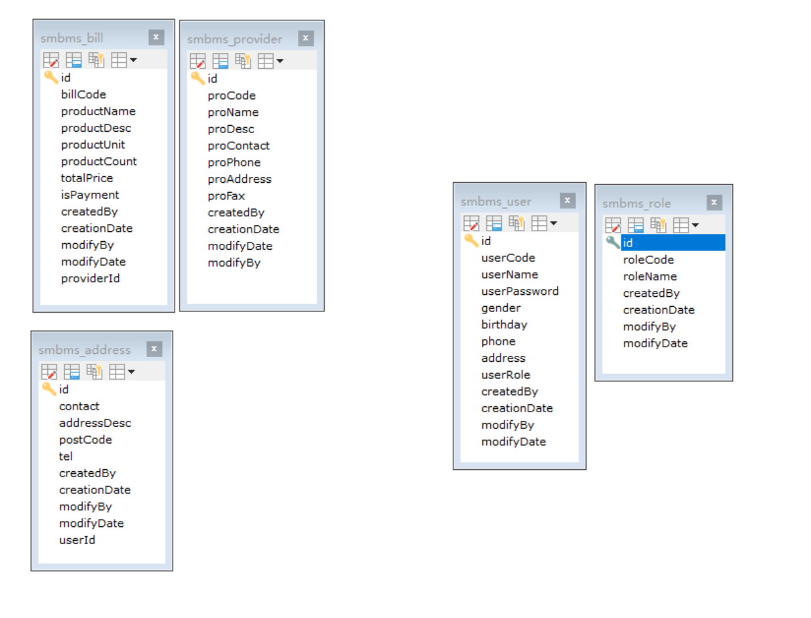

## 二、项目搭建

### 2.1 创建maven项目

1. 以webapp模板的方式创建maven项目

   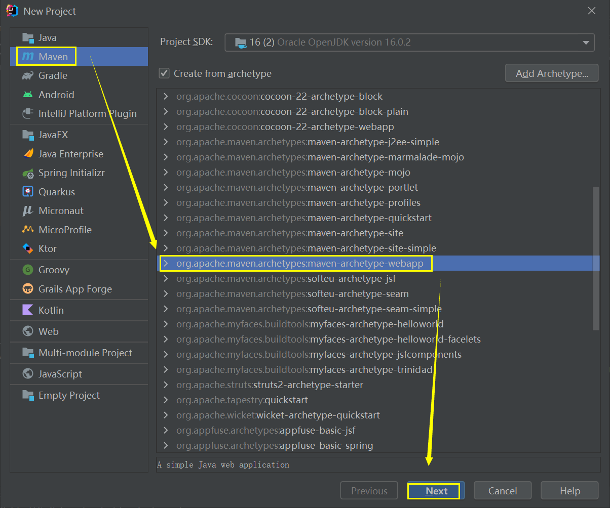

2. 填写项目名称

   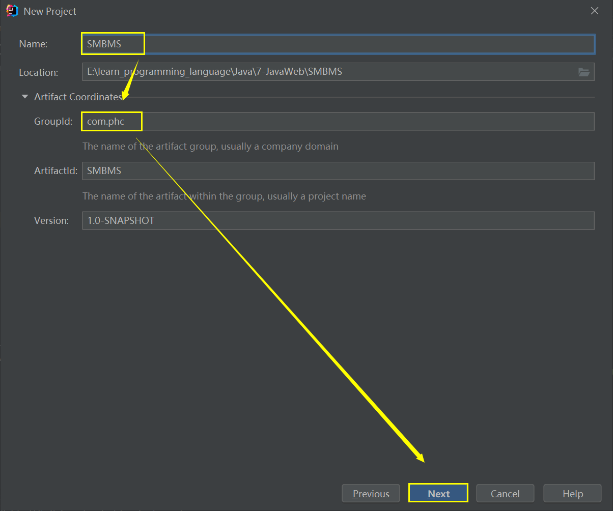

3. 查看项目信息

   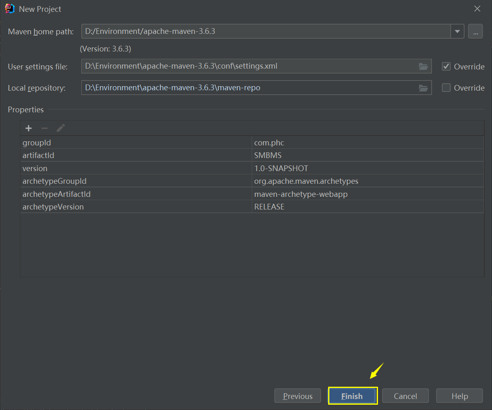


### 2.2 其他创建步骤

> 1. 搭建一个maven web项目（2.1已完成）
>
> 2. 配置tomcat
>
>    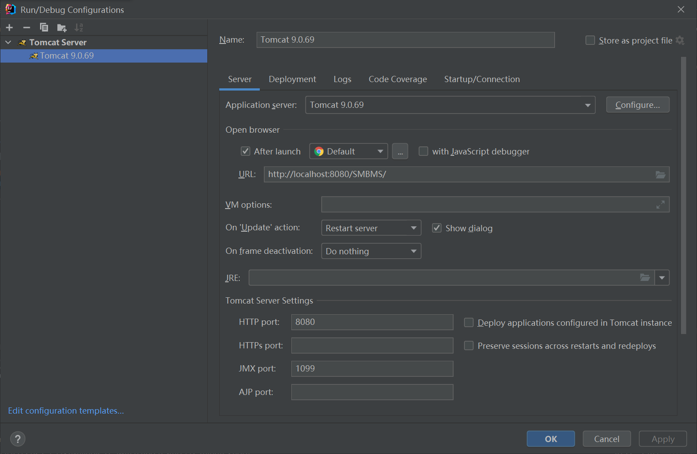
>
> 3. 测试项目是否可以跑起来
>
>    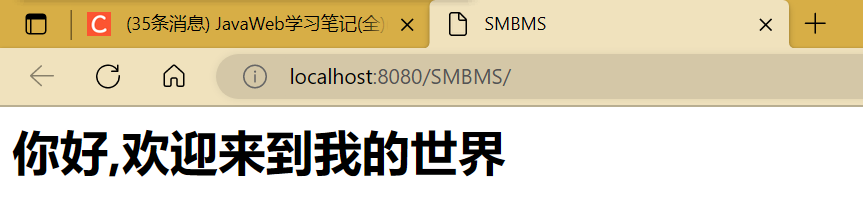
>
> 4. 导入项目中所需jar包
>
>    `SMBMS\pom.xml`
>
>    ```xml
>    <dependencies>
>        <!--mysql的驱动jar包-->
>        <dependency>
>            <groupId>mysql</groupId>
>            <artifactId>mysql-connector-java</artifactId>
>            <version>8.0.30</version>
>        </dependency>
>        <!--用于测试的依赖包-->
>        <dependency>
>            <groupId>junit</groupId>
>            <artifactId>junit</artifactId>
>            <version>4.13.2</version>
>        </dependency>
>        <!--servlet依赖包-->
>        <dependency>
>            <groupId>javax.servlet</groupId>
>            <artifactId>javax.servlet-api</artifactId>
>            <version>4.0.1</version>
>        </dependency>
>        <!--jsp依赖包-->
>        <dependency>
>            <groupId>javax.servlet.jsp</groupId>
>            <artifactId>javax.servlet.jsp-api</artifactId>
>            <version>2.3.3</version>
>        </dependency>
>        <!--jstl规范依赖包-->
>        <dependency>
>            <groupId>javax.servlet.jsp.jstl</groupId>
>            <artifactId>jstl-api</artifactId>
>            <version>1.2</version>
>        </dependency>
>        <!--jsp标签库依赖包-->
>        <dependency>
>            <groupId>taglibs</groupId>
>            <artifactId>standard</artifactId>
>            <version>1.1.2</version>
>        </dependency>
>    </dependencies>
>    ```
>
> 5. 创建项目包结构
>
>    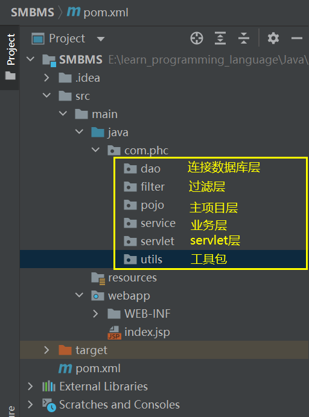
>
> 6. `idea`连接数据库
>
>    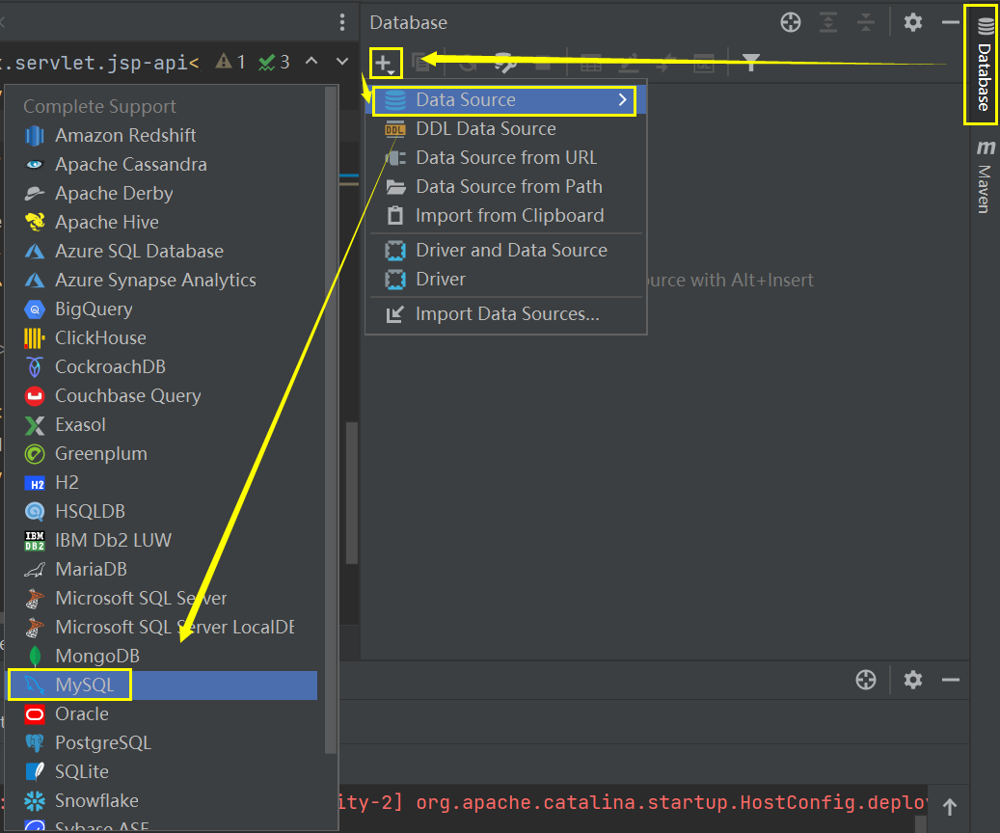
>
>    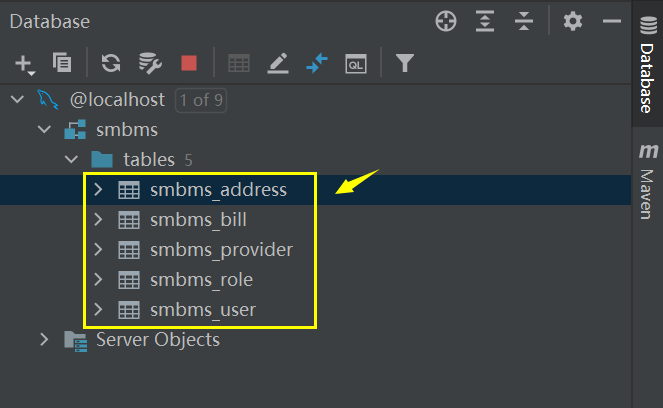

### 2.3 编写实体类

> ORM映射：表-类映射
>
> 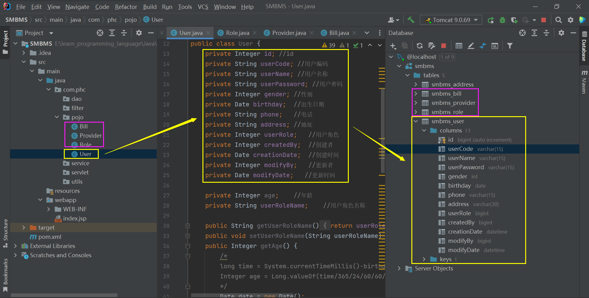

### 2.4 编写基础公共类

1. 数据库配置文件

   `SMBMS\src\main\resources\db.properties`

   ```properties
   driver=com.mysql.cj.jdbc.Driver
   url=jdbc:mysql://localhost:3306/smbms?useUnicode=true&characterEncoding=utf-8
   username=root
   password=123456
   ```

2. 编写有关数据库的公共类

   `SMBMS\src\main\java\com\phc\dao\BaseDao.java`

   ```java
   package com.phc.dao;
   
   import java.io.IOException;
   import java.io.InputStream;
   import java.sql.*;
   import java.util.Properties;
   
   /**
    * @FileName BaseDao.java
    * @Description 公共类:用于读取数据库
    * @Author phc
    * @date 2022/12/30 10:49
    * @Version 1.0
    */
   public class BaseDao {
       private static String driver;
       private static String url;
       private static String username;
       private static String password;
   
       //静态代码块,类加载的时候就会初始化
       static {
           Properties properties = new Properties();
           //通过类加载器读取对应的资源
           InputStream is = BaseDao.class.getClassLoader().getResourceAsStream("db.properties");
   
           try {
               properties.load(is);
           } catch (IOException e) {
               e.printStackTrace();
           }
   
           driver = properties.getProperty("driver");
           url = properties.getProperty("url");
           username = properties.getProperty("username");
           password = properties.getProperty("password");
       }
   
       //获取数据库的连接
       public static Connection getConnection() {
           Connection connection=null;
           try {
               Class.forName(driver);
               connection = DriverManager.getConnection(url, username, password);
           } catch (Exception e) {
               e.printStackTrace();
           }
           return connection;
       }
   
       //编写查询数据库操作公共类
       public static ResultSet execute(Connection connection,PreparedStatement pstm,ResultSet rs,String sql,Object[] params) throws Exception {
           pstm=connection.prepareStatement(sql);
           for(int i=0;i<params.length;i++) {
               //setObject,占位符从1开始,而数组是从0开始!
               pstm.setObject(i+1,params[i]);
           }
           rs = pstm.executeQuery();
           return rs;
       }
   
       //编写增删改数据库操作的公共类
       public static int execute(Connection connection,PreparedStatement pstm,String sql,Object[] params) throws Exception {
           int affectRows = 0;
           pstm = connection.prepareStatement(sql);
           for(int i=0;i<params.length;i++) {
               //setObject,占位符从1开始,而数组是从0开始!
               pstm.setObject(i+1,params[i]);
           }
           affectRows = pstm.executeUpdate();
           return affectRows;
       }
   
       //释放资源
       public static boolean closeResource(Connection connection,PreparedStatement pstm,ResultSet rs) {
           boolean flag = true;
           if(rs!=null) {
               try {
                   rs.close();
                   rs = null; //GC回收
               } catch (SQLException e) {
                   e.printStackTrace();
                   flag=false;
               }
           }
           if(pstm != null){
               try {
                   pstm.close();
                   pstm = null;//GC回收
               } catch (SQLException e) {
                   // TODO Auto-generated catch block
                   e.printStackTrace();
                   flag = false;
               }
           }
           if(connection != null){
               try {
                   connection.close();
                   connection = null;//GC回收
               } catch (SQLException e) {
                   // TODO Auto-generated catch block
                   e.printStackTrace();
                   flag = false;
               }
           }
           return flag;
       }
   }
   ```

3. 编写字符编码过滤器

   （1）`SMBMS\src\main\java\com\phc\filter\CharacterEncodingFilter.java`

   ```java
   package com.phc.filter;
   
   
   import javax.servlet.*;
   import java.io.IOException;
   
   /**
    * @FileName CharacterEncodingFilter.java
    * @Description 字符编码过滤器
    * @Author phc
    * @date 2022/12/30 11:16
    * @Version 1.0
    */
   public class CharacterEncodingFilter implements Filter {
       @Override
       public void init(FilterConfig filterConfig) throws ServletException {}
   
       @Override
       public void doFilter(ServletRequest servletRequest, ServletResponse servletResponse, FilterChain filterChain) throws IOException, ServletException {
           servletRequest.setCharacterEncoding("utf-8");
           servletRequest.setCharacterEncoding("utf-8");
           filterChain.doFilter(servletRequest,servletResponse);
       }
   
       @Override
       public void destroy() {}
   }
   ```
   
   （2）`SMBMS\src\main\webapp\WEB-INF\web.xml`
   
   ```xml
   <!--字符编码过滤器-->
   <filter>
       <filter-name>CharacterEncodingFilter</filter-name>
       <filter-class>com.phc.filter.CharacterEncodingFilter</filter-class>
   </filter>
   <filter-mapping>
       <filter-name>CharacterEncodingFilter</filter-name>
       <url-pattern>/*</url-pattern>
   </filter-mapping>
   ```

### 2.5 导入静态资源

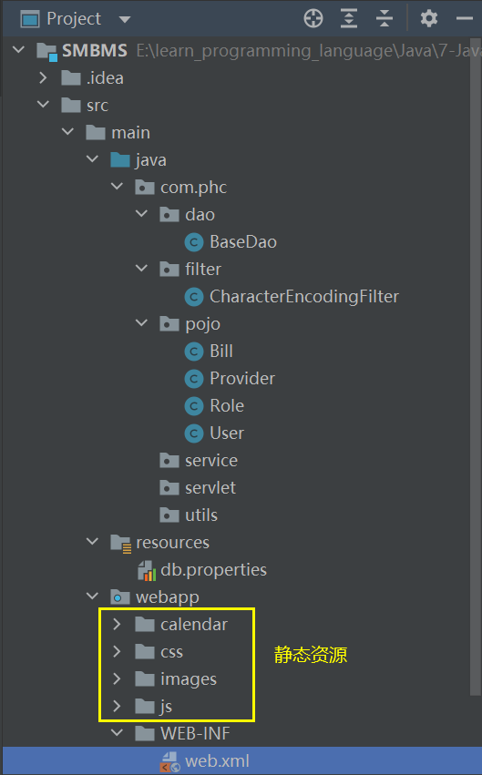

## 三、登录功能实现

### 3.1 登录流程

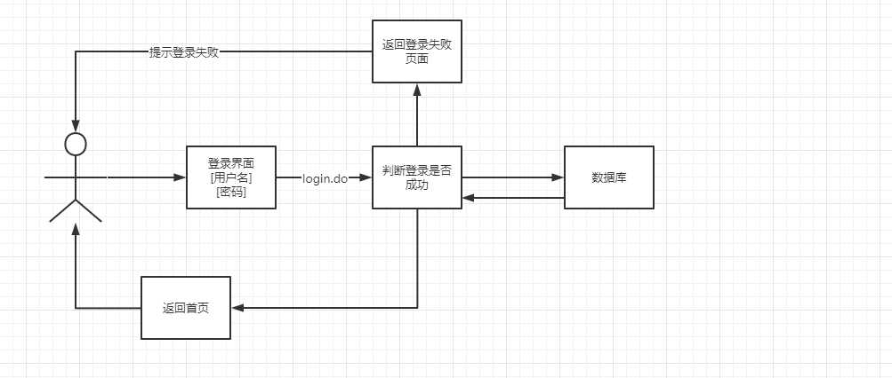

### 3.2 编写前端页面`login.jsp`

`SMBMS\src\main\webapp\login.jsp`

```jsp
<%@ page language="java" contentType="text/html; charset=UTF-8"
    pageEncoding="UTF-8"%>
<!DOCTYPE html>
<html>
    <head lang="en">
        <meta charset="UTF-8">
        <title>系统登录 - 超市订单管理系统</title>
        <link type="text/css" rel="stylesheet" href="${pageContext.request.contextPath }/css/style.css" />
        <script type="text/javascript">
            /* if(top.location!=self.location){
	      top.location=self.location;
	 } */
        </script>
    </head>
    <body class="login_bg">
        <section class="loginBox">
            <header class="loginHeader">
                <h1>超市订单管理系统</h1>
            </header>
            <section class="loginCont">
                <form class="loginForm" action="${pageContext.request.contextPath}/login.do"  name="actionForm" id="actionForm"  method="post" >
                    <div class="info">${error}</div>
                    <div class="inputbox">
                        <label for="userCode">用户名：</label>
                        <input type="text" class="input-text" id="userCode" name="userCode" placeholder="请输入用户名" required/>
                    </div>	
                    <div class="inputbox">
                        <label for="userPassword">密码：</label>
                        <input type="password" id="userPassword" name="userPassword" placeholder="请输入密码" required/>
                    </div>	
                    <div class="subBtn">
                        <input type="submit" value="登录"/>
                        <input type="reset" value="重置"/>
                    </div>	
                </form>
            </section>
        </section>
    </body>
</html>
```

### 3.3 设置首页

`SMBMS\src\main\webapp\WEB-INF\web.xml`

```xml
<!--设置欢迎页面-->
<welcome-file-list>
    <welcome-file>/login.jsp</welcome-file>
</welcome-file-list>
```

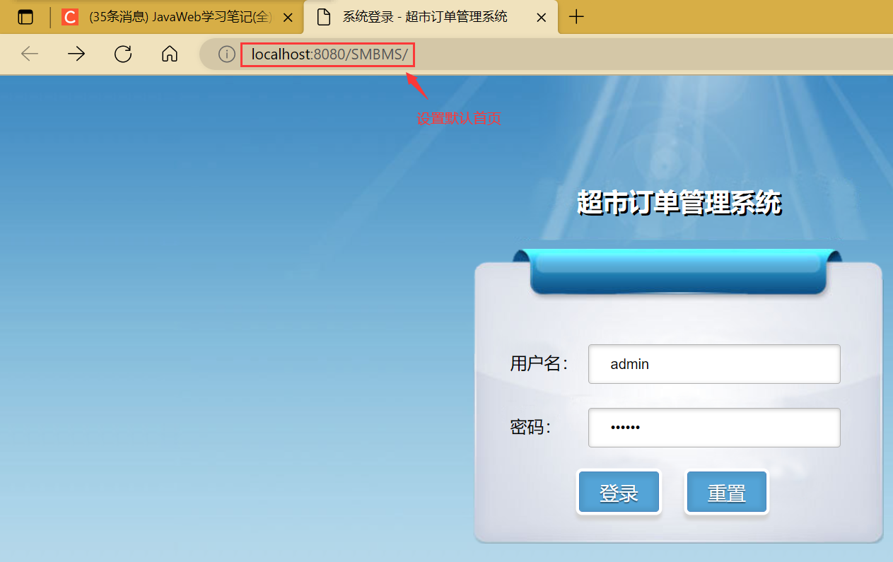

### 3.4 编写`dao`层用户登录的功能

1. 用户登录接口`UserDao`

   `SMBMS\src\main\java\com\phc\dao\user\UserDao.java`

   ```java
   package com.phc.dao.user;
   
   import com.phc.pojo.User;
   import java.sql.Connection;
   
   /**
    * @FileName UserDao接口
    * @Description 用户表连接数据库接口
    * @Author phc
    * @date 2022/12/30 16:50
    * @Version 1.0
    */
   public interface UserDao {
       //得到要登录的用户
       public User getLoginUser(Connection connection,String userCode,String userPassword) throws Exception;
   }
   ```

   

2. 实现`UserDao`接口

   ```java
   package com.phc.dao.user;
   
   import com.phc.dao.BaseDao;
   import com.phc.pojo.User;
   
   import java.sql.Connection;
   import java.sql.PreparedStatement;
   import java.sql.ResultSet;
   
   /**
    * @FileName UserDaoImpl.java
    * @Description 实现UserDao接口
    * @Author phc
    * @date 2022/12/30 16:53
    * @Version 1.0
    */
   public class UserDaoImpl implements UserDao {
       //得到要登录的用户
       @Override
       public User getLoginUser(Connection connection, String userCode, String userPassword) throws Exception {
           PreparedStatement pstm=null;
           ResultSet rs=null;
           User user=null;
           if(null!=connection) {
               String sql = "SELECT * FROM `smbms_user` WHERE userCode=? and userPassword=?";
               Object[] params={userCode,userPassword};
               rs=BaseDao.executeQuery(connection,pstm,sql,params);
               //查询到相应的用户
               if(rs.next()) {
                   user = new User();
                   user.setId(rs.getInt("id"));
                   user.setUserCode(rs.getString("userCode"));
                   user.setUserName(rs.getString("userName"));
                   user.setUserPassword(rs.getString("userPassword"));
                   user.setGender(rs.getInt("gender"));
                   user.setBirthday(rs.getDate("birthday"));
                   user.setPhone(rs.getString("phone"));
                   user.setAddress(rs.getString("address"));
                   user.setUserRole(rs.getInt("userRole"));
                   user.setCreatedBy(rs.getInt("createdBy"));
                   user.setCreationDate(rs.getTimestamp("creationDate"));
                   user.setModifyBy(rs.getInt("modifyBy"));
                   user.setModifyDate(rs.getTimestamp("modifyDate"));
               }
               BaseDao.closeResource(null,pstm,rs);
           }
           return user;
       }
   }
   ```

### 3.5 业务层处理登录功能

1. 用户登录接口`UserService`

   `SMBMS\src\main\java\com\phc\service\user\UserService.java`

   ```java
   package com.phc.service.user;
   import com.phc.pojo.User;
   /**
    * @FileName UserService接口
    * @Description 实现用户登录
    * @Author phc
    * @date 2022/12/30 19:47
    * @Version 1.0
    */
   public interface UserService {
       public User login(String userCode, String password) throws Exception;
   }
   ```

   

2. 实现用户登录接口`UserServiceImpl`

   `SMBMS\src\main\java\com\phc\service\user\UserServiceImpl.java`

   ```java
   package com.phc.service.user;
   
   import com.phc.dao.BaseDao;
   import com.phc.dao.user.UserDao;
   import com.phc.dao.user.UserDaoImpl;
   import com.phc.pojo.User;
   import org.junit.Test;
   
   import java.sql.Connection;
   
   /**
    * @FileName UserServiceImpl.java
    * @Description 用户登录业务逻辑处理层
    * @Author phc
    * @date 2022/12/30 19:49
    * @Version 1.0
    */
   public class UserServiceImpl implements UserService{
       //业务层都会调用Dao层,所以我们要引入Dao层;
       private UserDao userDao;
       //无参构造函数
       public UserServiceImpl() {
           userDao=new UserDaoImpl();
       }
   
       @Override
       public User login(String userCode, String userPassword) throws Exception {
           Connection connection=null;
           User user=null;
           connection= BaseDao.getConnection();
           //通过业务层调用对应的具体的数据库操作
           user=userDao.getLoginUser(connection,userCode,userPassword);
           BaseDao.closeResource(connection,null,null);
           return user;
       }
   
       //测试
       @Test
       public void test() throws Exception {
           UserServiceImpl userService = new UserServiceImpl();
           User admin = userService.login("admin", "123456");
           System.out.println(admin.getPhone());
           System.out.println(admin.getAddress());
       }
   }
   ```

### 3.6 servlet层实现用户登录

1. `SMBMS\src\main\java\com\phc\servlet\user\LoginServlet.java`

   ```java
   package com.phc.servlet.user;
   
   import com.phc.pojo.User;
   import com.phc.service.user.UserServiceImpl;
   import com.phc.utils.Constants;
   
   import javax.servlet.ServletException;
   import javax.servlet.http.HttpServlet;
   import javax.servlet.http.HttpServletRequest;
   import javax.servlet.http.HttpServletResponse;
   import java.io.IOException;
   
   /**
    * @FileName LoginServlet.java
    * @Description 从前端获取用户名和密码
    * @Author phc
    * @date 2022/12/30 20:09
    * @Version 1.0
    */
   public class LoginServlet extends HttpServlet {
       //Servlet:控制层,调用业务层代码
   
       @Override
       protected void doGet(HttpServletRequest req, HttpServletResponse resp) throws ServletException, IOException {}
   
       @Override
       protected void doPost(HttpServletRequest req, HttpServletResponse resp) throws ServletException, IOException {
           System.out.println("进入了LoginServlet.java------");
           //从前端login.jsp的请求中获取用户名和密码
           String userCode = req.getParameter("userCode");
           String userPassword = req.getParameter("userPassword");
   
           //和数据库中的用户名和密码进行对比,调用业务层逻辑代码
           UserServiceImpl userService = new UserServiceImpl();
           User user = userService.login(userCode, userPassword);
   
           if(null!=user) { //查有此人,可以登录
               //将用户的信息放入session中,携带到会话中;
               req.getSession().setAttribute(Constants.USER_SESSION,user);
               //跳转到系统管理员主页
               resp.sendRedirect("jsp/frame.jsp");
           } else { //查无此人,无法登录
               //转发回登录页面,并提示用户:用户名或者密码错误
               req.setAttribute("error","用户名或者密码错误");
               req.getRequestDispatcher("login.jsp").forward(req,resp); //转发至登录页面
           }
       }
   }
   ```

2. `SMBMS\src\main\webapp\WEB-INF\web.xml`

   ```xml
   <!--servlet层实现用户登录-->
   <servlet>
       <servlet-name>LoginServlet</servlet-name>
       <servlet-class>com.phc.servlet.user.LoginServlet</servlet-class>
   </servlet>
   <servlet-mapping>
       <servlet-name>LoginServlet</servlet-name>
       <url-pattern>/login.do</url-pattern>
   </servlet-mapping>
   ```

   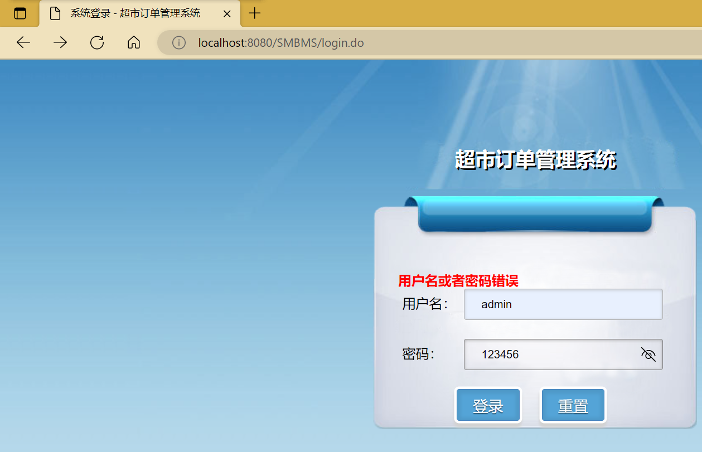

   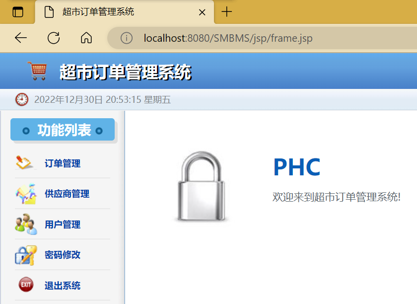

3. 

## 四、用户登录注销及权限过滤

### 4.1 用户登录注销

思路：移除session，返回登录界面

1. `SMBMS\src\main\java\com\phc\servlet\user\LogoutServlet.java`

   ```java
   package com.phc.servlet.user;
   import com.phc.utils.Constants;
   import javax.servlet.ServletException;
   import javax.servlet.http.HttpServlet;
   import javax.servlet.http.HttpServletRequest;
   import javax.servlet.http.HttpServletResponse;
   import java.io.IOException;
   /**
    * @FileName LogoutServlet.java
    * @Description 用户注销登录
    * @Author phc
    * @date 2022/12/30 20:59
    * @Version 1.0
    */
   public class LogoutServlet extends HttpServlet {
       @Override
       protected void doGet(HttpServletRequest req, HttpServletResponse resp) throws ServletException, IOException {
           //移除用户的session
           req.getSession().removeAttribute(Constants.USER_SESSION);
           //重定向到登录页面
           resp.sendRedirect(req.getContextPath()+"/login.jsp");
       }
       @Override
       protected void doPost(HttpServletRequest req, HttpServletResponse resp) throws ServletException, IOException {
           doGet(req, resp);
       }
   }
   ```

2. `SMBMS\src\main\webapp\WEB-INF\web.xml`

   ```xml
   <!--servlet层实现用户注销-->
   <servlet>
       <servlet-name>LogoutServlet</servlet-name>
       <servlet-class>com.phc.servlet.user.LogoutServlet</servlet-class>
   </servlet>
   <servlet-mapping>
       <servlet-name>LogoutServlet</servlet-name>
       <url-pattern>/jsp/logout.do</url-pattern>
   </servlet-mapping>
   ```


### 4.2 登录拦截优化

描述：在用户没有登录的情况下是不允许访问`http://localhost:8080/SMBMS/jsp/frame.jsp`首页的。

1. `SMBMS\src\main\java\com\phc\filter\SysFilter.java`

   ```java
   package com.phc.filter;
   import com.phc.pojo.User;
   import com.phc.utils.Constants;
   import javax.servlet.*;
   import javax.servlet.http.HttpServletRequest;
   import javax.servlet.http.HttpServletResponse;
   import java.io.IOException;
   
   /**
    * @FileName SysFilter.java
    * @Description 登录拦截优化
    * @Author phc
    * @date 2022/12/30 21:10
    * @Version 1.0
    */
   public class SysFilter implements Filter {
       @Override
       public void init(FilterConfig filterConfig) throws ServletException {}
   
       @Override
       public void doFilter(ServletRequest servletRequest, ServletResponse servletResponse, FilterChain filterChain) throws IOException, ServletException {
   
           HttpServletRequest req = (HttpServletRequest) servletRequest;
           HttpServletResponse resp = (HttpServletResponse) servletResponse;
           //过滤器:从session中获取用户信息
           User user = (User)req.getSession().getAttribute(Constants.USER_SESSION);
           if(null==user) {
               //已经被移除或者注销了,或者未登录
               resp.sendRedirect(req.getContextPath()+"/error.jsp");
           }
           filterChain.doFilter(servletRequest,servletResponse);
       }
   
       @Override
       public void destroy() {}
   }
   ```

2. `SMBMS\src\main\webapp\WEB-INF\web.xml`

   ```xml
   <!--过滤器:登录拦截优化-->
   <filter>
       <filter-name>SysFilter</filter-name>
       <filter-class>com.phc.filter.SysFilter</filter-class>
   </filter>
   <filter-mapping>
       <filter-name>SysFilter</filter-name>
       <!--jsp文件夹下的页面均需要过滤-->
       <url-pattern>/jsp/*</url-pattern>
   </filter-mapping>
   ```

   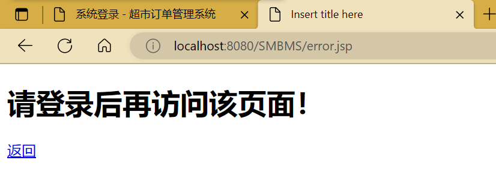


## 五、密码修改实现

### 5.1 导入前端素材

`SMBMS\src\main\webapp\jsp\pwdmodify.jsp`

```jsp
<%@ page language="java" contentType="text/html; charset=UTF-8"
    pageEncoding="UTF-8"%>
<%@include file="/jsp/common/head.jsp"%>
<div class="right">
    <div class="location">
        <strong>你现在所在的位置是:</strong>
        <span>密码修改页面</span>
    </div>
    <div class="providerAdd">
        <form id="userForm" name="userForm" method="post" action="${pageContext.request.contextPath }/jsp/user.do">
            <input type="hidden" name="method" value="savepwd">
            <!--div的class 为error是验证错误，ok是验证成功-->
            <div class="info">${message}</div>
            <div class="">
                <label for="oldPassword">旧密码：</label>
                <input type="password" name="oldpassword" id="oldpassword" value=""> 
                <font color="red"></font>
            </div>
            <div>
                <label for="newPassword">新密码：</label>
                <input type="password" name="newpassword" id="newpassword" value=""> 
                <font color="red"></font>
            </div>
            <div>
                <label for="newPassword">确认新密码：</label>
                <input type="password" name="rnewpassword" id="rnewpassword" value=""> 
                <font color="red"></font>
            </div>
            <div class="providerAddBtn">
                <!--<a href="#">保存</a>-->
                <input type="button" name="save" id="save" value="保存" class="input-button">
            </div>
        </form>
    </div>
</div>
</section>
<%@include file="/jsp/common/foot.jsp" %>
<script type="text/javascript" src="${pageContext.request.contextPath }/js/pwdmodify.js"></script>
```

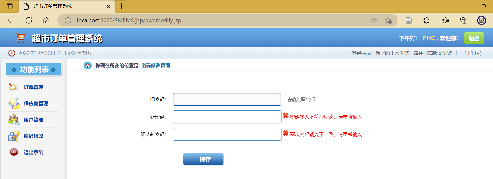


### 5.2 dao层实现密码修改

1. `updatePwd`接口

   `SMBMS\src\main\java\com\phc\dao\user\UserDao.java`

   ```java
   //修改当前用户的密码
   public int updatePwd(Connection connection,int id,String userPassword) throws Exception;
   ```

2. `updatePwd`接口实现

   `SMBMS\src\main\java\com\phc\dao\user\UserDaoImpl.java`

   ```java
   //修改当前用户的密码
   @Override
   public int updatePwd(Connection connection, int id, String userPassword) throws Exception {
       int updateRows=0;
       PreparedStatement pstm = null;
       Object[] params = {userPassword,id};
       if(null!=connection) {
           String sql="UPDATE `smbms_user` SET userPassword = ? WHERE id = ?";
           updateRows = BaseDao.executeUpdate(connection, pstm, sql, params);
       }
       BaseDao.closeResource(null,pstm,null);
       return updateRows;
   }
   ```

   

### 5.3 service业务层

1. `SMBMS\src\main\java\com\phc\service\user\UserService.java`

   ```java
   //根据用户ID修改密码
   public boolean updatePwd(int id,String userPassword);
   ```

2. `SMBMS\src\main\java\com\phc\service\user\UserServiceImpl.java`

   ```java
   //修改密码
   @Override
   public boolean updatePwd(int id, String userPassword) {
       boolean flag=false;
       Connection connection=null;
       int updateRows = 0;
       try {
           connection = BaseDao.getConnection();
           updateRows = userDao.updatePwd(connection, id, userPassword);
           if(updateRows>0) {
               flag=true; //修改成功
           }
       } catch (Exception e) {
           e.printStackTrace();
       } finally {
           BaseDao.closeResource(connection,null,null);
       }
       return flag;
   }
   ```

3. 

### 5.4 servlet层联系前端和后端

1. `smbms-master\src\main\java\cn\smbms\servlet\user\UserServlet.java`

   ```java
   package com.phc.servlet.user;
   
   import com.mysql.cj.util.StringUtils;
   import com.phc.pojo.User;
   import com.phc.service.user.UserServiceImpl;
   import com.phc.utils.Constants;
   
   import javax.servlet.ServletException;
   import javax.servlet.http.HttpServlet;
   import javax.servlet.http.HttpServletRequest;
   import javax.servlet.http.HttpServletResponse;
   import java.io.IOException;
   
   /**
    * @FileName UserServlet.java
    * @Description 处理用户信息的servlet
    * @Author phc
    * @date 2022/12/31 9:47
    * @Version 1.0
    */
   public class UserServlet extends HttpServlet {
       @Override
       protected void doGet(HttpServletRequest req, HttpServletResponse resp) throws ServletException, IOException {}
   
       @Override
       protected void doPost(HttpServletRequest req, HttpServletResponse resp) throws ServletException, IOException {
           String method = req.getParameter("method");
           if(null!=method&&method.equals("savepwd")) {
               updatePwd(req,resp);
           }
       }
   
       public void updatePwd(HttpServletRequest req, HttpServletResponse resp) throws ServletException, IOException {
           //从session里拿ID
           Object obj = req.getSession().getAttribute(Constants.USER_SESSION);
           String newpassword = req.getParameter("newpassword");
           boolean flag=false;
           //有此用户且新密码不为空值
           if(null!=obj && !StringUtils.isNullOrEmpty(newpassword)) {
               UserServiceImpl userService = new UserServiceImpl();
               //调用service业务层修改密码
               flag = userService.updatePwd(((User) obj).getId(), newpassword);
               if(flag) {
                   //密码修改成功
                   req.setAttribute(Constants.SYS_MESSAGE,"修改密码成功,请退出并使用新密码重新登录!");
                   //移除当前session,需要重新登录
                   req.getSession().removeAttribute(Constants.USER_SESSION);
                   resp.sendRedirect(req.getContextPath()+"/login.jsp");
               } else {
                   //密码修改失败
                   req.setAttribute(Constants.SYS_MESSAGE,"修改密码失败!");
                   req.getRequestDispatcher("pwdmodify.jsp").forward(req,resp);
               }
           } else {
               req.setAttribute(Constants.SYS_MESSAGE,"新密码为空或者当前用户不存在!");
               req.getRequestDispatcher("pwdmodify.jsp").forward(req,resp);
           }
       }
   }
   ```

2. `SMBMS\src\main\webapp\WEB-INF\web.xml`

   ```xml
   <!--用户信息修改(比如密码)-->
   <servlet>
       <servlet-name>UserServlet</servlet-name>
       <servlet-class>com.phc.servlet.user.UserServlet</servlet-class>
   </servlet>
   <servlet-mapping>
       <servlet-name>UserServlet</servlet-name>
       <url-pattern>/jsp/user.do</url-pattern>
   </servlet-mapping>
   ```

3. 密码修改页面

   **注：这里需要注意有些浏览器（比如`Edge`）会拦截这个弹窗，所以该网站采用google浏览器打开**

   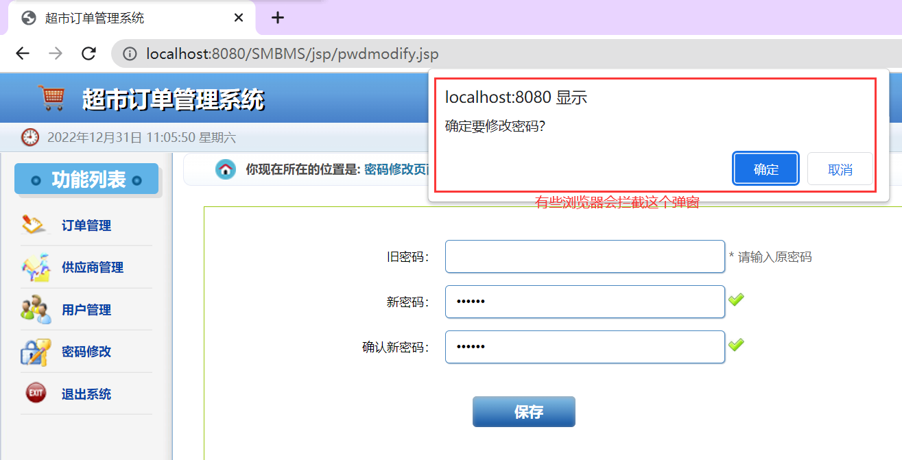

4. 

## 六、ajax验证旧密码实现（error）

1. `SMBMS\pom.xml`

   ```xml
   <!--fastjson依赖-处理json字符串-->
   <dependency>
       <groupId>com.alibaba</groupId>
       <artifactId>fastjson</artifactId>
       <version>1.2.62</version>
   </dependency>
   ```

   

2. `SMBMS\src\main\java\com\phc\servlet\user\UserServlet.java`

   ```java
   //验证旧密码,session中有用户的密码
   public void getPwdByUserId(HttpServletRequest req, HttpServletResponse resp) throws IOException {
       //从请求中拿到会话的session
       Object obj = req.getSession().getAttribute(Constants.USER_SESSION);
       String oldpassword = req.getParameter("oldpassword");
   
       System.out.println("oldpassword="+oldpassword);
   
       //万能的Map:结果集
       Map<String, String> resultMap = new HashMap<String, String>();
   
       if(null==obj) {
           //session失效了或者session过期了
           resultMap.put("result","sessionerror");
       } else if(StringUtils.isNullOrEmpty(oldpassword)) {
           //旧密码输入为空
           resultMap.put("result","error");
       } else {
           String userPassword = ((User) obj).getUserPassword();
           System.out.println("userPassword="+userPassword);
           if(oldpassword.equals(userPassword)) {
               //旧密码与session中的密码一致
               resultMap.put("result","true");
           } else {
               resultMap.put("result","false");
           }
       }
       resp.setContentType("application/json");
       PrintWriter writer = resp.getWriter();
       //JSONArray 阿里巴巴的JSON工具类,用于转换格式为JSON
       /*
               resultMap={"result","sessionerror","result","error"}
               JSON格式 = {key:value}
            */
       writer.write(JSONArray.toJSONString(resultMap));
       writer.flush();
       writer.close();
   }
   ```

3. `SMBMS\src\main\webapp\WEB-INF\web.xml`

   ```xml
   <!--用户信息修改(比如密码)-->
   <servlet>
       <servlet-name>UserServlet</servlet-name>
       <servlet-class>com.phc.servlet.user.UserServlet</servlet-class>
   </servlet>
   <servlet-mapping>
       <servlet-name>UserServlet</servlet-name>
       <url-pattern>/jsp/user.do</url-pattern>
   </servlet-mapping>
   ```


## 七、用户管理底层实现

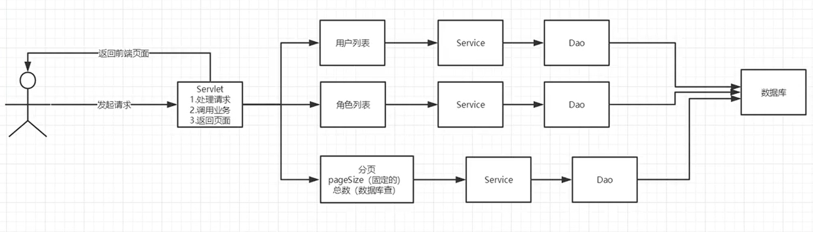

### 7.1 前期准备

1. 导入分页的工具类`SMBMS\src\main\java\com\phc\utils\PageSupport.java`
2. 用户列表 userlist.jsp 和分页页面userlist.jsp

### 7.2 获取用户数量

1. `SMBMS\src\main\java\com\phc\dao\user\UserDao.java`

   ```java
   //根据用户名或者角色查询用户总数
   public int getUserCount(Connection connection,String username,int userRole) throws Exception;
   ```

2. `SMBMS\src\main\java\com\phc\dao\user\UserDaoImpl.java`

   ```java
   //根据用户名或者角色查询用户总数
   @Override
   public int getUserCount(Connection connection, String username, int userRole) throws Exception {
       PreparedStatement pstm = null;
       ResultSet rs = null;
       int count = 0;
       if(null!=connection) {
           StringBuffer sql = new StringBuffer();
           //拼接sql语句
           sql.append("SELECT COUNT(1) AS `count` FROM `smbms_user` `user`,`smbms_role` `role` WHERE user.userRole=role.id");
           //存放的参数
           ArrayList<Object> list = new ArrayList<Object>();
           //传入的用户名不为空
           if(!StringUtils.isNullOrEmpty(username)) {
               sql.append(" AND user.userName like ?");
               list.add("%"+username+"%");//模糊查询
           }
   
           //传入的用户角色不为空
           if(userRole>0) {
               sql.append(" AND user.userRole = ?");
               list.add(userRole);
           }
           //把list转换成数组
           Object[] params = list.toArray();
   
           System.out.println("根据用户名和用户角色查询用户的数量(sql语句):"+sql.toString());
   
           rs = BaseDao.executeQuery(connection, pstm, sql.toString(), params);
           if(rs.next()) {
               count=rs.getInt("count");
           }
           BaseDao.closeResource(null,pstm,rs);
       }
       return count;
   }
   ```

   

3. `SMBMS\src\main\java\com\phc\service\user\UserService.java`

   ```java
   //根据用户名或者角色查询用户总数
   public int getUserCount(String username, int userRole);
   ```

4. `SMBMS\src\main\java\com\phc\service\user\UserServiceImpl.java`

   ```java
   //根据用户名或者角色查询用户总数
   @Override
   public int getUserCount(String username, int userRole) {
       Connection connection = null;
       int count = 0;
       connection = BaseDao.getConnection();
       try {
           count = userDao.getUserCount(connection,username,userRole);
       } catch (Exception e) {
           e.printStackTrace();
       } finally {
           BaseDao.closeResource(connection,null,null);
       }
       return count;
   }
   ```

   

### 7.3 获取用户列表

1. `SMBMS\src\main\java\com\phc\dao\user\UserDao.java`

   ```java
   //通过条件查询-userList
   public List<User> getUserList(Connection connection, String userName, int userRole, int currentPageNo, int pageSize)throws Exception;
   ```

2. `SMBMS\src\main\java\com\phc\dao\user\UserDaoImpl.java`

   ```java
   //通过条件查询-userList
   @Override
   public List<User> getUserList(Connection connection, String userName, int userRole, int currentPageNo, int pageSize) throws Exception {
       PreparedStatement pstm = null;
       ResultSet rs = null;
       List<User> userList = new ArrayList<User>();
       if(connection != null){
           StringBuffer sql = new StringBuffer();
           sql.append("select u.*,r.roleName as userRoleName from smbms_user u,smbms_role r where u.userRole = r.id");
           List<Object> list = new ArrayList<Object>();
           if(!StringUtils.isNullOrEmpty(userName)){
               sql.append(" and u.userName like ?");
               list.add("%"+userName+"%");
           }
           if(userRole > 0){
               sql.append(" and u.userRole = ?");
               list.add(userRole);
           }
           //对页面进行分页处理
           sql.append(" order by creationDate DESC limit ?,?");
           currentPageNo = (currentPageNo-1)*pageSize;
           list.add(currentPageNo);
           list.add(pageSize);
   
           Object[] params = list.toArray();
           System.out.println("sql ----> " + sql.toString());
           rs = BaseDao.executeQuery(connection, pstm, sql.toString(), params);
           while(rs.next()){
               User _user = new User();
               _user.setId(rs.getInt("id"));
               _user.setUserCode(rs.getString("userCode"));
               _user.setUserName(rs.getString("userName"));
               _user.setGender(rs.getInt("gender"));
               _user.setBirthday(rs.getDate("birthday"));
               _user.setPhone(rs.getString("phone"));
               _user.setUserRole(rs.getInt("userRole"));
               _user.setUserRoleName(rs.getString("userRoleName"));
               userList.add(_user);
           }
           BaseDao.closeResource(null, pstm, rs);
       }
       return userList;
   }
   ```

   

3. `SMBMS\src\main\java\com\phc\service\user\UserService.java`

   ```java
   //根据条件查询用户列表
   public List<User> getUserList(String queryUserName, int queryUserRole, int currentPageNo, int pageSize);
   ```

4. `SMBMS\src\main\java\com\phc\service\user\UserServiceImpl.java`

   ```java
   //根据条件查询用户列表
   @Override
   public List<User> getUserList(String queryUserName, int queryUserRole, int currentPageNo, int pageSize) {
       Connection connection = null;
       List<User> userList = null;
       System.out.println("queryUserName ---- > " + queryUserName);
       System.out.println("queryUserRole ---- > " + queryUserRole);
       System.out.println("currentPageNo ---- > " + currentPageNo);
       System.out.println("pageSize ---- > " + pageSize);
       try {
           connection = BaseDao.getConnection();
           userList = userDao.getUserList(connection, queryUserName,queryUserRole,currentPageNo,pageSize);
       } catch (Exception e) {
           // TODO Auto-generated catch block
           e.printStackTrace();
       }finally{
           BaseDao.closeResource(connection, null, null);
       }
       return userList;
   }
   ```


