# Mybatis学习笔记

推荐笔记：[【狂神说】Mybatis学习笔记（全）](https://blog.csdn.net/weixin_52200256/article/details/126611600)

推荐视频：[【狂神说Java】Mybatis最新完整教程IDEA版通俗易懂_哔哩哔哩_bilibili](https://www.bilibili.com/video/BV1NE411Q7Nx/?spm_id_from=333.337.search-card.all.click&vd_source=3e10f7e5d3cf396ddb49835c00d21a43)

## 一、简介

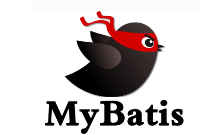

### 1.1 什么是Mybatis

（1）MyBatis 是一款优秀的持久层框架

（2）它支持自定义 SQL、存储过程以及高级映射

（3）MyBatis 免除了几乎所有的 JDBC 代码以及设置参数和获取结果集

（4）MyBatis 可以通过简单的 XML 或注解来配置和映射原始类型、接口和 Java POJO（Plain Old Java Objects，普通老式 Java 对象）为数据库中的记录。

（5）Mybatis现迁移到GitHub

### 1.2 如何获得Mybatis

1. Maven仓库：https://mvnrepository.com/

   ```xml
   <!-- https://mvnrepository.com/artifact/org.mybatis/mybatis -->
   <dependency>
       <groupId>org.mybatis</groupId>
       <artifactId>mybatis</artifactId>
       <version>3.5.6</version>
   </dependency>
   ```

2. GitHub：https://github.com/mybatis/mybatis-3

3. 官方文档：https://mybatis.org/mybatis-3/zh/index.html

### 1.3 持久化与持久层

#### 1.3.1 持久化

> 1. 数据持久化
>    - 持久化就是将程序的数据在持久状态和瞬时状态转化的过程
>    - 内存：**断电即失**
>    - 数据库（jdbc）,io文件持久化
>    - 生活结合：冰箱冷藏
> 2. 为什么需要持久化
>    - 有一些对象，不能让他丢掉，需要永久保存下来
>    - 内存太贵

#### 1.3.2 持久层

> Dao层，Service层，Controller层…
>
> - 完成持久化工作的代码块
> - 层与层之间的界限是十分明显的

### 1.4 为什么需要Mybatis

1. 帮助程序员将数据存入到数据库中

2. 方便

3. 传统的jdbc代码太复杂了，简化代码，形成框架。----自动化

4. 不使用MyBatis也可以，更容易上手

5. 优点

   > （1）简单易学：本身就很小且简单。没有任何第三方依赖，最简单安装只要两个jar文件+配置几个sql映射文件。易于学习，易于使用。通过文档和源代码，可以比较完全的掌握它的设计思路和实现。
   >
   > （2）灵活：mybatis不会对应用程序或者数据库的现有设计强加任何影响。 sql写在xml里，便于统一管理和优化。通过sql语句可以满足操作数据库的所有需求。
   >
   > （3）解除sql与程序代码的耦合：通过提供DAO层，将业务逻辑和数据访问逻辑分离，使系统的设计更清晰，更易维护，更易单元测试。sql和代码的分离，提高了可维护性。
   >
   > （4）提供映射标签，支持对象与数据库的orm字段关系映射。
   >
   > （5）提供对象关系映射标签，支持对象关系组建维护。
   >
   > （6）提供xml标签，支持编写动态sql。

## 二、第一个Mybatis程序

  思路：搭建环境—>导入Mybatis—>编写代码---->测试

### 2.1 搭建环境

#### 2.1.1 创建数据库

新建myBatis数据库创建user表添加数据（这里使用Navicat）

```sql
CREATE DATABASE IF NOT EXISTS `mybatis`;
USE `mybatis`;

CREATE TABLE IF NOT EXISTS `user` (
	`id` INT(20) NOT NULL,
	`name` VARCHAR(30) DEFAULT NULL,
	`pwd` VARCHAR(30) DEFAULT NULL,
	PRIMARY KEY(`id`)
)ENGINE=INNODB CHARACTER SET=utf8mb4;

INSERT INTO `user` (`id`,`name`,`pwd`) VALUES
(1,"小兰","123"),
(2,"柯南","12345"),
(3,"小明","123456")
```

#### 2.1.2 新建项目

1. 新建一个普通的Maven项目

2. 删除src目录

   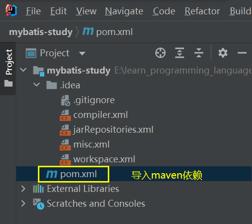

3. 导入maven依赖

   `mybatis-study\pom.xml`

   ```xml
   <?xml version="1.0" encoding="UTF-8"?>
   <project xmlns="http://maven.apache.org/POM/4.0.0"
            xmlns:xsi="http://www.w3.org/2001/XMLSchema-instance"
            xsi:schemaLocation="http://maven.apache.org/POM/4.0.0 http://maven.apache.org/xsd/maven-4.0.0.xsd">
       <modelVersion>4.0.0</modelVersion>
   
       <!--父工程-->
       <groupId>com.phc</groupId>
       <artifactId>mybatis-study</artifactId>
       <version>1.0-SNAPSHOT</version>
   
       <!--导入依赖-->
       <dependencies>
           <!--mysql驱动-->
           <dependency>
               <groupId>mysql</groupId>
               <artifactId>mysql-connector-java</artifactId>
               <version>8.0.30</version>
           </dependency>
           <!--mybatis依赖包-->
           <!-- https://mvnrepository.com/artifact/org.mybatis/mybatis -->
           <dependency>
               <groupId>org.mybatis</groupId>
               <artifactId>mybatis</artifactId>
               <version>3.5.6</version>
           </dependency>
           <!--junit测试包-->
           <dependency>
               <groupId>junit</groupId>
               <artifactId>junit</artifactId>
               <version>4.13.2</version>
           </dependency>
       </dependencies>
   </project>
   ```

### 2.2 创建普通的maven模块

#### 2.2.1 编写mybatis的核心配置文件

`mybatis-study\mybatis-01\src\main\resources\mybatis-config.xml`

```xml
<?xml version="1.0" encoding="UTF-8" ?>
<!DOCTYPE configuration
        PUBLIC "-//mybatis.org//DTD Config 3.0//EN"
        "http://mybatis.org/dtd/mybatis-3-config.dtd">
<!--mybatis核心配置文件-->
<configuration>
    <environments default="development">
        <environment id="development">
            <transactionManager type="JDBC"/>
            <dataSource type="POOLED">
                <property name="driver" value="com.mysql.cj.jdbc.Driver"/>
                <property name="url" value="jdbc:mysql://localhost:3306/mybatis?useSSL=false&amp;useUnicode=true&amp;characterEncoding=UTF-8"/>
                <property name="username" value="root"/>
                <property name="password" value="123456"/>
            </dataSource>
        </environment>
    </environments>
    <!--每一个Mapper.xml都需要在MyBatis核心配置文件中注册-->
    <mappers>
        <mapper resource="com/qjd/dao/UserMapper.xml"/>
    </mappers>
</configuration>
```

#### 2.2.2 编写mybatis的工具类

`mybatis-study\mybatis-01\src\main\java\com\phc\utils\MybatisUtils.java`

```java
package com.phc.utils;

import org.apache.ibatis.io.Resources;
import org.apache.ibatis.session.SqlSession;
import org.apache.ibatis.session.SqlSessionFactory;
import org.apache.ibatis.session.SqlSessionFactoryBuilder;

import java.io.IOException;
import java.io.InputStream;

/**
 * @FileName MybatisUtils.java
 * @Description 创建sqlSessionFactory,获得sqlSession
 * @Author phc
 * @date 2023/1/7 11:13
 * @Version 1.0
 */
//sqlSessionFactory ---> sqlSession
public class MybatisUtils {
    private static SqlSessionFactory sqlSessionFactory;
    static {
        try {
            //这是使用mybatis的第一步:获取sqlSessionFactory对象
            String resource = "mybatis-config.xml";
            InputStream inputStream = Resources.getResourceAsStream(resource);
            sqlSessionFactory = new SqlSessionFactoryBuilder().build(inputStream);
        } catch (IOException e) {
            e.printStackTrace();
        }
    }
    //既然有了 SqlSessionFactory，顾名思义，我们可以从中获得 SqlSession 的实例。
    // SqlSession 提供了在数据库执行 SQL 命令所需的所有方法
    public static SqlSession getSqlSession() {
        return sqlSessionFactory.openSession();
    }
}
```

### 2.3 编写代码

#### 2.3.1 实体类

`mybatis-study\mybatis-01\src\main\java\com\phc\pojo\User.java`

```java
package com.phc.pojo;
/**
 * @FileName User.java
 * @Description 实体类,实现数据库mybatis的User表
 * @Author phc
 * @date 2023/1/7 15:35
 * @Version 1.0
 */
public class User {
    private int id;
    private String name;
    private String pwd;
    //构造函数
    public User() {
    }
    public User(int id, String name, String pwd) {
        this.id = id;
        this.name = name;
        this.pwd = pwd;
    }
    //getter与setter方法
    public int getId() {
        return id;
    }
    public void setId(int id) {
        this.id = id;
    }
    public String getName() {
        return name;
    }
    public void setName(String name) {
        this.name = name;
    }
    public String getPwd() {
        return pwd;
    }
    public void setPwd(String pwd) {
        this.pwd = pwd;
    }
    @Override
    public String toString() {
        return "User{" +
            "id=" + id +
            ", name='" + name + '\'' +
            ", pwd='" + pwd + '\'' +
            '}';
    }
}
```

#### 2.3.2 Dao接口

`mybatis-study\mybatis-01\src\main\java\com\phc\dao\UserDao.java`

```java
package com.phc.dao;
import com.phc.pojo.User;
import java.util.List;
/**
 * @FileName UserDao.java
 * @Description UserDao接口
 * @Author phc
 * @date 2023/1/7 15:40
 * @Version 1.0
 */
public interface UserDao {
    List<User> getUserList();
}
```

#### 2.3.3 `Mapper`配置文件

`mybatis-study\mybatis-01\src\main\java\com\phc\dao\UserMapper.xml`

```xml
<?xml version="1.0" encoding="UTF-8" ?>
<!DOCTYPE mapper
        PUBLIC "-//mybatis.org//DTD Mapper 3.0//EN"
        "http://mybatis.org/dtd/mybatis-3-mapper.dtd">

<!--namespace:绑定一个Dao/Mapper接口,这里是绑定UserDao接口-->
<mapper namespace="com.phc.dao.UserDao">
    <!--select查询语句,id对应namespace中接口里的方法名,resultType对应返回值的类型-->
    <select id="getUserList" resultType="com.phc.pojo.User">
        select * from mybatis.user
    </select>
</mapper>
```

### 2.4 测试

`mybatis-study\mybatis-01\src\test\java\com\phc\dao\UserDaoTest.java`

```java
package com.phc.dao;

import com.phc.pojo.User;
import com.phc.utils.MybatisUtils;
import org.apache.ibatis.session.SqlSession;
import org.junit.Test;

import java.util.List;

/**
 * @FileName UserDaoTest.java
 * @Description 测试第一个mybatis代码
 * @Author phc
 * @date 2023/1/7 15:47
 * @Version 1.0
 */
public class UserDaoTest {
    @Test
    public void test() {
        //1.获取SqlSessionFactory对象
        SqlSession sqlSession = MybatisUtils.getSqlSession();
        //方式一:getMapper(推荐)
        //2.执行sql
        UserDao userDaoMapper = sqlSession.getMapper(UserDao.class);
        List<User> userList = userDaoMapper.getUserList();
//        //方式二:selectList(不推荐)
//        List<User> userList = sqlSession.selectList("com.phc.dao.UserDao.getUserList");
        for(User user:userList) {
            System.out.println(user);
        }
        //3.关闭SqlSession
        sqlSession.close();
    }
}
```

1. 文件结构

   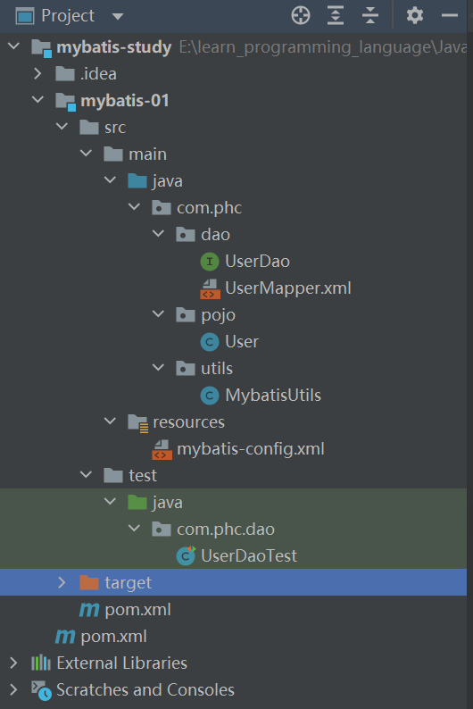

2. 执行结果

   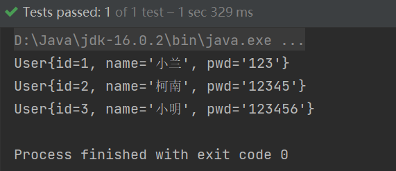

### 2.5 错误分析

#### 2.5.1 错误一

1. 错误描述：`org.apache.ibatis.binding.BindingException: Type interface com.phc.dao.UserDao is not known to the MapperRegistry.`

2. 问题原因：每一个`Mapper.xml`都需要在`MyBatis`核心配置文件中注册才能生效！

3. 问题解决：

   在核心配置文件（`mybatis-config.xml`）中注册Mappers

   `mybatis-study\mybatis-01\src\main\resources\mybatis-config.xml`

   ```xml
   <!--每一个Mapper.xml都需要在MyBatis核心配置文件中注册-->
   <mappers>
       <mapper resource="com/phc/dao/UserMapper.xml"/>
   </mappers>
   ```

#### 2.5.2 错误二

1. 错误描述：`org.apache.ibatis.builder.BuilderException: Error parsing SQL Mapper Configuration. Cause: java.io.IOException: Could not find resource com/phc/dao/UserMapper.xml`

2. 问题原因：`maven`导出资源是时默认只会导出`resources`文件夹下的资源文件，要导出`java`文件夹下的资源文件，需要在`pom`文件中声明！

3. 问题解决：

   `mybatis-study\pom.xml`

   ```xml
   <!--在build中配置resources,来防止我们资源导出失败的问题-->
   <build>
       <resources>
           <resource>
               <directory>src/main/resources</directory>
               <includes>
                   <include>**/*.properties</include>
                   <include>**/*.xml</include>
               </includes>
           </resource>
           <resource>
               <directory>src/main/java</directory>
               <includes>
                   <include>**/*.properties</include>
                   <include>**/*.xml</include>
               </includes>
           </resource>
       </resources>
   </build>
   ```

#### 2.5.3 还可能存在的问题

1. `Mapper`配置文件没有注册（错误一）
2. 绑定接口错误
3. 方法名不对
4. 返回类型不对
5. maven导出资源问题（错误二）

## 三、CRUD

### 3.1 增删改查

```xml
<!--namespace:绑定一个Dao/Mapper接口,这里是绑定UserMapper接口-->
<mapper namespace="com.phc.dao.UserMapper">
```

1. namespace

   namespace中的包名要和接口中的包名一致：uesrDao–>userMapper

2. select（查询）

   ```xml
   <!--parameterType:方法参数类型-->
   <select id="getUserById" parameterType="int" resultType="com.phc.pojo.User" >
       select * from mybatis.user where id=#{id};
   </select>
   ```

   选择查询语句：

   - id就是对应的namespace中的方法名
   - resultType就是Sql语句执行的返回值
   - parameterType就是参数类型

3. 增（create）删（delete）改（update）

   **注意：增删改需要提交事务才能对数据库进行操作**

   > （1）编写接口
   >
   > `mybatis-study\mybatis-01\src\main\java\com\phc\dao\UserMapper.java`
   >
   > ```java
   > package com.phc.dao;
   > import com.phc.pojo.User;
   > import java.util.List;
   > /**
   >  * @FileName UserDao.java
   >  * @Description UserDao接口
   >  * @Author phc
   >  * @date 2023/1/7 15:40
   >  * @Version 1.0
   >  */
   > public interface UserMapper {
   >     //查询全部用户
   >     List<User> getUserList();
   > 
   >     //根据ID查询用户
   >     User getUserById(int id);
   > 
   >     //增加(insert)一个用户
   >     int addUser(User user);
   > 
   >     //修改用户属性
   >     int updateUser(User user);
   > 
   >     //根据ID删除用户
   >     int deleteUser(int id);
   > }
   > ```
   >
   > （2）写对应Mapper中的sql语句
   >
   > `mybatis-study\mybatis-01\src\main\java\com\phc\dao\UserMapper.xml`
   >
   > ```xml
   > <!--parameterType:方法参数类型-->
   > <select id="getUserById" parameterType="int" resultType="com.phc.pojo.User" >
   >     select * from mybatis.user where id=#{id};
   > </select>
   > 
   > <!--增:sql为insert时标签也需要为insert-->
   > <insert id="addUser" parameterType="com.phc.pojo.User">
   >     <!--对象中的属性可以直接取出来-->
   >     insert into mybatis.user(id,name,pwd) values (#{id},#{name},#{pwd});
   > </insert>
   > 
   > <!--改-->
   > <update id="updateUser" parameterType="com.phc.pojo.User" >
   >     update mybatis.user set name=#{name},pwd=#{pwd} where id=#{id};
   > </update>
   > 
   > <!--删-->
   > <delete id="deleteUser" parameterType="int" >
   >     delete from mybatis.user where id=#{id};
   > </delete>
   > ```
   >
   > （3）测试
   >
   > `mybatis-study\mybatis-01\src\test\java\com\phc\dao\UserDaoTest.java`
   >
   > ```java
   > @Test
   > public void getUserByIdTest() {
   >     //获取SqlSessionFactory对象
   >     SqlSession sqlSession = MybatisUtils.getSqlSession();
   >     //拿到UserMapper类
   >     UserMapper userMapper = sqlSession.getMapper(UserMapper.class);
   >     //执行UserMapper类中的方法
   >     User user = userMapper.getUserById(2);
   >     System.out.println(user);
   >     sqlSession.close();
   > }
   > 
   > //增删改查需要提交事务,不提交事务即使不报错也不能将修改后的值插入到数据库的表中
   > @Test
   > public void addUserTest() {
   >     SqlSession sqlSession = MybatisUtils.getSqlSession();
   >     UserMapper userMapper = sqlSession.getMapper(UserMapper.class);
   >     int affectRows = userMapper.addUser(new User(5,"小黄","1111"));
   >     if(affectRows>0) {
   >         System.out.println("插入成功!影响了"+affectRows+"行");
   >     } else {
   >         System.out.println("插入失败!");
   >     }
   >     //提交事务
   >     sqlSession.commit();
   >     sqlSession.close();
   > }
   > 
   > @Test
   > public void updateUserTest() {
   >     SqlSession sqlSession = MybatisUtils.getSqlSession();
   >     UserMapper userMapper = sqlSession.getMapper(UserMapper.class);
   >     int affectRows = userMapper.updateUser(new User(3, "phc", "666"));
   >     if(affectRows>0) {
   >         System.out.println("修改成功!影响了"+affectRows+"行");
   >     } else {
   >         System.out.println("修改失败!");
   >     }
   >     sqlSession.commit();
   >     sqlSession.close();
   > }
   > 
   > @Test
   > public void deleteUserTest() {
   >     SqlSession sqlSession = MybatisUtils.getSqlSession();
   >     UserMapper userMapper = sqlSession.getMapper(UserMapper.class);
   >     int deleteUserById = 5;
   >     int affectRows = userMapper.deleteUser(deleteUserById);
   >     if(affectRows>0) {
   >         System.out.println("删除成功!影响了"+affectRows+"行,删除的用户ID为"+deleteUserById);
   >     } else {
   >         System.out.println("删除ID为"+deleteUserById+"的用户失败!");
   >     }
   >     sqlSession.commit();
   >     sqlSession.close();
   > }
   > ```


### 3.2 map方法

假设我们的实体类，或者数据库中的表，字段或者参数过多，我们应当考虑使用**Map**

1. `mybatis-study\mybatis-01\src\main\java\com\phc\dao\UserMapper.java`

   ```java
   //使用map添加一个用户
   int addUserByMap(Map map);
   ```

2. `mybatis-study\mybatis-01\src\main\java\com\phc\dao\UserMapper.xml`

   ```xml
   <!--使用map传递参数就只要根据key值即可,不需要严格按照数据库属性的值来设定-->
   <insert id="addUserByMap" parameterType="Map" >
       insert into mybatis.user(id,name,pwd) values (#{ID},#{userName},#{userPassword})
   </insert>
   ```

3. `mybatis-study\mybatis-01\src\test\java\com\phc\dao\UserDaoTest.java`

   ```java
   @Test
   public void addUserByMapTest() {
       SqlSession sqlSession = MybatisUtils.getSqlSession();
       UserMapper userMapper = sqlSession.getMapper(UserMapper.class);
       Map<String, Object> newUser = new HashMap<String, Object>();
       newUser.put("ID",5);
       newUser.put("userName","小李");
       newUser.put("userPassword","55555");
       int affectRows = userMapper.addUserByMap(newUser);
       if(affectRows>0) {
           System.out.println("插入成功!影响了"+affectRows+"行");
       } else {
           System.out.println("插入失败!");
       }
       //提交事务
       sqlSession.commit();
       sqlSession.close();
   }
   ```

- Map传递参数，直接在sql中取出key即可！
- 对象传递参数，直接在sql中去对象的属性即可！
- 只有一个基本类型参数的情况下，可以直接在sql中取到！
- 多个参数用Map,或者注解

### 3.3 模糊查询

1. `mybatis-study\mybatis-01\src\main\java\com\phc\dao\UserMapper.java`

   ```java
   //模糊查询
   List<User> getUserLike(String userName);
   ```

2. `mybatis-study\mybatis-01\src\main\java\com\phc\dao\UserMapper.xml`

   ```xml
   <!--模糊查询-->
   <select id="getUserLike" parameterType="String" resultType="com.phc.pojo.User" >
       select * from mybatis.user where name like "%"#{value}"%";
   </select>
   ```

3. `mybatis-study\mybatis-01\src\test\java\com\phc\dao\UserDaoTest.java`

   ```java
   //模糊查询
   @Test
   public void getUserLikeTest() {
       SqlSession sqlSession = MybatisUtils.getSqlSession();
       UserMapper userMapper = sqlSession.getMapper(UserMapper.class);
       List<User> users = userMapper.getUserLike("小");
       for(User user:users) {
           System.out.println(user);
       }
       sqlSession.close();
   }
   ```

## 四、配置解析

### 4.1 核心配置文件`mybatis-config.xml`

MyBatis 的配置文件包含了会深深影响 MyBatis 行为的设置和属性信息。 配置文档的顶层结构如下：

> configuration（配置）
>
> * properties（属性）
> * settings（设置）
> * typeAliases（类型别名）
> * typeHandlers（类型处理器）
> * objectFactory（对象工厂）
> * plugins（插件）
> * environments（环境配置）
>   * environment（环境变量）
>     * transactionManager（事务管理器）
>       dataSource（数据源）
>  * databaseIdProvider（数据库厂商标识）
>  *  mappers（映射器）

### 4.2 环境配置（environments）

- MyBatis 可以配置成适应多种环境

- **不过要记住：尽管可以配置多个环境，但每个 SqlSessionFactory 实例只能选择一种环境。**

- 数据源的配置（比如：type=“POOLED”）

- 学会配置多套运行环境-----更改id

  ```xml
  <environments default="id">
  ```

- Mybatis默认的事务管理器就是JDBC，连接池：POOLED

### 4.3 属性（properties）

我们可以通过properties属性来实现引用配置文件

这些属性可以在外部进行配置，并可以进行动态替换。你既可以在典型的 Java 属性文件中配置这些属性，也可以在 properties 元素的子元素中设置【db.properties】

编写一个配置文件db.properties：

`mybatis-study\mybatis-01\src\main\resources\db.properties`

```properties
driver=com.mysql.cj.jdbc.Driver
url=jdbc:mysql://localhost:3306/mybatis?useSSL=false&useUnicode=true&characterEncoding=UTF-8
username=root
password=123456
```

在核心配置文件中引入

`mybatis-study\mybatis-01\src\main\resources\mybatis-config.xml`

```xml
<!--mybatis核心配置文件-->
<configuration>
    <!--引入外部配置文件(优先使用)-->
    <properties resource="db.properties" />
    <environments default="development">
        <environment id="development">
            <transactionManager type="JDBC"/>
            <dataSource type="POOLED">
                <property name="driver" value="${driver}"/>
                <property name="url" value="${url}"/>
                <property name="username" value="${username}"/>
                <property name="password" value="${password}"/>
            </dataSource>
        </environment>
    </environments>
    <!--每一个Mapper.xml都需要在MyBatis核心配置文件中注册-->
    <mappers>
        <mapper resource="com/phc/dao/UserMapper.xml"/>
    </mappers>
</configuration>
```

注意事项

1. 可以直接引入外部文件

2. 可以在其中增加一些属性配置

3. 如果外部配置与property标签配置有同一个字段，则优先使用外部配置文件的

   ```xml
   <!--引入外部配置文件(优先使用)-->
   <properties resource="db.properties">
       <!--优先级较低,若外部配置与property标签配置有同一个字段,则优先使用外部配置文件的-->
       <property name="password" value="111111"/>
   </properties>
   ```

### 4.4 typeAliases（类型别名）

类型别名可为 Java 类型设置一个缩写名字。它仅用于 XML 配置，意在降低冗余的全限定类名书写。

1. 方法一：通过`typeAlias`设置一一对应的`type`和`alias`

   （1）`mybatis-study\mybatis-01\src\main\resources\mybatis-config.xml`

   ```xml
   <!--设置别名-->
   <typeAliases>
       <typeAlias type="com.phc.pojo.User" alias="User" />
   </typeAliases>
   ```

   （2）`mybatis-study\mybatis-01\src\main\java\com\phc\dao\UserMapper.xml`

   ```xml
   <!--select查询语句,id对应namespace中接口里的方法名,resultType对应返回值的类型-->
   <!--<select id="getUserList" resultType="com.phc.pojo.User" >-->
   <select id="getUserList" resultType="User" >
       select * from mybatis.user;
   </select>
   ```

2. 方法二：通过`package`标签可以指定一个包名，MyBatis会在包名下搜索需要的Java Bean，比如：扫描实体类的包，它的默认别名就为这个类的类名，首字母小写。

   （1）`mybatis-study\mybatis-01\src\main\resources\mybatis-config.xml`

   ```xml
   <!--设置别名-->
   <typeAliases>
       <!--<typeAlias type="com.phc.pojo.User" alias="User" />-->
       <package name="com.phc.pojo"/>
   </typeAliases>
   ```

   （2）`mybatis-study\mybatis-01\src\main\java\com\phc\dao\UserMapper.xml`

   ```xml
   <!--select查询语句,id对应namespace中接口里的方法名,resultType对应返回值的类型-->
   <!--<select id="getUserList" resultType="com.phc.pojo.User" >-->
   <!--<select id="getUserList" resultType="User" >-->
   <select id="getUserList" resultType="user" >
       select * from mybatis.user;
   </select>
   ```

   在实体类比较少的时候，使用第一种方式；如果实体类十分多，建议使用第二种

3. 方法三：在实体类中使用注解起别名

   `mybatis-study\mybatis-01\src\main\java\com\phc\pojo\User.java`

   ```java
   @Alias("userAlias")
   public class User {
       ......
   }
   ```


### 4.5 设置(settings)

这是 MyBatis 中极为重要的调整设置，它们会改变 MyBatis 的运行时行为。

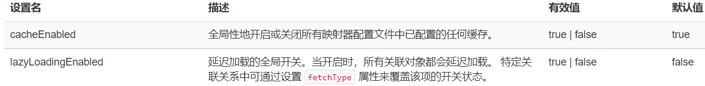

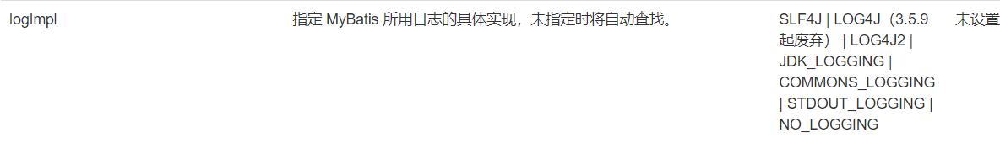

一个配置完整的 settings 元素的示例如下：

```xml
<settings>
  <setting name="cacheEnabled" value="true"/>
  <setting name="lazyLoadingEnabled" value="true"/>
  <setting name="multipleResultSetsEnabled" value="true"/>
  <setting name="useColumnLabel" value="true"/>
  <setting name="useGeneratedKeys" value="false"/>
  <setting name="autoMappingBehavior" value="PARTIAL"/>
  <setting name="autoMappingUnknownColumnBehavior" value="WARNING"/>
  <setting name="defaultExecutorType" value="SIMPLE"/>
  <setting name="defaultStatementTimeout" value="25"/>
  <setting name="defaultFetchSize" value="100"/>
  <setting name="safeRowBoundsEnabled" value="false"/>
  <setting name="mapUnderscoreToCamelCase" value="false"/>
  <setting name="localCacheScope" value="SESSION"/>
  <setting name="jdbcTypeForNull" value="OTHER"/>
  <setting name="lazyLoadTriggerMethods" value="equals,clone,hashCode,toString"/>
</settings>
```

其他配置（了解就行）

- typeHandlers（类型处理器）
- objectFactory（对象工厂）
- plugins（插件）

### 4.6 映射器（mappers）

MapperRegistry：注册绑定我们的Mapper文件，每写一个dao层就要写一个Mapper文件 

1. 方式一：建议使用

   ```xml
   <!--每一个Mapper.xml都需要在MyBatis核心配置文件中注册-->
   <mappers>
       <mapper resource="com/phc/dao/UserMapper.xml"/>
   </mappers>
   ```

2. 方式二

   ```xml
   <!-- 使用映射器接口实现类的完全限定类名 -->
   <mappers>
       <mapper class="org.mybatis.builder.AuthorMapper"/>
       <mapper class="org.mybatis.builder.BlogMapper"/>
       <mapper class="org.mybatis.builder.PostMapper"/>
   </mappers>
   
   ```

   注意：

   - 接口和他的Mapper配置文件必须同名
   - 接口和他的Mapper配置文件必须在同一个包下

3. 方式三

   ```xml
   <!-- 将包内的映射器接口实现全部注册为映射器 -->
   <mappers>
     <package name="org.mybatis.builder"/>
   </mappers>
   ```

   注意：

   - 接口和他的Mapper配置文件必须同名
   - 接口和他的Mapper配置文件必须在同一个包下

### 4.7 生命周期和作用域

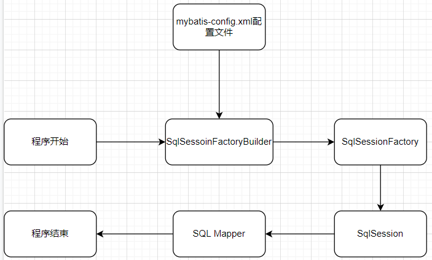

不同作用域和生命周期类别是至关重要的，因为错误的使用会导致非常严重的**并发问题**。

1. SqlSessionFactoryBuilder：

   - 一旦创建了 SqlSessionFactory，就不再需要SqlSessionFactoryBuilder了
   - 局部变量

2. **SqlSessionFactory**

   - 可以理解为数据库连接池
   - SqlSessionFactory 一旦被创建就应该在应用的运行期间一直存在，没有任何理由丢弃它或重新创建另一个实例
   - SqlSessionFactory 的最佳作用域是应用作用域，最简单的就是使用单例模式或者静态单例模式

3. **SqlSession**

   - 连接到连接池的一个请求
   - SqlSession 的实例不是线程安全的，因此是不能被共享的，所以它的最佳的作用域是请求或方法作用域
   - 用完之后需要赶紧关闭，否则资源被占用

   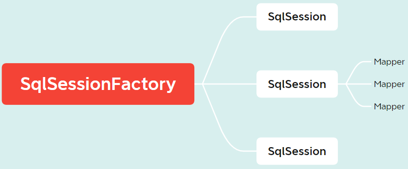

   这里每一个Mapper就代表一个具体的业务

## 五、解决属性名和字段名不一致的问题

### 5.1 问题

1. 数据库中的字段

   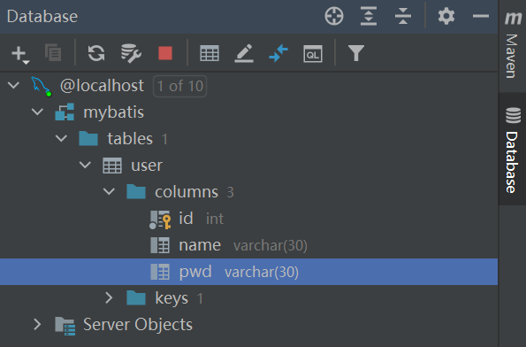

2. 新建一个项目，拷贝之前的，测试实体类字段不一样的情况

   ```java
   public class User {
       private int id;
       private String name;
       private String password; //属性名和字段名存在不一致的问题
   }
   ```

   

3. 测试出现`password=null`的错误

   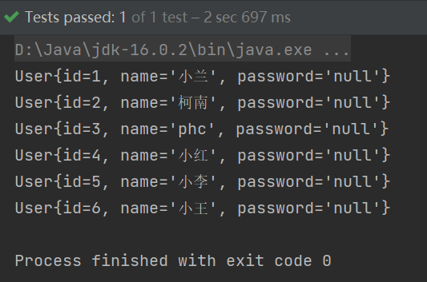

4. 问题原因

   ```sql
   # 此时已经没有pwd
   select id,name,pwd from mybatis.user
   ```

### 5.2 解决方法

1. 解决方法：起别名

   ```sql
   select id,name,pwd as password from mybatis.user 
   ```

2. ### resultMap方法

   `mybatis-study\mybatis-02\src\main\java\com\phc\dao\UserMapper.xml`

   ```xml
   <!--resultMap结果集映射-->
   <resultMap id="UserMap" type="User">
       <!--column数据库中的字段，properties实体类中的属性-->
       <result column="pwd" property="password" />
   </resultMap>
   
   <!--select查询语句,id对应namespace中接口里的方法名,resultType对应返回值的类型-->
   <select id="getUserList" resultMap="UserMap" >
       select * from mybatis.user;
   </select>
   ```

   `resultMap` 元素是 MyBatis 中最重要最强大的元素

   `ResultMap` 的设计思想是，对简单的语句做到零配置，对于复杂一点的语句，只需要描述语句之间的关系就行了

### 5.3 回顾使用mybatis的步骤

新建一个普通的maven模块：mybatis-03

> 1. 在src/main/resources路径下建立mybatis-config.xml文件建立核心配置文件
> 2. 在src/main/java/com/phc/utils路径下编写工具类MybatisUtils.java读取配置文件获取sqlsessionfactory
> 3. 在src/main/java/com/phc/pojo路径下编写实体类User.java
> 4. 在src/main/java/com/phc/dao路径下编写接口UserMapper.java和UserMapper.xml
> 5. 编写测试类

## 六、日志

### 6.1 日志工厂

如果一个数据库操作出现了异常，我们需要排错，日志就是最好的助手

之前: sout,debug

现在：日志工厂

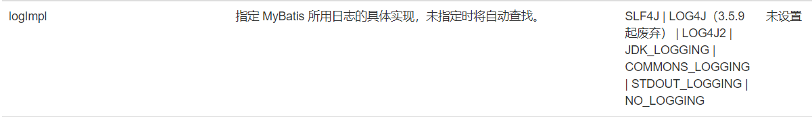

日志工厂模式：

- SLF4J |
- **LOG4J（3.5.9 起废弃）**
- LOG4J2
- JDK_LOGGING
- COMMONS_LOGGING
- **STDOUT_LOGGING（标准日志输出）**
- NO_LOGGING

1. 在mybatis核心配置文件中，配置我们的日志

   `mybatis-study\mybatis-03\src\main\resources\mybatis-config.xml`

   ```xml
   <settings>
       <setting name="logImpl" value="STDOUT_LOGGING"/>
   </settings>
   ```

2. 日志输出结果

   ```bash
   Logging initialized using 'class org.apache.ibatis.logging.stdout.StdOutImpl' adapter.
   PooledDataSource forcefully closed/removed all connections.
   PooledDataSource forcefully closed/removed all connections.
   PooledDataSource forcefully closed/removed all connections.
   PooledDataSource forcefully closed/removed all connections.
   Opening JDBC Connection
   Created connection 1250142026.
   Setting autocommit to false on JDBC Connection [com.mysql.cj.jdbc.ConnectionImpl@4a83a74a]
   ==>  Preparing: select * from mybatis.user;
   ==> Parameters: 
   <==    Columns: id, name, pwd
   <==        Row: 1, 小兰, 123
   <==        Row: 2, 柯南, 12345
   <==        Row: 3, phc, 666
   <==        Row: 4, 小红, 0000
   <==        Row: 5, 小李, 55555
   <==        Row: 6, 小王, 666666
   <==      Total: 6
   User{id=1, name='小兰', pwd='123'}
   User{id=2, name='柯南', pwd='12345'}
   User{id=3, name='phc', pwd='666'}
   User{id=4, name='小红', pwd='0000'}
   User{id=5, name='小李', pwd='55555'}
   User{id=6, name='小王', pwd='666666'}
   Resetting autocommit to true on JDBC Connection [com.mysql.cj.jdbc.ConnectionImpl@4a83a74a]
   Closing JDBC Connection [com.mysql.cj.jdbc.ConnectionImpl@4a83a74a]
   Returned connection 1250142026 to pool.
   ```

### 6.2 日志工厂模式之`LOG4J`

什么是log4j：

> （1）Log4j是Apache的一个开源项目，通过使用Log4j，我们可以控制日志信息输送的目的地是控制台、文件、GUI组件
>
> （2）我们也可以控制每一条日志的输出格式
>
> （3）通过定义每一条日志信息的级别，我们能够更加细致地控制日志的生成过程
>
> （4）通过一个配置文件来灵活地进行配置，而不需要修改应用的代码

1. 先导入log4j的包

   `mybatis-study\pom.xml`

   ```xml
   <!--日志工厂模式(log4j)-->
   <!-- https://mvnrepository.com/artifact/log4j/log4j -->
   <dependency>
       <groupId>log4j</groupId>
       <artifactId>log4j</artifactId>
       <version>1.2.17</version>
   </dependency>
   ```

2. log4j配置文件

   `mybatis-study\mybatis-03\src\main\resources\log4j.properties`

   ```properties
   ### 配置根 ###
   log4j.rootLogger = debug,console,file
   
   
   ### 配置输出到控制台 ###
   log4j.appender.console = org.apache.log4j.ConsoleAppender
   log4j.appender.console.Target = System.out
   log4j.appender.console.Threshold = debug 
   log4j.appender.console.layout = org.apache.log4j.PatternLayout
   log4j.appender.console.layout.ConversionPattern =  %d{ABSOLUTE} %5p %c{1}:%L - %m%n
   
   ### 配置输出到文件 ###
   log4j.appender.file = org.apache.log4j.FileAppender
   log4j.appender.file.File = ./log/phc.log
   
   log4j.appender.file.Append = true
   log4j.appender.file.Threshold = debug
   
   log4j.appender.file.layout = org.apache.log4j.PatternLayout
   log4j.appender.file.layout.ConversionPattern = %-d{yyyy-MM-dd HH:mm:ss}  [ %t:%r ] - [ %p ]  %m%n
   
   ### 配置输出到文件，并且每天都创建一个文件 ###
   log4j.appender.dailyRollingFile = org.apache.log4j.DailyRollingFileAppender
   log4j.appender.dailyRollingFile.File = logs/log.log
   log4j.appender.dailyRollingFile.Append = true
   log4j.appender.dailyRollingFile.Threshold = debug
   log4j.appender.dailyRollingFile.layout = org.apache.log4j.PatternLayout
   log4j.appender.dailyRollingFile.layout.ConversionPattern = %-d{yyyy-MM-dd HH:mm:ss}  [ %t:%r ] - [ %p ]  %m%n
   
   ### 设置输出sql的级别，其中logger后面的内容全部为jar包中所包含的包名 ###
   log4j.logger.org.mybatis=debug
   log4j.logger.java.sql=debug
   log4j.logger.java.sql.Connection=debug
   log4j.logger.java.sql.Statement=debug
   log4j.logger.java.sql.PreparedStatement=debug
   log4j.logger.java.sql.ResultSet=debug
   ```

3. 在mybatis核心配置文件中设置log4j为日志的实现

   `mybatis-study\mybatis-03\src\main\resources\mybatis-config.xml`

   ```xml
   <settings>
       <!--<setting name="logImpl" value="STDOUT_LOGGING"/>-->
       <setting name="logImpl" value="LOG4J"/>
   </settings>
   ```

4. Log4j的使用，直接运行刚才的测试

   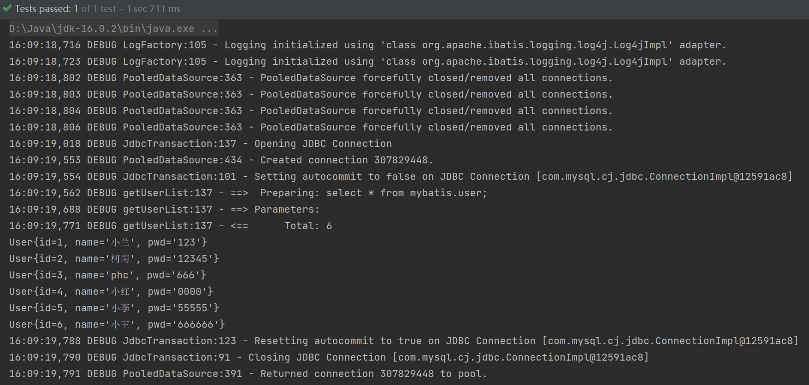

5. 简单使用

   （1）在要使用Log4j的类中，导入包import org.apache.log4j.Logger;

   （2）日志对象，参数为当前类的class

   `mybatis-study\mybatis-03\src\test\java\com\phc\dao\UserDaoTest.java`

   ```java
   import org.apache.log4j.Logger;
   //log4j的使用
   static Logger logger = Logger.getLogger(UserDaoTest.class);
   @Test
   public void log4jTest() {
       logger.info("info:进入了log4jTest");
       logger.debug("debug:进入了log4jTest");
       logger.error("error:进入了log4jTest");
   }
   ```

   （3）输出

   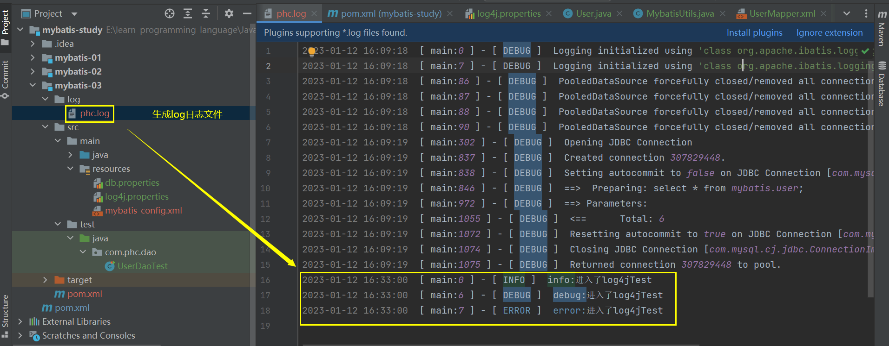

## 七、分页的实现

为什么要分页：减少数据的一次性处理量

### 7.1 使用Limit分页

```sql
SELECT * FROM user limit startIndex,pageSize;
SELECT * FROM user limit 0,2;
SELECT * FROM user limit 3;#[0,n]
```

使用`Mybatis`实现分页，核心就是`sql`

1. `mybatis-study\mybatis-03\src\main\java\com\phc\dao\UserMapper.java`

   ```java
   //使用limit进行分页
   List<User> getUserByLimit(Map<String,Integer> map);
   ```

2. `mybatis-study\mybatis-03\src\main\java\com\phc\dao\UserMapper.xml`

   ```xml
   <!--使用limit进行分页-->
   <select id="getUserByLimit" parameterType="map" resultType="User">
       select * from mybatis.user limit #{startIndex},#{pageSize}
   </select>
   ```

3. `mybatis-study\mybatis-03\src\test\java\com\phc\dao\UserDaoTest.java`

   ```java
   //使用limit进行分页
   @Test
   public void getUserByLimitTest() {
       SqlSession sqlSession = MybatisUtils.getSqlSession();
       UserMapper userMapper = sqlSession.getMapper(UserMapper.class);
       HashMap<String,Integer> map = new HashMap<>();
       map.put("startIndex",0);
       map.put("pageSize",3);
       List<User> userList = userMapper.getUserByLimit(map);
       for(User user:userList) {
           System.out.println(user);
       }
       sqlSession.close();
   }
   ```

### 7.2 RowBounds分页

RowBounds分页了解，不建议使用

不再使用sql实现分页

1. `mybatis-study\mybatis-03\src\main\java\com\phc\dao\UserMapper.java`

   ```java
   //RowBounds分页
   List<User> getUserByRowBounds();
   ```

2. `mybatis-study\mybatis-03\src\main\java\com\phc\dao\UserMapper.xml`

   ```xml
   <!--RowBounds分页-->
   <select id="getUserByRowBounds"  resultMap="UserMap">
       select * from mybatis.user
   </select>
   ```

3. `mybatis-study\mybatis-03\src\test\java\com\phc\dao\UserDaoTest.java`

   ```java
   @Test
   public void getUserByRowBounds(){
       SqlSession sqlSession = MybatisUtils.getSqlSession();
       //RowBounds实现
       RowBounds rowBounds = new RowBounds(1, 2);
       //通过java代码层面实现分页
       List<User> userList = sqlSession.selectList("com.phc.dao.UserMapper.getUserByRowBounds",null,rowBounds);
       for (User user : userList) {
           System.out.println(user);
       }
       sqlSession.close();
   }
   ```

### 7.3 分页插件

MyBatis 分页插件 PageHelper

如何使用---->https://pagehelper.github.io/docs/howtouse/

## 八、使用注解开发

### 8.1 面向接口编程

1. 什么叫面向接口编程：在一个面向对象的系统中，系统的各种功能是由许许多多的不同对象协作完成的。在这种情况下，各个对象内部是如何实现自己的，对系统设计人员来讲就不那么重要了；而各个对象之间的协作关系则成为系统设计的关键。小到不同类之间的通信，大到各模块之间的交互，在系统设计之初都是要着重考虑的，这也是系统设计的主要工作内容。面向接口编程就是指按照这种思想来编程。

2. 面向接口编程的优点：

   （1）降低程序的耦合性。其能够最大限度的解耦，所谓解耦既是解耦合的意思，它和耦合相对。耦合就是联系，耦合越强，联系越紧密。在程序中紧密的联系并不是一件好的事情，因为两种事物之间联系越紧密，你更换其中之一的难度就越大，扩展功能和debug的难度也就越大。

   （2）易于程序的扩展；

   （3）有利于程序的维护。

### 8.2 注解应用实例

1. `mybatis-study\mybatis-04\src\main\java\com\phc\dao\UserMapper.java`

   ```java
   package com.phc.dao;
   
   import com.phc.pojo.User;
   import org.apache.ibatis.annotations.Select;
   
   import java.util.List;
   import java.util.Map;
   
   /**
    * @FileName UserDao.java
    * @Description UserDao接口
    * @Author phc
    * @date 2023/1/7 15:40
    * @Version 1.0
    */
   public interface UserMapper {
       //使用注解开发
       @Select("select * from mybatis.user")
       List<User> getUsers();
   }
   ```

2. 删除实现接口的`UserMapper.xml`

3. `mybatis-study\mybatis-04\src\main\resources\mybatis-config.xml`

   ```xml
   <!--绑定接口-->
   <mappers>
       <mapper class="com.phc.dao.UserMapper" />
   </mappers>
   ```

4. `mybatis-study\mybatis-04\src\test\java\com\phc\dao\UserMapperTest.java`

   ```java
   package com.phc.dao;
   
   import com.phc.pojo.User;
   import com.phc.utils.MybatisUtils;
   import org.apache.ibatis.session.SqlSession;
   import org.junit.Test;
   
   import java.util.List;
   
   /**
    * @FileName UserMapperTest.java
    * @Description 使用注解开发
    * @Author phc
    * @date 2023/1/12 17:30
    * @Version 1.0
    */
   public class UserMapperTest {
       @Test
       public void getUsersTest() {
           SqlSession sqlSession = MybatisUtils.getSqlSession();
           UserMapper userMapper = sqlSession.getMapper(UserMapper.class);
           List<User> users = userMapper.getUsers();
           for(User user:users) {
               System.out.println(user);
           }
           sqlSession.close();
       }
   }
   ```

本质：反射机制实现

底层：动态代理

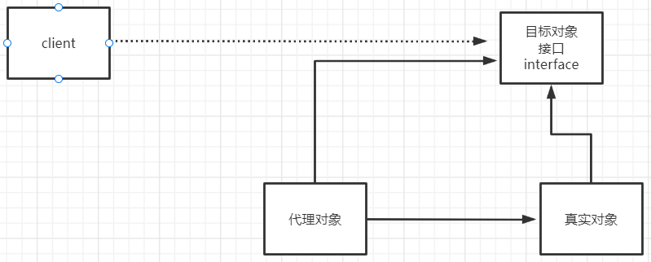

### 8.3 Mybatis详细执行流程

具体实现

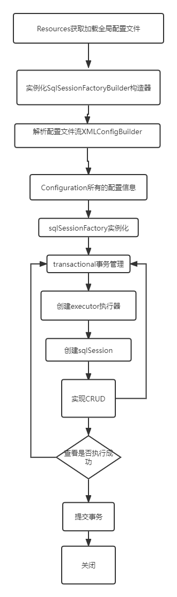

概要步骤：

1. 在src/main/resources路径下建立mybatis-config.xml文件建立核心配置文件
2. 在src/main/java/com/phc/utils路径下编写工具类MybatisUtils.java读取配置文件获取sqlsessionfactory
3. 在src/main/java/com/phc/pojo路径下编写实体类User.java
4. 在src/main/java/com/phc/dao路径下编写接口UserMapper.java和UserMapper.xml
5. 编写测试类

### 8.4 注解实现CRUD

1. 我们可以在工具类创建的时候实现自动提交事务

   `mybatis-study\mybatis-04\src\main\java\com\phc\utils\MybatisUtils.java`

   ```java
   public static SqlSession getSqlSession() {
       //return sqlSessionFactory.openSession();
       //自动提交事务
       return sqlSessionFactory.openSession(true);
   }
   ```

2. `mybatis-study\mybatis-04\src\main\java\com\phc\dao\UserMapper.java`

   ```java
   package com.phc.dao;
   
   import com.phc.pojo.User;
   import org.apache.ibatis.annotations.*;
   
   import java.util.List;
   
   /**
    * @FileName UserMapper.java
    * @Description 使用注解+接口实现CRUD
    * @Author phc
    * @date 2023/1/12 21:03
    * @Version 1.0
    */
   public interface UserMapper {
       //增
       @Insert("insert into mybatis.user(id,name,pwd) values (#{id},#{name},#{pwd})")
       int addUser(User user);
   
       //删
       @Delete("delete from mybatis.user where id=#{uid}")
       int deleteUser(@Param("uid") int id);
   
       //改
       @Update("update user set name=#{name},pwd=#{pwd} where id=#{id}")
       int updateUser(User user);
   
       //查
       @Select("select * from mybatis.user")
       List<User> getUsers();
   }
   ```

3. 绑定接口

   `mybatis-study\mybatis-04\src\main\resources\mybatis-config.xml`

   ```xml
   <!--绑定接口-->
   <mappers>
       <mapper class="com.phc.dao.UserMapper" />
   </mappers>
   ```

4. `mybatis-study\mybatis-04\src\test\java\com\phc\dao\UserMapperTest.java`

   ```java
   package com.phc.dao;
   
   import com.phc.pojo.User;
   import com.phc.utils.MybatisUtils;
   import org.apache.ibatis.session.SqlSession;
   import org.junit.Test;
   
   import java.util.List;
   
   /**
    * @FileName UserMapperTest.java
    * @Description 使用注解开发
    * @Author phc
    * @date 2023/1/12 17:30
    * @Version 1.0
    */
   public class UserMapperTest {
       //增
       @Test
       public void addUserTest() {
           SqlSession sqlSession = MybatisUtils.getSqlSession();
           UserMapper userMapper = sqlSession.getMapper(UserMapper.class);
           int affectRows = userMapper.addUser(new User(7, "小黑子", "7777777"));
           if(affectRows>0) {
               System.out.println("添加用户成功!");
           } else {
               System.out.println("添加用户失败!");
           }
           sqlSession.close();
       }
       //删
       @Test
       public void deleteUserTest() {
           SqlSession sqlSession = MybatisUtils.getSqlSession();
           UserMapper userMapper = sqlSession.getMapper(UserMapper.class);
           int affectRows = userMapper.deleteUser(7);
           if(affectRows>0) {
               System.out.println("删除用户成功!");
           } else {
               System.out.println("删除用户失败!");
           }
           sqlSession.close();
       }
       //改
       @Test
       public void updateUserTest() {
           SqlSession sqlSession = MybatisUtils.getSqlSession();
           UserMapper userMapper = sqlSession.getMapper(UserMapper.class);
           int affectRows = userMapper.updateUser(new User(7, "小霍", "134134"));
           if(affectRows>0) {
               System.out.println("修改用户成功!");
           } else {
               System.out.println("修改用户失败!");
           }
           sqlSession.close();
       }
       //查
       @Test
       public void getUsersTest() {
           SqlSession sqlSession = MybatisUtils.getSqlSession();
           UserMapper userMapper = sqlSession.getMapper(UserMapper.class);
           List<User> users = userMapper.getUsers();
           for(User user:users) {
               System.out.println(user);
           }
           sqlSession.close();
       }
   }
   ```

5. **关于 @Param("") 注解**

   - 基本类型的参数或者String需要加上
   - 引用类型不需要加
   - 如果只有一个基本类型的话，可以忽略，但是建议大家都加上
   - 我们在sql中引用的就是我们这里的@Param(“”)中设定的属性名

6. #{ } 和 ${ }

   （1）#{}是预编译处理，$ {}是字符串替换

   （2）mybatis在处理两个字符时，处理的方式也是不同的：

   * 处理#{}时，会将sql中的#{}整体替换为占位符（即：?），调用PreparedStatement的set方法来赋值；
   * 在处理 $ { } 时，就是把 ${ } 替换成变量的值。

   （3）假如用${}来编写SQL会出现：恶意SQL注入，对于数据库的数据安全性就没办法保证了

   （4）使用 #{} 可以有效的防止SQL注入，提高系统安全性：

   预编译的机制。预编译是提前对SQL语句进行预编译，而后再调用SQL，注入的参数就不会再进行SQL编译。而SQL注入是发生在编译的过程中，因为恶意注入了某些特殊字符，最后被编译时SQL时轻而易举的通过，从而导致数据泄露。而预编译机制则可以很好的防止SQL注入。


